<!-- ────────────────────────────────────────────────────────────────────────── -->
<div align="center">


<br>

**Workaholic-Willy picks what you name: it finds the object with a camera, plans a collision-free 6-DoF
grasp, refuses anything unsafe, drives a real or simulated arm, and verifies, recovers and logs each
attempt. It is a Python 3.11 library you import as `willy`, and the first run below needs no GPU,
camera or robot.**

<br>
</div>
<!-- ────────────────────────────────────────────────────────────────────────── -->

## Install

```bash
python -m venv .venv
source .venv/bin/activate            # Windows: .\.venv\Scripts\Activate.ps1
pip install -r requirements.txt      # everything, with CUDA torch wheels that also import without a GPU
pip install -e . --no-deps           # the repository itself, so `from willy import ...` resolves
```

`requirements-cpu.txt` installs the same set against CPU torch, for a host that cannot take the CUDA
wheels. Perception weights are fetched on their own: `python scripts/model_weights/fetch.py dino-tiny sam2`
fetches the detector and the segmenter a vision pick needs, and `--list` shows every key with its size.
The planner and the exact-mesh collision engine install as in [`ext_deps/`](ext_deps/README.md).

## Try it without hardware

From the repository root:

```bash
python -m src.config                              # the config tree loads: "OK: config under <default> validates"
python examples/simulation/01_rehearse_a_pick.py  # one pick on a dummy arm, ending "layers (none)"
python -m src.robot.execution.real_cell --check   # what stops a real cell, each with its fix; a fresh tree blocks by design
```

The rehearsal from Python, which is what that example does:

```python
from willy import Cell, PickRun, Recording, load_tree

cell = Cell.rehearsal(load_tree("console_dummy").robot)  # the desk profile: a dummy arm and a dummy hand
report = PickRun.from_cell(cell, runs=1, recording=Recording.off()).execute()
print(report)                        # "RESULT: 1/1 succeeded", the rule it was judged by, what was recorded
raise SystemExit(report.exit_code)   # 0 passed, 1 refused, 2 picked and did not pass, 3 a fault stopped it
```

A success here says the code path ran, not that anything was held: the dummy hand holds nothing, and
the dummy arm reports `UNGATED` because no guard sits in front of it. The same campaign from a shell is
`python -m src.robot.execution.real_cell --rehearse --runs 3 --profile console_dummy`.

## Your own cell

A cell is a profile: a layer of `*.<your cell>.yaml` files beside the files they change in
[`config/`](config/). `WILLY_PROFILE` names it, and every `real_robot` example and every command that
reads the tree follows it (in PowerShell, `$env:WILLY_PROFILE = "<your cell>"` before the command);
the simulation and offline examples name the tree they read in the file.

1. **Write the profile.** Start from a worked cell: `ur5e` (a UR5e on a bench), `ur3e`, `ur5e,eth2`
   (two fixed RGB-D cameras, fused) or `sim` (the Isaac UR5e cell). [Guide 01](docs/guide/01-configuration.md)
   explains the tree, and the profile step of [cell_bringup.md](docs/runbooks/cell_bringup.md) writes it.
   The base tree names no hand on purpose: name yours with `robot.gripper.model` in your layer, or chain
   the shipped hand layer, as in `ur5e,hande` for a Robotiq Hand-E.
2. **Check it at a desk.** `WILLY_PROFILE=<your cell> python -m src.robot.execution.real_cell --check`
   lists every item that stops a first connect. The tool frame, the payload, the hand and the camera
   calibration are values only your bench can give, so the shipped tree leaves them unset: a
   plausible guess would fail open.
3. **Run [`examples/real_robot/`](examples/README.md) in order.** 01 loads your tree and 02 is the desk
   check; neither moves anything. 03 connects and moves, 04 and 05 use the hand, 06 opens the camera,
   07 to 10 calibrate a fixed and a wrist camera by an automatic sweep or your own fixed poses, 11 and
   12 locate and pick or place with the camera world, 13 runs a campaign, 14 tunes the pick motion, 15
   takes a spoken command, and 16 and 17 hand the picked part to a person, by force or by sight.
4. **Follow the runbooks at the bench.** [cell_bringup.md](docs/runbooks/cell_bringup.md) takes any
   robot from its profile to a connected arm, with URSim for a UR.
   [your_own_gripper.md](docs/runbooks/your_own_gripper.md) fits a hand the repository never shipped,
   [calibration-setup.md](docs/calibration-setup.md) calibrates a camera, and
   [real_cell_first_pick.md](docs/runbooks/real_cell_first_pick.md) is the ordered bring-up to a first
   pick on a physical arm.

> [!WARNING]
> From `03_connect_and_move.py` on, the examples move the arm, and connecting can sweep the fingers as
> the hand activates. Every motion goes through the cell's safety checks, but software collision
> avoidance is not certified functional safety: a real cell needs the vendor's safety-rated stop.

## What you can do

| I want to | Run or read | Needs |
|---|---|---|
| see the robot's verbs at a desk: move, grasp, pick, place | `python examples/simulation/02_a_robot_at_the_desk.py` | nothing |
| ask what a config key means and which file set it | `python -m src.config explain <key>` | nothing |
| see which hand and which planner a tree builds (the file names its tree; put yours there) | [`examples/offline/config/`](examples/offline/config/) | nothing |
| rank grasps for an object's point cloud | `python examples/offline/grasping/grasps_for_a_cloud.py` | nothing |
| check that every guard of my cell refuses its own violation | `python scripts/checks/safety_guards.py` | my cell's profile |
| drive my cell from Python | [`examples/real_robot/`](examples/README.md), in order | the cell |
| see which grasp mode my cell can actually run, and what each one switches on | `python examples/simulation/06_grasp_modes_and_what_each_needs.py` | nothing |
| run a pick rate in Isaac Sim | [`docs/isaac-ready.md`](docs/isaac-ready.md), then `examples/simulation/03_isaac_pick_rate.py` | Isaac Sim, an NVIDIA GPU |
| generate grasp data and train a generator on my own parts | [`examples/offline/`](examples/README.md), [train_your_own_generator.md](docs/runbooks/train_your_own_generator.md) | nothing to plan; a GPU to train |
| download the public meshes a dataset draws from | `python examples/offline/datagen/06_fetch_public_parts.py` | the network, for the download itself |
| train a generator with no simulator and no parts of my own | `python examples/offline/training/04_train_on_a_public_corpus.py` | the network, and a GPU to train |
| run the operator console | `python -m api --profile console_dummy`, [`api/`](api/README.md) | the [frontend](frontend/README.md) built, for the page |
| roll up KPIs from a pick log | `python -m src.robot.grasping.replay --records <file>` | a record log: a campaign with `Recording.to_file("picks.jsonl")` writes one |
| find the command line for any of these | [`docs/cli.md`](docs/cli.md) | |

Every public name `willy` exports, with the example that shows it, is in
[`willy/README.md`](willy/README.md). An object a program holds between calls, such as a connected
robot, a located object or a spoken turn, is Python only; everything else also has a command line.

## See it work

<div align="center">


</div>

| Vision-language perception | Autonomous decision |
|:--:|:--:|
|  |  |
| A prompt, detection, segmentation, a masked point cloud, a 6-DoF grasp | Perceive, refine, verify, recover; the AUTO gate is opt-in (`run_m1_pick --mode auto`) |
| **Scene recovery** | **Fail-closed safety** |
|  |  |
| A push near the blocker's centre of mass frees the target | Refused as `approach_path_blocked`, a grasping-side check beside the six guards |

Jaw and suction on the same deep KLT bin: the jaw clears the shallow tray and suction reaches the
floor. In the suction segment the part rides the wrist kinematically, because attaching a physics
joint mid-play freezes Isaac's render; the jaw picks are real physics.

<div align="center">


</div>

<details>
<summary><b>Full-length cuts, and the originals</b></summary>

<br>

The loops above are muted GIFs. The edited cuts and one original per capability are in
[`docs/assets/demo/`](docs/assets/demo/), and GitHub plays them on click:

- [The autonomy endgame](docs/assets/demo/willy_endgame_demo.mp4), the whole run through the four scenarios
- [KLT, jaw and suction](docs/assets/demo/klt_combined.mp4)
- [`docs/assets/demo/raw/`](docs/assets/demo/raw/): the wrist-camera pick, the seal-gated suction
  pick, exposing an occluded object, the planner working a bin, clearing a bin to empty, and a second
  gripper meeting a shape it cannot hold

The `run_*` recorders under [`src/willy_sim/`](src/willy_sim/README.md) reproduce each of them on an
Isaac workstation. The endgame recorder retries each segment and keeps the first take that lifts
clear, so the reel shows successful takes rather than a per-attempt rate, and the on-frame banner
never claims a recovery that did not happen.

</details>

## How it fits together

```mermaid
flowchart LR
    P["<b>prompt</b><br/><i>pick the red cube</i>"]:::io
    C["<b>RGB-D or stereo</b>"]:::io
    D["<b>GroundingDINO</b><br/>ground the words"]:::perc
    S["<b>SAM2</b><br/>segment, then a point cloud"]:::perc
    G["<b>Grasp calculator</b><br/>generate, score, rank"]:::grasp
    F["<b>SafetyPreflight</b><br/>six fail-closed guards"]:::safe
    M["<b>cuRobo</b><br/>collision-free plan"]:::safe
    E["<b>Arm and gripper</b><br/>UR, KUKA, Isaac, Dummy"]:::exe
    V["<b>verify, then recover</b>"]:::exe
    L["<b>GraspAttemptRecord</b><br/>JSONL telemetry"]:::io

    P --> D
    C --> D --> S --> G --> F --> M --> E --> V --> L
    V -.->|"retry, rescan, push"| G

    classDef io    fill:#1f2933,stroke:#63768d,color:#e4e7eb
    classDef perc  fill:#2b3a55,stroke:#5b8def,color:#e4e7eb
    classDef grasp fill:#2d3b2f,stroke:#5fa463,color:#e4e7eb
    classDef safe  fill:#4a2f2f,stroke:#d16565,color:#e4e7eb
    classDef exe   fill:#3a3355,stroke:#8b7fd1,color:#e4e7eb
```



The dependency stack points one way, and nothing imports up:

- [`willy/`](willy/README.md): the one import, `from willy import ...`, over the packages below.
- [`src/robot/execution/`](src/robot/execution/README.md): `Robot`, `Cell` and `PickRun`, and the
  composition root that assembles a cell from its tree.
- [`src/robot/grasping/`](src/robot/grasping/README.md): generate, score, decide, refine, verify,
  recover and log; every formula is in [`docs/grasping-math.md`](docs/grasping-math.md).
- [`src/robot/safety/`](src/robot/safety/README.md): `SafetyPreflight`, six ordered fail-closed guards
  that outrank anything a model proposes, and the cuRobo binding; formulas in
  [`docs/safety-math.md`](docs/safety-math.md).
- Perception: [`src/camera/`](src/camera/README.md), [`src/calibration/`](src/calibration/README.md),
  [`src/models/`](src/models/README.md) and [`src/robot/perception/`](src/robot/perception/README.md).
- The vendor boundary: [`src/robot/core/`](src/robot/core/README.md) holds the `RobotArm` and `Gripper`
  Protocols, [`src/robot/drivers/`](src/robot/drivers/README.md) the UR, KUKA, Isaac and Dummy arms,
  and [`src/robot/grippers/`](src/robot/grippers/README.md) the hands. Vendor SDKs import lazily.
- Foundations: [`src/config/`](src/config/README.md), a Pydantic tree with `extra='forbid'`, so a typo
  fails at load; [`src/geometry/`](src/geometry/README.md), poses in millimetres with XYZW
  quaternions; [`src/contracts/`](src/contracts/README.md), the calling convention.
- Beside the library: [`src/willy_sim/`](src/willy_sim/README.md) runs the Isaac Sim cell,
  [`datagen/`](datagen/README.md) generates synthetic scenes with analytic grasp labels, and
  [`api/`](api/README.md) with [`frontend/`](frontend/README.md) is the operator console.

The library under `src/` imports no web framework. The console is the one named exception: it
depends on the library, and the library never imports it back. There is no ROS node in this
repository.

The default pick is open-loop: perceive, rank geometrically, gate, move, log. The AUTO decision gate,
closed-loop refinement and verification, recovery, multi-view fusion, the learned success model and
reinforcement learning are built, opt-in and off by default; each is a `robot.grasping.*` block, and
[`docs/grasping-config-reference.md`](docs/grasping-config-reference.md) says which grasp mode each can
fire in. A switch that would read as on while doing nothing is refused by the schema.

<details>
<summary><b>Repository layout</b></summary>

```
config/                     the YAML tree every cell is described in, plus the shipped profiles
src/
    contracts/              the calling convention: factories, one verb, frozen reports, UNSET
    geometry/               numpy SE(3): Frame, Pose, Transform, quaternions
    calibration/            extrinsics, eye-hand through AX=XB, stereo, versioned artifacts
    camera/                 capture rigs, frame providers, streaming over OpenCV or RealSense
    models/                 GroundingDINO, SAM2, RT-DETR, a VLM route, hand and speech wrappers
    config/                 the loader, the schema and the CLI that reads the tree above
    robot/
        core/               RobotArm and Gripper Protocols, typed motion objects, vendor enums
        drivers/            UR over RTDE, KUKA over EKI, Isaac Sim, Dummy, and two empty slots
        grippers/           robotiq, onrobot, jaw_io, vacuum, the two simulated ones, dummy, null
        safety/             the ordered fail-closed preflight, and the cuRobo binding
        perception/         real-camera RGB-D into a PerceptionFrame, and the Locator
        grasping/           generate, score, decide, refine, verify, recover, log
        execution/          Robot, Cell, PickRun, the composition root, the real cell, calibration
    willy_sim/              the Isaac Sim runners, the full-motion validation platform
    utility/                paths, device selection, atomic IO, logging, unit scaling
api/                        the console backend: FastAPI, seven routers, an event hub
frontend/                   the console UI: React and Vite, built into api/static/
datagen/                    synthetic scenes, analytic grasp labels, a physics reward
willy/                      the one import door: from willy import ...
examples/                   the library called as your code calls it: real_robot, simulation, offline
scripts/                    the checks, the URSim probes, the build and bake tools
ext_deps/                   the single install root for Coal and cuRobo; the payload is ignored
tests/                      the suite, gated at 80 percent coverage
docs/                       the guide, the runbooks, the math references, and the media
```

</details>

## Testing

Continuous integration runs lint, types, tests, coverage and the soak gate on every change. Locally:

```bash
ruff check src api datagen tests scripts examples willy
mypy src api datagen scripts examples willy
pytest tests --cov=src --cov=api --cov=datagen --cov-fail-under=80
python -m src.robot.grasping.replay --soak-report
```

The suite needs no GPU, camera or robot: it mocks every model constructor and every robot and camera
connection. The Isaac imports are lazy, so the simulation tests pass on a machine with no Isaac.
`examples/real_robot/` is type-checked against the library's signatures and never run, because each
file drives a real cell.

## Status and honest scope

Three levels of evidence run through this repository, and they mean exactly this:

|  |  |
|---|---|
| **measured in simulation** | Isaac Sim, on the box, with numbers |
| **measured against real controller software** | a real protocol or a real controller, no physical motion |
| **never touched hardware** | code complete, behaviour unproven |

| Area | State |
|---|---|
| Vision-language perception | measured in simulation: prompt, detect, segment, masked cloud |
| Generate, score, decide, execute, verify, recover, log | measured in simulation: the core pipeline |
| Fail-closed safety preflight | measured in simulation: runs before every motion, outranks every model |
| Motion: cuRobo with exact-mesh collision | measured in simulation: the standard path |
| Isaac Sim validation on a UR5e with a 2F-85 | measured in simulation: known-pose, real-vision, eye-in-hand and multi-view picks, plus calibration |
| Jaw and suction | measured in simulation: both |
| Driver: UR over RTDE | measured against real controller software: connect, power, motion, digital I/O, tool frame, payload, protective stop |
| Drivers: Dummy and Isaac Sim | measured in simulation |
| Driver: KUKA over EthernetKRL | never touched hardware: software-complete, unvalidated |
| Drivers: Franka and ROS2 | reserved empty vendor slots |
| Grippers: Robotiq, OnRobot, jaw and suction over digital I/O | never touched hardware: drivers complete, the I/O pins seen switching on real controller software |
| Real-camera perception over RealSense | never touched hardware: complete and reachable from configuration, never fed a real frame |
| Operator console | measured against real controller software: five screens, driven end to end |
| Speech to a prompt, push to talk, a person confirms | never touched hardware: no physical microphone or recorded human voice has driven it |
| Synthetic data engine | measured in simulation: proof run complete, verifier clean |
| Offline reinforcement learning | measured in simulation: the chain closes on measured physics outcomes, and the committed policies abstain rather than pretend |
| **Physical arm motion** | **no line of this code has ever executed on a physical robot** |
| A ROS node | does not exist; `src/robot/drivers/ros2/` is an empty slot |

The advanced grasping layers ship off, and the default pick is open-loop. The soak gate is a
synthetic contract self-check: it proves telemetry and KPI consistency, not grasp quality, and says so
in its own provenance block. Software collision avoidance is not certified functional safety.

## Where the details live

**Start with [the guide](docs/guide/README.md)**, which goes from an empty directory to a robot picking
an object: [configuration](docs/guide/01-configuration.md), [models](docs/guide/02-models.md),
[calibration](docs/guide/03-calibration.md), [robot and safety](docs/guide/04-robot-and-safety.md),
[the pick loop](docs/guide/05-pick-loop.md) and [grippers](docs/guide/06-grippers.md). The shorter
path is the [Quickstart](docs/Quickstart.md), every command line is in [`docs/cli.md`](docs/cli.md), and
the bench procedures are the [runbooks](docs/runbooks/).

<table>
<tr><th align="left">Foundations</th><th align="left">Vision and calibration</th></tr>
<tr valign="top"><td>

- [The `willy` import](willy/README.md), every public name
- [Examples](examples/README.md), by what has to be attached
- [Contracts](src/contracts/README.md), the calling convention
- [Configuration](src/config/README.md), the loader, the schema and the CLI
- [Geometry](src/geometry/README.md), SE(3) value objects
- [Utility](src/utility/README.md), paths, device, IO

</td><td>

- [Camera](src/camera/README.md), rigs, acquisition, streaming
- [Image capture](src/camera/setup/README.md)
- [Calibration](src/calibration/README.md), extrinsics, stereo, persistence
- [Hand-eye](src/calibration/eye_hand/README.md), the two workflows
- [Real-camera perception](src/robot/perception/README.md)
- [Models](src/models/README.md), detection, segmentation, the VLM route
- [Speech](src/models/speech/README.md), push to talk and a confirmation

</td></tr>
<tr><th align="left">The robot</th><th align="left">Drivers and grippers</th></tr>
<tr valign="top"><td>

- [Robot facade](src/robot/README.md)
- [Core Protocols](src/robot/core/README.md)
- [Safety pipeline](src/robot/safety/README.md), the six guards
- [Motion planning](src/robot/safety/planning/README.md)
- [Execution root](src/robot/execution/README.md), [the service](src/robot/execution/autonomous_grasp/README.md), [the real cell](src/robot/execution/real_cell/README.md)

</td><td>

- [Driver registry](src/robot/drivers/README.md)
- [Universal Robots](src/robot/drivers/ur/README.md), over RTDE
- [KUKA](src/robot/drivers/kuka/README.md), over EthernetKRL
- [Isaac Sim](src/robot/drivers/sim/README.md)
- [Grippers](src/robot/grippers/README.md)

</td></tr>
<tr><th align="left">Grasping</th><th align="left">Simulation, data and operations</th></tr>
<tr valign="top"><td>

- [The full 6-DoF pipeline](src/robot/grasping/README.md)
- [Contacts](src/robot/grasping/contacts/README.md), [planning](src/robot/grasping/planning/README.md), [collision](src/robot/grasping/collision/README.md)
- [Scoring](src/robot/grasping/scoring/README.md), [suction](src/robot/grasping/suction/README.md), [multi-view](src/robot/grasping/multiview/README.md)
- [KPI and the soak gate](src/robot/grasping/replay/README.md), [offline RL](src/robot/grasping/rl/README.md)
- [Config reference](docs/grasping-config-reference.md), every block and the mode gate

</td><td>

- [Isaac Sim harness](src/willy_sim/README.md)
- [Synthetic data engine](datagen/README.md), and its [grasp labels](datagen/grasps/README.md)
- [Operator console API](api/README.md), and the [UI](frontend/README.md)
- [Scripts](scripts/README.md), the checks, the probes and the build tools
- [Installing the motion engines](ext_deps/README.md)

</td></tr>
</table>

<div align="center">
<br>


**Workaholic-Willy** &middot; perceive &middot; grasp &middot; verify &middot; recover
<br><sub>by Alet-Robotics &middot; never clocks off &middot; <i>currently employed exclusively in simulation</i></sub>

</div>
