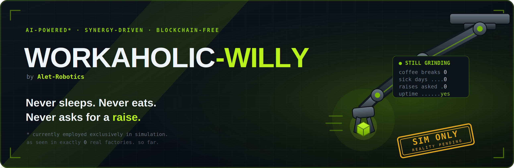
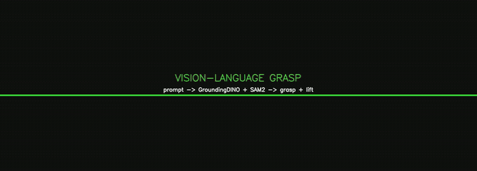
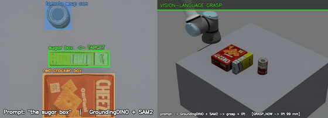
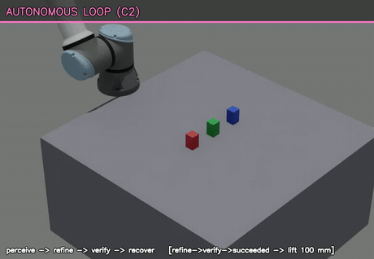
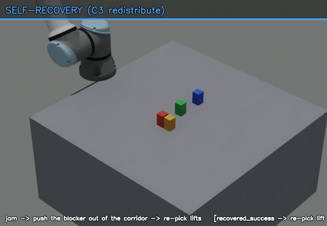
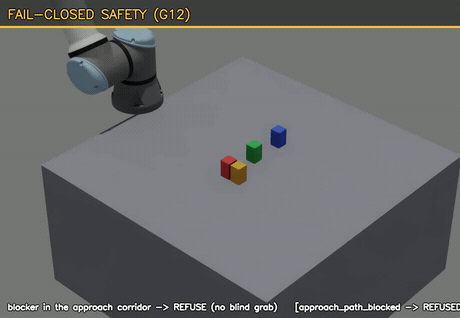
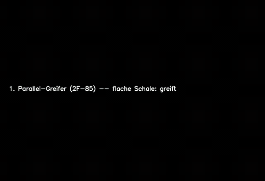
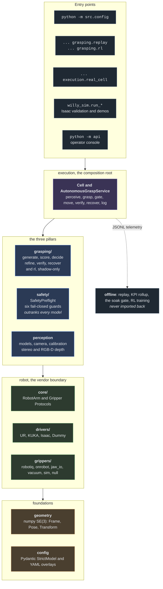
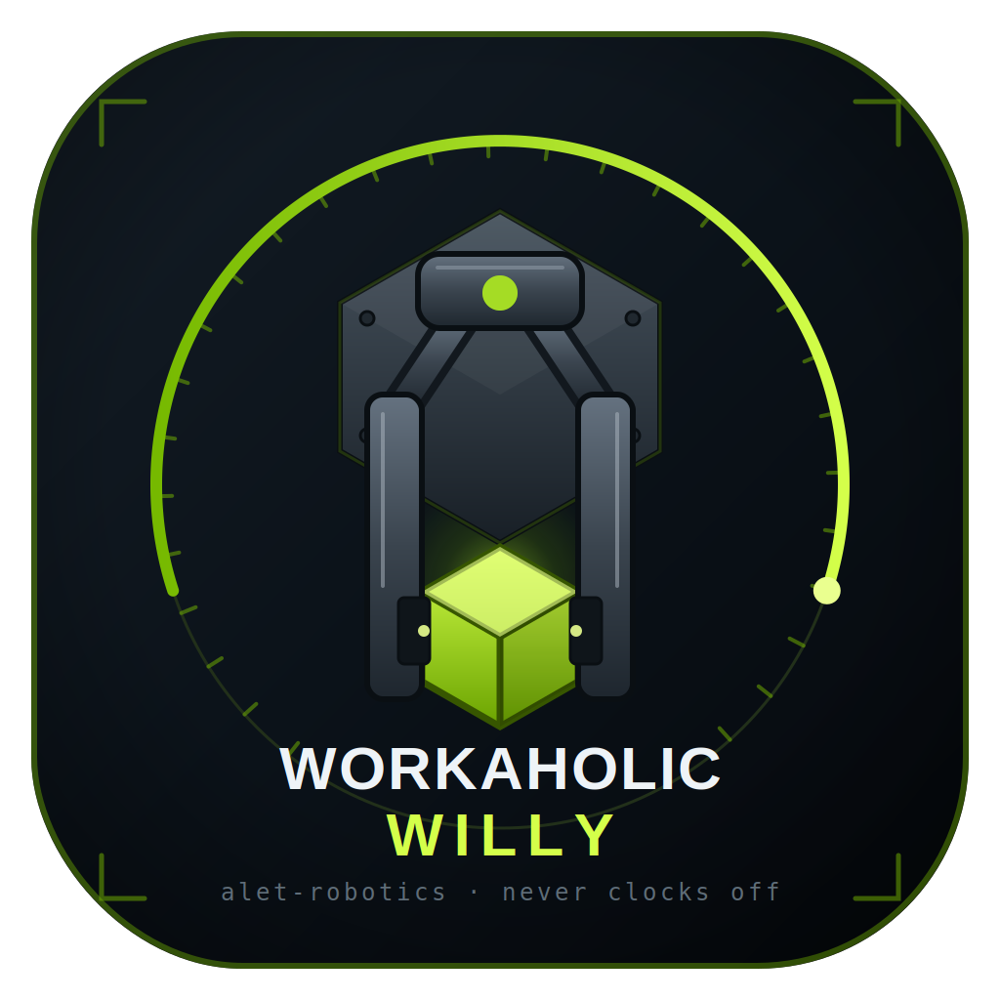

```mermaid
flowchart LR
    P["<b>prompt</b><br/><i>pick the red cube</i>"]:::io
    C["<b>RGB-D or stereo</b>"]:::io
    D["<b>GroundingDINO</b><br/>ground the words"]:::perc
    S["<b>SAM2</b><br/>segment, then a point cloud"]:::perc
    G["<b>Grasp calculator</b><br/>generate, score, rank"]:::grasp
    F["<b>SafetyPreflight</b><br/>six fail-closed guards"]:::safe
    M["<b>cuRobo</b><br/>collision-free plan"]:::safe
    E["<b>Arm and gripper</b><br/>UR, KUKA, Isaac, Dummy"]:::exe
    V["<b>verify, then recover</b>"]:::exe
    L["<b>GraspAttemptRecord</b><br/>JSONL telemetry"]:::io

    P --> D
    C --> D --> S --> G --> F --> M --> E --> V --> L
    V -.->|"retry, rescan, push"| G

    classDef io    fill:#1f2933,stroke:#63768d,color:#e4e7eb
    classDef perc  fill:#2b3a55,stroke:#5b8def,color:#e4e7eb
    classDef grasp fill:#2d3b2f,stroke:#5fa463,color:#e4e7eb
    classDef safe  fill:#4a2f2f,stroke:#d16565,color:#e4e7eb
    classDef exe   fill:#3a3355,stroke:#8b7fd1,color:#e4e7eb
```

<div align="center">



<br>

### Say **what** to pick. Willy finds it, plans a collision-free 6-DoF grasp, refuses anything unsafe, executes it on a real or simulated arm, then verifies, recovers and logs.

<br>


[See it work](#see-it-work) &middot; [Quick start](#quick-start) &middot; [Your cell](#describe-your-cell) &middot;
[Console](#operator-console) &middot; [Architecture](#how-the-pieces-fit-together) &middot;
[Status](#status-and-honest-scope) &middot; [Reading](#further-reading)

</div>

---

Workaholic-Willy turns **a text prompt and a camera scene** into **a completed pick**. It grounds the
prompt (GroundingDINO, SAM2, stereo or RGB-D depth), synthesizes and scores 6-DoF grasps, plans a
collision-free trajectory (cuRobo with exact-mesh collision), gates every motion through six
fail-closed guards, drives an arm and a gripper (UR, KUKA, Isaac Sim, Dummy, all behind one
`Protocol`), then verifies the grasp, recovers on failure, and logs each attempt as a frozen
`GraspAttemptRecord`.

It runs **two end-effector modalities**, a parallel jaw and suction, and is validated end to end in
NVIDIA Isaac Sim on a UR5e cell.



> [!NOTE]
> **A library and a CLI stack, with one optional service on top.** The library under `src/` imports
> **no web framework**, and that is a contract rather than a habit: the operator console
> ([`api/`](api/README.md) and [`frontend/`](frontend/README.md)) is the single named exception, a
> FastAPI application that depends on the library and that the library may never import back. There
> is no ROS node in this repository.

---

## See it work

<div align="center">

**Four scenarios, one stack: perceive, grasp, recover, refuse.**



</div>

Four pillars, one loop each, and every clip below plays on its own:

| Vision-language perception | Autonomous decision |
|:--:|:--:|
|  |  |
| Prompt, then GroundingDINO, then SAM2, then a masked point cloud, then a 6-DoF grasp | The dense autonomous loop: perceive, refine, verify, recover. The AUTO decision gate is a separate opt-in; `run_m1_pick --mode auto` demonstrates it |
| **Scene recovery** | **Fail-closed safety** |
|  |  |
| A contact-redistribute push: the arm nudges a blocker aside near its centre of mass to free the target | Six ordered guards run before every motion ([`src/robot/safety/preflight.py`](src/robot/safety/preflight.py)). This clip's refusal is `approach_path_blocked`, from a seventh grasping-side check, and the pipeline fails closed either way |

**Complementary end-effectors**, jaw and suction on the same deep KLT bin: the jaw clears the shallow
tray, suction reaches the floor. In the suction segment the object is carried kinematically on the
wrist rather than held by a physics joint, because attaching one mid-play freezes Isaac's render.
The jaw picks are real physics.

<div align="center">



</div>

<details>
<summary><b>Full-length cuts, and the originals</b></summary>

<br>

The loops above are muted GIFs. The edited cuts and one original per capability are in
[`docs/assets/demo/`](docs/assets/demo/), and GitHub plays them on click:

- [The autonomy endgame](docs/assets/demo/willy_endgame_demo.mp4), the whole run through the four pillars
- [KLT, jaw and suction](docs/assets/demo/klt_combined.mp4)
- [`docs/assets/demo/raw/`](docs/assets/demo/raw/): the wrist-camera pick, the seal-gated suction
  pick, exposing an occluded object, the planner working a bin, clearing a bin to empty, and a second
  gripper meeting a shape it cannot hold

Every one of them is reproducible on the workstation through the `run_*` recorders under
[`src/willy_sim/`](src/willy_sim/README.md).

</details>

---

## What is inside

|  |  |
|---|---|
| **Vision-language perception** | A text prompt, then detection, then segmentation, then a masked point cloud, over stereo or RGB-D depth. A VLM route handles the attribute prompts a detector gets wrong. |
| **6-DoF grasp synthesis** | Support-plane geometry, then antipodal, surface and dense contact sampling, then geometric, stability and reachability scoring, then a deterministic rank. Every formula: [`docs/grasping-math.md`](docs/grasping-math.md). |
| **Fail-closed safety** | Six ordered guards, workspace, joint limit, IK quality, self-collision, payload and motion continuity, run before every motion and outrank anything a model proposes. Every formula: [`docs/safety-math.md`](docs/safety-math.md). |
| **Collision-free motion** | cuRobo for planning and Coal or fcl for vertex-exact mesh self-collision, with the engines installed once into a single local root. |
| **Vendor-neutral drivers** | UR over RTDE, KUKA over EthernetKRL, Isaac Sim and Dummy, all behind one `RobotArm` and `Gripper` `Protocol`, with vendor SDKs imported lazily inside the driver. |
| **Gripper drivers** | Robotiq over its URCap socket, OnRobot over Modbus, a jaw and a suction cup over digital I/O, the two simulated grippers, and Dummy and Null. Every wiring number is configuration, so bring-up is measuring rather than coding. |
| **Multi-camera calibration and fusion** | Per-camera eye-to-hand and eye-in-hand extrinsics through one central map, solved by AX=XB. Multi-camera geometry fusion runs inside the pick loop, and a worked two-camera cell ships as a configuration example. |
| **Structured telemetry** | Every attempt becomes a frozen `GraspAttemptRecord`, which feeds the KPI rollup, the soak gate, the failure taxonomy and offline reinforcement learning. |
| **Offline reinforcement learning** | Train, evaluate off-policy, promote through a gate. It runs shadow-only at run time and never overrides the safety mask, and `check-dataset` answers whether a log is trainable before the training run rather than after. |
| **Operator console** | FastAPI and React: preflight, cell, pick, history and configuration, over a typed HTTP surface with a live event stream. Driven end to end against real UR controller software. |
| **Isaac Sim platform** | A config-driven UR5e cell: known-pose, real-vision, eye-in-hand, multi-view and suction picks, hand-eye calibration, and the cinematic recorders that made the clips above. |
| **Synthetic data engine** | [`datagen/`](datagen/README.md): path-traced scenes with a posed arm, analytic grasp labels and a physics reward. It is the independent reference the grasp calculator is measured against. |

---

## Quick start

**Windows 10 or later, and Linux.** The library and the test suite need no GPU, camera or robot. Only
the Isaac Sim runners need the workstation.

```bash
# 1. install
python -m venv .venv
source .venv/bin/activate            # Windows: .\.venv\Scripts\Activate.ps1
pip install -r requirements.txt      # runtime, drivers, console and tooling in one file
#    The cu128 wheels import without a GPU, so this is the default everywhere. If you would
#    rather not pull them, requirements-cpu.txt installs the same set against CPU torch.

# 2. validate the whole configuration tree
python -m src.config --print

# 3. run the synthetic soak and KPI gate; exit 0 means every locked gate passed
python -m src.robot.grasping.replay --soak-report

# 4. rehearse the real-cell boot path end to end, on a dummy arm, commanding nothing
python -m src.robot.execution.real_cell --rehearse --runs 3
```

Two rehearsals that need nothing but the clone, and print what they actually did:

```bash
python scripts/examples/01_robot_setup.py     # is this cell described coherently?
python scripts/examples/03_pick.py            # one grasp on a dummy arm, and which layers ran
```

The same pick from Python, which is what those examples call:

```python
from src.config import load_config
from src.robot.execution.cell import Cell
from src.robot.execution.pick_run import PickRun, Recording

cell   = Cell.rehearsal(load_config().robot)     # or Cell.from_robot_config(...) for a real one
report = PickRun.from_cell(cell, runs=1, recording=Recording.off()).execute()

print(report.render())        # what happened, in words
report.exit_code              # 0 passed, 1 refused, 2 picked and did not pass, 3 raised
```

New here? Read the [five-part guide](docs/guide/README.md), which goes from an empty directory to a
pick, or the shorter [Quickstart](docs/Quickstart.md). Getting the workstation ready for Isaac and
the motion engines: [`docs/isaac-ready.md`](docs/isaac-ready.md).

---

## Describe your cell

Configuration is a Pydantic `StrictModel` tree with `extra='forbid'`, so a typo fails loudly at load
rather than quietly at run time. The YAML lives in [`config/`](config/), and a **profile** is a set of
overlay files deep-merged onto it, selected by `WILLY_PROFILE`.

Four worked cells ship as profiles, and each one is commented key by key for the person standing at
the bench:

| Profile | The cell |
|---|---|
| `sim` | The Isaac UR5e cell, the same tree the simulator boots from |
| `ur3e` | A UR3e, in simulation or on a bench. Every position is re-anchored, because a UR3e works a 500 mm sphere where a UR5e works 850 |
| `ur5e` | A real UR5e on a bench: the workspace box, the home pose, the bench as a collision fixture, and the planner's world |
| `ur5e,eth2` | The same bench with two fixed RGB-D cameras, fused |

```bash
python -m src.config                              # validate the shipped tree
WILLY_PROFILE=ur5e,eth2 python -m src.config      # validate a two-camera cell
python -m src.config explain robot.safety.self_collision.planner_margin_mm
```

`explain` reports a key's type, its default, which file and which layer set the winning value, the
whole override chain, and the comment written above that line.

> [!TIP]
> The `ur5e` example draws a line worth copying. A value that **fails closed** if it is wrong ships
> as a worked example with its assumption stated, because a workspace box that is too small refuses
> a motion visibly. A value that **fails open** does not ship at all: a tool frame or a payload that
> is merely plausible drives the arm into the bench and logs a success, so those keys are written out
> as commented blocks with what to measure, and the shipped refusals stay armed.

Full reference: [`src/config/README.md`](src/config/README.md). Every `robot.grasping` block, what it
does and which grasp mode it can fire in:
[`docs/grasping-config-reference.md`](docs/grasping-config-reference.md).

---

## Operator console

A browser front end for the people who stand at the cell, not a demo shell. Five screens over a typed
HTTP surface with a live event stream, served same-origin from one process.

```bash
python -m api --profile console_dummy      # hardware-free; --profile ursim for a UR controller
# then open http://127.0.0.1:8000
```

| Screen | Answers |
|---|---|
| **Preflight** | Is this cell runnable? Every check verbatim, with its fix instruction, nothing softened. |
| **Cell** | Build, preview the connect, connect, and watch live telemetry: TCP, joints, controller state, both stop flags. |
| **Pick** | Run an attempt against a live event stream. A refusal names the guard that refused, and why. |
| **History** | Every logged attempt, rolled up. |
| **Config** | The merged, validated tree, the same one the cell booted from. |

> [!TIP]
> The console was driven end to end against URSim, which is real UR controller software running a
> robot that does not exist. That is what proved the motion-explanation path: a refused pick reported
> the guard, the pose and the reason rather than a generic failure.

Full surface, error envelope and event contract: [`api/README.md`](api/README.md). UI internals:
[`frontend/README.md`](frontend/README.md).

---

## Examples

Seven executable examples in dependency order, sharing one output shape. They call the library
rather than shelling out to a command line, so each one is also a worked example of the API.

> Nothing moves unless you pass `--live`. Every example that can drive an arm defaults to a
> rehearsal: it loads the configuration, builds the real components, runs every check that needs no
> motion, and commands nothing.

| Run | What you learn |
|---|---|
| [`01_robot_setup.py`](scripts/examples/01_robot_setup.py) | Is this cell described coherently, and does the controller agree? |
| [`02_calibration.py`](scripts/examples/02_calibration.py) | Where the camera is in the robot's frame, eye-to-hand and eye-in-hand. |
| [`03_pick.py`](scripts/examples/03_pick.py) | One grasp, and which layers actually ran. |
| [`04_datagen.py`](scripts/examples/04_datagen.py) | Build a corpus from your own objects, priced before it starts, with no GPU. |
| [`05_train.py`](scripts/examples/05_train.py) | Train a generator, and read the number that means something. |
| [`06_full_pipeline.py`](scripts/examples/06_full_pipeline.py) | All of it, stopping at the first blocking stage. |
| [`07_sim.py`](scripts/examples/07_sim.py) | The same pick in Isaac, where a wrong answer is free. |

Full index: [`scripts/examples/README.md`](scripts/examples/README.md).

---

## How the pieces fit together

A strict downward dependency stack, and nothing imports up.



> [!IMPORTANT]
> **The default pick is open-loop**: perceive, rank geometrically, gate, move, log. The AUTO decision
> gate, closed-loop refine and verify, recovery, multi-view fusion, the learned success model and
> reinforcement learning are all built, opt-in and default-off. A switch that would read as on while
> doing nothing is refused by the schema rather than silently accepted.

<details>
<summary><b>Repository layout</b></summary>

```
config/                     the YAML tree every cell is described in, plus the shipped profiles
src/
    contracts/              the calling convention: factories, one verb, frozen reports, UNSET
    geometry/               numpy SE(3): Frame, Pose, Transform, quaternions
    calibration/            extrinsics, eye-hand through AX=XB, stereo, versioned artifacts
    camera/                 capture rigs, frame providers, streaming over OpenCV or RealSense
    models/                 GroundingDINO, SAM2, RT-DETR, a VLM route, hand and speech wrappers
    config/                 the loader, the schema and the CLI that reads the tree above
    robot/
        core/               RobotArm and Gripper Protocols, typed motion objects, vendor enums
        drivers/            UR over RTDE, KUKA over EKI, Isaac Sim, Dummy, and two empty slots
        grippers/           robotiq, onrobot, jaw_io, vacuum, the two simulated ones, dummy, null
        safety/             the ordered fail-closed preflight, and the cuRobo binding
        perception/         real-camera RGB-D into a PerceptionFrame
        grasping/           generate, score, decide, refine, verify, recover, log
        execution/          the composition root, the real cell, the calibration routine
    willy_sim/              the Isaac Sim runners, the full-motion validation platform
    utility/                paths, device selection, atomic IO, logging, unit scaling
api/                        the console backend: FastAPI, seven routers, an event hub
frontend/                   the console UI: React and Vite, built into api/static/
datagen/                    synthetic scenes, analytic grasp labels, a physics reward
scripts/                    the seven examples, the URSim probes, the build and bake tools
ext_deps/                   the single install root for Coal and cuRobo; the payload is ignored
tests/                      the suite, torch-free, gated at 80 percent coverage
docs/                       the guide, the runbooks, the math references, and the media
```

</details>

---

## Testing

Continuous integration runs lint, types, tests, coverage and the soak gate on every change. Locally:

```bash
ruff check src config api datagen tests scripts/examples
mypy src api datagen scripts/examples
pytest tests --cov=src --cov-fail-under=80
python -m src.robot.grasping.replay --soak-report
```

The suite mocks every model constructor and every robot and camera connection, so it needs no GPU, no
camera and no robot, and it is torch-free. The Isaac imports are lazy, so the mock-mode simulation
tests stay green on a machine that has no Isaac at all.

---

## Status and honest scope

Three levels of evidence run through this repository, and they mean exactly this:

|  |  |
|---|---|
| **measured in simulation** | Isaac Sim, on the box, with numbers |
| **measured against real controller software** | a real protocol or a real controller, no physical motion |
| **never touched hardware** | code complete, behaviour unproven |

| Area | State |
|---|---|
| Vision-language perception | measured in simulation: prompt, detect, segment, masked cloud |
| Generate, score, decide, execute, verify, recover, log | measured in simulation: the core pipeline |
| Fail-closed safety preflight | measured in simulation: runs before every motion, outranks every model |
| Motion: cuRobo with exact-mesh collision | measured in simulation: the standard path |
| Isaac Sim validation on a UR5e with a 2F-85 | measured in simulation: known-pose, real-vision, eye-in-hand and multi-view picks, plus calibration |
| Jaw and suction | measured in simulation: both |
| Driver: UR over RTDE | measured against real controller software: connect, power, motion, digital I/O, tool frame, payload, protective stop |
| Drivers: Dummy and Isaac Sim | measured in simulation |
| Driver: KUKA over EthernetKRL | never touched hardware: software-complete, unvalidated |
| Drivers: Franka and ROS2 | reserved empty vendor slots |
| Grippers: Robotiq, OnRobot, jaw and suction over digital I/O | never touched hardware: the drivers are complete and the digital-I/O pins were measured switching on a real controller, the grippers were not |
| Real-camera perception over RealSense | never touched hardware: complete and reachable from configuration, never fed a real frame |
| Operator console | measured against real controller software: five screens, driven end to end |
| Synthetic data engine | measured in simulation: proof run complete, verifier clean |
| Offline reinforcement learning | measured in simulation: the chain closes on measured physics outcomes, and the committed policies abstain rather than pretend |
| **Physical arm motion** | **no line of this code has ever executed on a physical robot** |
| A ROS node, or a voice API | does not exist, by design |

> [!IMPORTANT]
> **Honesty first.** The advanced grasping layers ship default-off and byte-identical, and the
> default pick is open-loop. The soak gate is a synthetic contract self-check: it proves telemetry
> and KPI consistency, not grasp quality, and says so in its own provenance block. Software collision
> avoidance is **not certified functional safety**; a real cell needs the vendor's safety-rated stop,
> not this guard. On the clips: the endgame recorder retries each segment and keeps the first take
> that lifts clear, so the reel shows representative successful takes rather than a per-attempt rate,
> and the on-frame banner never claims a recovery that did not happen.

---

## Further reading

> **New here? Start with [the guide](docs/guide/README.md).** Five sequential walkthroughs that go
> from an empty directory to a robot picking an object:
> [configuration](docs/guide/01-configuration.md), [models](docs/guide/02-models.md),
> [calibration](docs/guide/03-calibration.md),
> [robot and safety](docs/guide/04-robot-and-safety.md), [the pick loop](docs/guide/05-pick-loop.md).
> The package READMEs below are the per-module reference you reach for afterwards.

**The two math references**, every formula the stack evaluates and how each one fails:
[grasping](docs/grasping-math.md), from prompt to point cloud to grasp pose, and
[safety](docs/safety-math.md), workspace, forward kinematics, Jacobian, capsules and mesh distance.

<table>
<tr><th align="left">Foundations</th><th align="left">Vision and calibration</th></tr>
<tr valign="top"><td>

- [Contracts](src/contracts/README.md), the calling convention
- [Configuration](src/config/README.md), the loader, the schema and the CLI
- [Geometry](src/geometry/README.md), SE(3) value objects
- [Utility](src/utility/README.md), paths, device, IO

</td><td>

- [Camera](src/camera/README.md), rigs, acquisition, streaming
- [Image capture](src/camera/setup/README.md)
- [Calibration](src/calibration/README.md), extrinsics, stereo, persistence
- [Hand-eye](src/calibration/eye_hand/README.md), the two workflows
- [Real-camera perception](src/robot/perception/README.md)
- [Models](src/models/README.md), detection, segmentation, the VLM route

</td></tr>
<tr><th align="left">The robot</th><th align="left">Drivers and grippers</th></tr>
<tr valign="top"><td>

- [Robot facade](src/robot/README.md)
- [Core Protocols](src/robot/core/README.md)
- [Safety pipeline](src/robot/safety/README.md), the six guards
- [Motion planning](src/robot/safety/planning/README.md)
- [Execution root](src/robot/execution/README.md), [the service](src/robot/execution/autonomous_grasp/README.md), [the real cell](src/robot/execution/real_cell/README.md)

</td><td>

- [Driver registry](src/robot/drivers/README.md)
- [Universal Robots](src/robot/drivers/ur/README.md), over RTDE
- [KUKA](src/robot/drivers/kuka/README.md), over EthernetKRL
- [Isaac Sim](src/robot/drivers/sim/README.md)
- [Grippers](src/robot/grippers/README.md)

</td></tr>
<tr><th align="left">Grasping</th><th align="left">Simulation, data and operations</th></tr>
<tr valign="top"><td>

- [The full 6-DoF pipeline](src/robot/grasping/README.md)
- [Contacts](src/robot/grasping/contacts/README.md), [planning](src/robot/grasping/planning/README.md), [collision](src/robot/grasping/collision/README.md)
- [Scoring](src/robot/grasping/scoring/README.md), [suction](src/robot/grasping/suction/README.md), [multi-view](src/robot/grasping/multiview/README.md)
- [KPI and the soak gate](src/robot/grasping/replay/README.md), [offline RL](src/robot/grasping/rl/README.md)
- [Config reference](docs/grasping-config-reference.md), every block and the mode gate

</td><td>

- [Isaac Sim harness](src/willy_sim/README.md)
- [Synthetic data engine](datagen/README.md), and its [grasp labels](datagen/grasps/README.md)
- [Operator console API](api/README.md), and the [UI](frontend/README.md)
- [Runbooks](docs/runbooks/real_cell_first_pick.md): a first pick on a real cell
- [Installing the motion engines](ext_deps/README.md)

</td></tr>
</table>

---

<div align="center">
<br>



**Workaholic-Willy** &middot; perceive &middot; grasp &middot; verify &middot; recover
<br><sub>by Alet-Robotics &middot; never clocks off &middot; <i>currently employed exclusively in simulation</i></sub>

</div>
