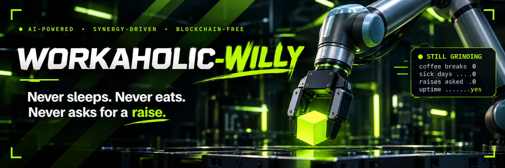
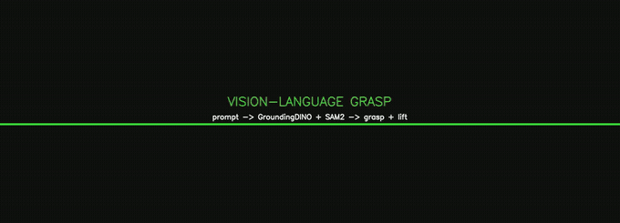
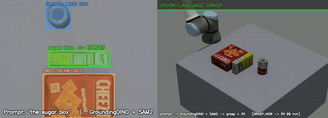
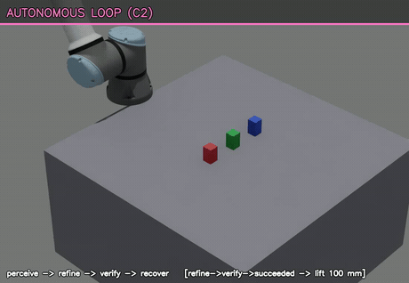
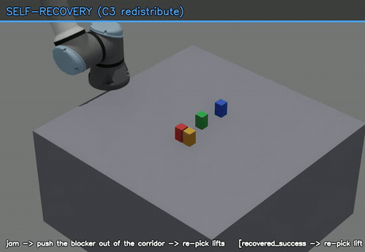
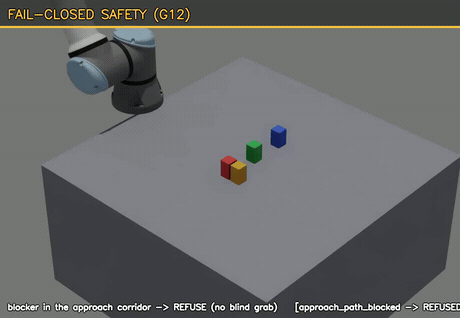
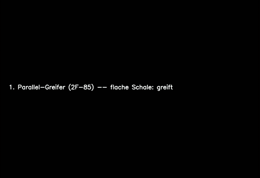
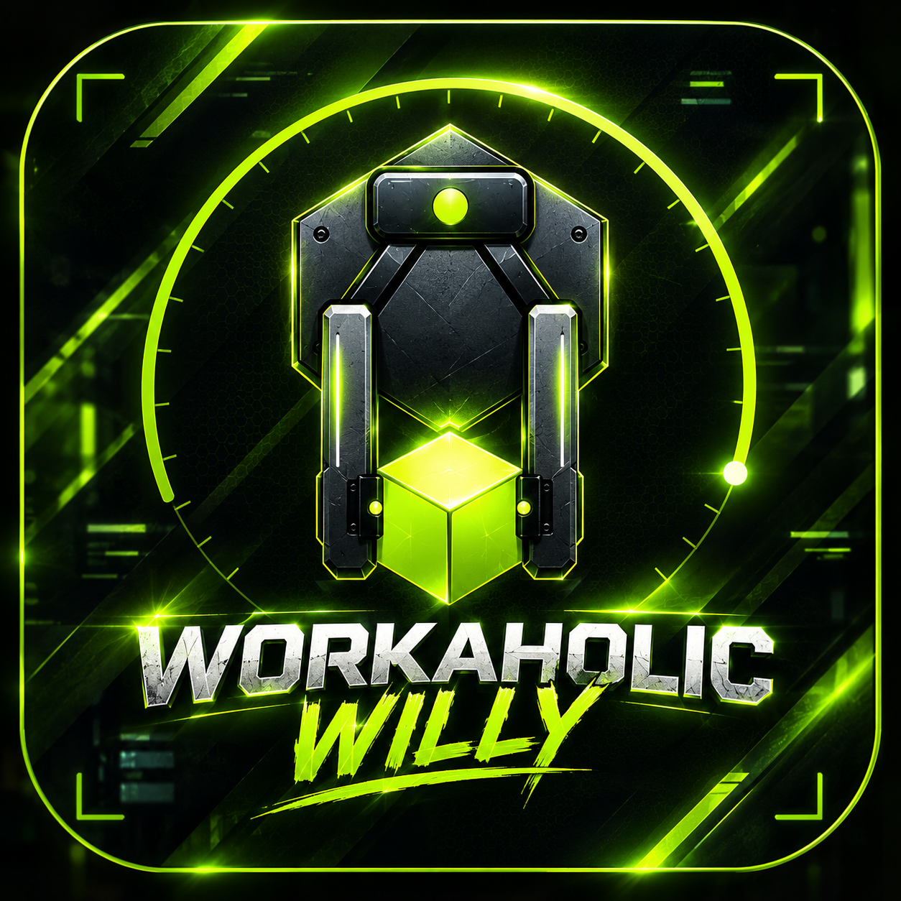

<!-- ────────────────────────────────────────────────────────────────────────── -->
<div align="center">



<br>

**Say _what_ to pick. Willy perceives it, plans a collision-free 6-DoF grasp, gates every motion through
a fail-closed safety pipeline, executes on a real or simulated arm, then checks the hold, recovers and logs.**

<br>


[](https://github.com/ManterJochen/Workaholic-Willy/actions/workflows/ci.yml)
[](LICENSE)

**[See it work](#see-it-work)** · **[Quick Start](#-quick-start)** · **[Console](#operator-console)** · **[Architecture](#how-it-fits-together)** · **[Config](#your-own-cell)** · **[Reading](#where-the-details-live)**

</div>

<!-- ────────────────────────────────────────────────────────────────────────── -->

Workaholic-Willy turns a **text prompt + a camera scene** into a **completed pick**. It grounds the
prompt (GroundingDINO + SAM2 or Qwen-VL + stereo/RGB-D depth), synthesizes and scores 6-DoF grasps, plans a
collision-free trajectory (cuRobo + Coal), gates every motion through six fail-closed guards, drives a
robot arm + gripper, then checks the hold, recovers on failure, and logs each attempt as a structured `GraspAttemptRecord`.
With a **wrist camera** it looks from several poses, fuses what it saw and stops as soon as the grasp is safe.

It runs **two end-effector modalities**, a parallel **jaw** and **suction**, and runs
end-to-end on a **real UR10** with a jaw and a wrist **Intel RealSense** camera.


```mermaid
flowchart LR
    P["🗣 <b>prompt</b><br/><i>pick the red cube</i>"]:::io
    C["📷 <b>RGB-D / stereo</b>"]:::io
    D["<b>GroundingDINO / Qwen-VL / RT_DETR</b><br/>"]:::perc
    S["<b>SAM2 / OneFormer</b><br/>"]:::perc
    G["<b>Grasp calculator</b><br/>generate · score · rank"]:::grasp
    F["<b>SafetyPreflight</b><br/>"]:::safe
    M["<b>cuRobo + Coal</b><br/>"]:::safe
    E["<b>Arm + gripper</b><br/>"]:::exe
    V["<b>hold check → recover</b>"]:::exe
    L["📊 <b>GraspAttemptRecord</b><br/>JSONL telemetry"]:::io

    P --> D
    C --> D --> S --> G --> F --> M --> E --> V --> L
    V -.->|"retry · rescan · push"| G

    classDef io    fill:#1f2933,stroke:#63768d,color:#e4e7eb
    classDef perc  fill:#2b3a55,stroke:#5b8def,color:#e4e7eb
    classDef grasp fill:#2d3b2f,stroke:#5fa463,color:#e4e7eb
    classDef safe  fill:#4a2f2f,stroke:#d16565,color:#e4e7eb
    classDef exe   fill:#3a3355,stroke:#8b7fd1,color:#e4e7eb
```

<!-- ────────────────────────────────────────────────────────────────────────── -->

## See it work

<div align="center">

**Four scenarios, one stack: perceive · grasp · recover · refuse. Stitched from four runs.**



</div>

Four pillars, one loop each, and every clip below **plays automatically**:

|  👁 &nbsp; Vision-language perception  |  🧠 &nbsp; Autonomous decision  |
|:--:|:--:|
|  |  |
| Prompt → GroundingDINO or Qwen-VL → SAM2 → masked point cloud → 6-DoF grasp | Filmed with the retired **DENSE_AUTONOMOUS** loop (perceive → refine → verify → recover); a clip of the **wrist multi-view** pick replaces it soon. The **AUTO decision gate** runs today: demo it with `run_m1_pick --mode auto` |
|  ♻ &nbsp; **Scene recovery**  |  🛡 &nbsp; **Fail-closed safety**  |
|  |  |
| Filmed with the earlier simulator push, a sweep that cleared a blocker out of the approach corridor. Today's **push** (`dense_clutter`, on a wrist camera's pick) slides a boxed-in part with the outer face of the open finger, inside an automatic push box, and never changes the jaws | Six ordered guards run **before every motion** ([`safety/preflight.py`](src/robot/safety/preflight.py)); this clip's refusal is `approach_path_blocked` from the swept-approach check, a *seventh*, grasping-side gate, and the pipeline fails closed either way |

**Complementary end-effectors**, the jaw and suction on the *same* deep KLT bin.

<div align="center">



</div>

<details>
<summary><b>🎬 Full-length cinematic cuts (H.264, silent)</b></summary>

<br>

The looping previews above are muted GIFs. The full recordings live in [`docs/assets/demo/`](docs/assets/demo/), click to play on GitHub:

- [Autonomy endgame, 46 s](docs/assets/demo/willy_endgame_demo.mp4) · the whole run through the four pillars
- [KLT jaw + suction, 57 s](docs/assets/demo/klt_combined.mp4)

</details>

> Every demo is reproducible on-box via the `run_*` recorders. See [`04_isaac_record_a_pick.py`](examples/simulation/04_isaac_record_a_pick.py).

<!-- ────────────────────────────────────────────────────────────────────────── -->

## What's inside

|  |  |
|---|---|
| 🗣 **Vision-language perception** | Text prompt → GroundingDINO or Qwen-VL detect → SAM2 segment → masked point cloud, over stereo or RGB-D depth. A VLM route handles the attribute prompts the detector gets wrong. |
| ✋ **6-DoF grasp synthesis** | Support-plane geometry → antipodal / surface / dense contact sampling → geometric + stability + reachability scoring → deterministic rank. The math: [`docs/grasping-math.md`](docs/grasping-math.md). |
| 🛡 **Fail-closed safety** | Six ordered guards (workspace · joint-limit · IK-quality · self-collision · payload · motion-continuity) run before every motion and **outrank ML/RL**. The math: [`docs/safety-math.md`](docs/safety-math.md). |
| 🧭 **Collision-free motion** | cuRobo + Coal (vertex-exact mesh self-collision), with a blind-IK fallback that keeps CI green. |
| 🤖 **Vendor-neutral drivers** |  All behind one `RobotArm`/`Gripper` `Protocol`. |
| 🤏 **Six gripper drivers** | Robotiq (URCap socket) · jaw over digital I/O · suction over digital I/O · Isaac sim jaw + suction · Dummy · Null. |
| 📷 **Multi-camera calibration & fusion** | Per-camera eye-to-hand / eye-in-hand extrinsics declared on each rig (`camera.cameras.rigs[<id>].extrinsics`) + AX=XB routine; multi-camera geometry fusion runs **in the core pick loop**. |
| 🔄 **Wrist multi-view** | A wrist (eye-in-hand) camera visits its look poses, fuses every view and **stops as soon as the grasp is safe**. One generated view on a straight joint line is the last resort, every frame of the pick stays in the planner's world, and `both_faces=True` refuses a grip whose jaw contact faces were not both seen. Fixed cameras fuse without moving. |
| 📊 **Structured telemetry** | Every attempt → a frozen `GraspAttemptRecord` → KPI rollup · soak gate · failure taxonomy · offline RL. |
| 🧠 **Offline RL (shadow)** | Train → OPE → promote, gated; runs shadow/canary-only and never overrides the safety mask. `check-dataset` answers *is this log trainable?* **before** the training run, not after. |
| 🧠 **Deep Learning GraspEngine** | Generate Dataset or use GraspAnything → train → check result → See the magic happen. Use of your own CAD models is supported. |
| 🎛 **Operator console** | FastAPI + React: say what to do, read what Willy understood, press **Start**. A task picks, places at a taught pose or into a bin the camera finds, and returns, once or until empty, with the live image, a step timeline, **halt now**, a stop card with Restart or Home, the jaws question in the browser, poses taught by hand, and an audience window for the projector. |
| 🎲 **Synthetic data engine** | [`datagen/`](datagen/README.md) · path-traced scenes with posed arms, analytic grasp labels and a physics reward. Choice of engines: Isaac-Sim, Mujoco and no engine at all. |

<!-- ────────────────────────────────────────────────────────────────────────── -->

## 🚀 Quick Start

**Validated on Windows 10+ and Linux (Ubuntu 24.04).**

```bash
python -m venv .venv
source .venv/bin/activate            # Windows: .\.venv\Scripts\Activate.ps1
pip install -r requirements.txt      # everything, with CUDA torch wheels that also import without a GPU
pip install -e . --no-deps           # the repository itself, so `from willy import ...` resolves
```

`requirements-cpu.txt` installs the same set against CPU torch, for a host that cannot take the CUDA
wheels. If you have no GPU you also cant use the CuRobo/Coal sidecars that rely on CUDA.

Getting the workstation ready (Isaac 5.1 + the cuRobo/Coal sidecars + the demos): **[docs/isaac-ready.md](docs/isaac-ready.md)**.
Setting up hand-eye calibration on a real cell: **[docs/calibration-setup.md](docs/calibration-setup.md)**.


For the next steps, refer to the [examples](examples/README.md) section to see how to run full pick-and-place workflows and other demonstrations.

<!-- ────────────────────────────────────────────────────────────────────────── -->

## Your own cell

A cell is either a profile or a custom data directory:
- `your/Path/<your cell>/` for a custom data directory, or `config/<your cell>.yaml` for a profile.

1. **Write the profile.** Start from a worked cell: `ur5e` (a UR5e on a bench), `ur3e`, `ur5e,eth2`
   (two fixed RGB-D cameras, fused) or `sim` (the Isaac UR5e cell). [Guide 01](docs/guide/01-configuration.md)
   explains the tree, and the profile step of [cell_bringup.md](docs/runbooks/cell_bringup.md) writes it.
   Name how the hand and its camera naturally stand with `robot.natural_closing_axis` (`"-y"` suits the real
   UR10's hand and wrist camera; no shipped profile sets it): every camera grasp then closes that way round,
   and `robot.tool_down` builds your fixed poses along it.
2. **Write your own Data** Start either from [all_keys](config/all_keys) to have the base structure for your cell or use an existing cell as a template.
2. **Check it at a desk.** `WILLY_PROFILE=<your cell> python -m src.robot.execution.real_cell --check` or `python -m src.robot.execution.real_cell --check --data-dir your/Path/<your cell>/`
   lists every item that stops a first connect. The tool frame, the payload, the hand and the camera
   calibration are values only your bench can give, so the shipped tree leaves them unset: a
   plausible guess would fail open.
3. **Run [`examples/real_robot/`](examples/README.md) in order.** 01 loads your tree and 02 is the desk
   check; neither moves anything. 03 connects and moves, 04 and 05 use the hand, 06 opens the camera,
   07 to 10 calibrate a fixed and a wrist camera, the arm moved by hand in freedrive or through fixed
   poses of your own, 11 teaches poses by guiding the arm by hand, 12 runs a campaign of camera picks
   on one part with your own pick motion, look poses and the part put back after every lift, 13 picks
   an object and sets it down on a target the camera found, with no coordinate in the program, 14
   takes a spoken command, 15 hands the picked part to where the camera sees a person's hand, 16 wires
   a cell with several cameras, and 17 plans each grasp on an object's surfaces fused from several
   fixed cameras.
4. **Follow the runbooks at the bench.** [cell_bringup.md](docs/runbooks/cell_bringup.md) takes any
   robot from its profile to a connected arm, with URSim for a UR.
   [your_own_gripper.md](docs/runbooks/your_own_gripper.md) fits a hand the repository never shipped,
   [calibration-setup.md](docs/calibration-setup.md) calibrates a camera, and
   [real_cell_first_pick.md](docs/runbooks/real_cell_first_pick.md) is the ordered bring-up to a first
   pick on a physical arm.

> [!WARNING]
> From `03_connect_and_move.py` on, the examples move the arm, and connecting can sweep the fingers as
> the hand activates. Every motion goes through the cell's safety checks, but software collision
> avoidance is not certified functional safety. Be prepared to use the vendor's safety-rated stop.


## Operator console

A browser front end for the people who stand at the cell: give Willy a task in one sentence, typed or spoken,
watch it run, stop it, and bring the cell back after a stop, without the command line.

```bash
# hardware-free: a dummy arm, a dummy hand, a desk scene, a place and a park pose
python -m api --profile console_dummy          # -> http://127.0.0.1:8000

# your cell: end the chain in its own git-ignored layer, where the poses taught at the cell are written
python -m api --profile <your cell>,cell
# or your own data directory
python -m api --data /path/to/your/data
```

| Page | Answers |
|---|---|
| 🕹 **Cockpit** | *What should Willy do?* Type it or say it. The **Understood** card shows what was read, and nothing moves before **Start**, whose label names the first motion. The live image, the step timeline, the success rate and a real chat. |
| 🛠 **Setup** | *Is this cell ready?* Check → Build → Preview → Connect (the jaws question in the browser) → Ready. Poses taught by hand, each screened by the exact guard and the planner at once. |
| 📈 **History** | Every task of the session in numbers and two charts, and every logged `GraspAttemptRecord`, rolled up. |
| ⚙ **Settings** | German or English, dark or light, the demo or the tech view, voice output, the talk key, and the bench values. |
| 📽 **Audience window** | A read-only mirror for the projector: the live image, the step in big words, and the **STILL GRINDING** card. |

**Nothing moves without a click** on a button that names the motion. **Nothing moves on its own after a stop**:
a person says the cell is clear, then chooses Restart or Home, and the stop outlives a restart of the server.
**"Sofort anhalten" is not the emergency stop**: one click stops the run and latches the arm, so nothing after
the move in flight is sent, and only with `robot.ur.brake_on_halt` on (off as shipped) is that move braked under
control. The red button at the cell stays the safety stop.

Full surface, refusals and events: [`api/README.md`](api/README.md) ·
the pages: [`frontend/README.md`](frontend/README.md) ·
at the cell: [`docs/runbooks/console_at_the_cell.md`](docs/runbooks/console_at_the_cell.md).

<!-- ────────────────────────────────────────────────────────────────────────── -->

## Examples

From the first pick to a fully functional pick-and-place workflow. Use them for a hands-on introduction to the library's capabilities.
See: [**`examples/`**](examples/README.md) for detailed usage and step-by-step guides.

<!-- ────────────────────────────────────────────────────────────────────────── -->

## How it fits together


```mermaid
flowchart LR
    P["<b>prompt</b><br/><i>pick the red cube</i>"]:::io
    C["<b>RGB-D or stereo</b>"]:::io
    D["<b>GroundingDINO</b><br/>ground the words"]:::perc
    S["<b>SAM2</b><br/>segment, then a point cloud"]:::perc
    G["<b>Grasp calculator</b><br/>generate, score, rank"]:::grasp
    F["<b>SafetyPreflight</b><br/>six fail-closed guards"]:::safe
    M["<b>cuRobo</b><br/>collision-free plan"]:::safe
    E["<b>Arm and gripper</b><br/>UR, KUKA, Isaac, Dummy"]:::exe
    V["<b>hold check, then recover</b>"]:::exe
    L["<b>GraspAttemptRecord</b><br/>JSONL telemetry"]:::io

    P --> D
    C --> D --> S --> G --> F --> M --> E --> V --> L
    V -.->|"retry, rescan, push"| G

    classDef io    fill:#1f2933,stroke:#63768d,color:#e4e7eb
    classDef perc  fill:#2b3a55,stroke:#5b8def,color:#e4e7eb
    classDef grasp fill:#2d3b2f,stroke:#5fa463,color:#e4e7eb
    classDef safe  fill:#4a2f2f,stroke:#d16565,color:#e4e7eb
    classDef exe   fill:#3a3355,stroke:#8b7fd1,color:#e4e7eb
```

The dependency stack points one way, and nothing imports up:

- [`willy/`](willy/README.md): hold the public API, `from willy import ...`.
- [`src/robot/execution/`](src/robot/execution/README.md): `Robot`, `Cell` and `PickRun`, and the
  composition root that assembles a cell from its tree.
- [`src/robot/grasping/`](src/robot/grasping/README.md): modules for generating grasps.
- [`src/robot/safety/`](src/robot/safety/README.md): `SafetyPreflight`, additional safety checks and fail-closed guards.
- Perception: [`src/camera/`](src/camera/README.md), [`src/calibration/`](src/calibration/README.md),
  [`src/models/`](src/models/README.md) and [`src/robot/perception/`](src/robot/perception/README.md).
- The vendor boundary: [`src/robot/core/`](src/robot/core/README.md) holds the `RobotArm` and `Gripper`
  Protocols, [`src/robot/drivers/`](src/robot/drivers/README.md) the vendor specific drivers,
  and [`src/robot/grippers/`](src/robot/grippers/README.md) the hands.
- Foundations: [`src/config/`](src/config/README.md), a Pydantic tree.
- [`src/geometry/`](src/geometry/README.md), poses in millimetres with XYZW
  quaternions; [`src/contracts/`](src/contracts/README.md), the calling convention.
- Beside the library: [`src/willy_sim/`](src/willy_sim/README.md) runs the Isaac Sim cell,
  [`datagen/`](datagen/README.md) generates synthetic scenes with analytic grasp labels, and
  [`api/`](api/README.md) with [`frontend/`](frontend/README.md) is the operator console.


The default pick is open-loop: perceive, rank geometrically, gate, move, log. A wrist camera handed look
poses looks around first, with no switch to set. The AUTO decision gate, recovery, fixed-camera fusion, the learned
success model and reinforcement learning are built, opt-in and off by default; each is a `robot.grasping.*` block
(reinforcement learning is `robot.rl`), and
[`docs/grasping-config-reference.md`](docs/grasping-config-reference.md) says which grasp mode each can
fire in.

<details>
<summary><b>Repository layout</b></summary>

```
config/                     the YAML tree every cell is described in, plus the shipped profiles
src/
    contracts/              the calling convention: factories, one verb, frozen reports, UNSET
    geometry/               numpy SE(3): Frame, Pose, Transform, quaternions
    calibration/            extrinsics, eye-hand through AX=XB, stereo, versioned artifacts
    camera/                 capture rigs, frame providers, streaming over OpenCV or RealSense
    models/                 GroundingDINO, SAM2, RT-DETR, a VLM route, hand and speech wrappers
    config/                 the loader, the schema and the CLI that reads the tree above
    robot/
        core/               RobotArm and Gripper Protocols, typed motion objects, vendor enums
        drivers/            UR over RTDE, KUKA over EKI, Isaac Sim, Dummy, and two empty slots
        grippers/           robotiq, onrobot, jaw_io, vacuum, the two simulated ones, dummy, null
        safety/             the ordered fail-closed preflight, and the cuRobo binding
        perception/         real-camera RGB-D into a PerceptionFrame, and the Locator
        grasping/           generate, score, decide, look again, recover, log
        execution/          Robot, Cell, PickRun, the composition root, the real cell, calibration
    willy_sim/              the Isaac Sim runners, the full-motion validation platform
    utility/                paths, device selection, atomic IO, logging, unit scaling
api/                        the console backend: FastAPI, thirteen routers, an event hub, the task and the way back
frontend/                   the console UI: React and Vite, built into api/static/
datagen/                    synthetic scenes, analytic grasp labels, a physics reward
willy/                      the one import door: from willy import ...
examples/                   the library called as your code calls it: real_robot, simulation, offline
scripts/                    the checks, the URSim probes, the build and bake tools
ext_deps/                   the single install root for Coal and cuRobo; the payload is ignored
tests/                      the suite, gated at 80 percent coverage
docs/                       the guide, the runbooks, the math references, and the media
```

</details>

## Testing

Continuous integration runs lint, types, tests, coverage and the soak gate of the Python tree on every change. Locally:

```bash
ruff check src api datagen tests scripts examples willy
mypy src api datagen scripts examples willy
pytest tests --cov=src --cov=api --cov=datagen --cov-fail-under=80
python -m src.robot.grasping.replay --soak-report

# the console pages, not in CI yet
cd frontend && npm ci && npm run lint && npm test && npm run build
```

<!-- ────────────────────────────────────────────────────────────────────────── -->

## Where the details live

**Start with [the guide](docs/guide/README.md)**, which goes from an empty directory to a robot picking
an object:


Including
    -> [configuration](docs/guide/01-configuration.md)
    -> [models](docs/guide/02-models.md)
    -> [calibration](docs/guide/03-calibration.md)
    -> [robot and safety](docs/guide/04-robot-and-safety.md)
    -> [the pick loop](docs/guide/05-pick-loop.md) and [grippers](docs/guide/06-grippers.md)

<table>
<tr><th align="left">Foundations</th><th align="left">Vision and calibration</th></tr>
<tr valign="top"><td>

- [The `willy` import](willy/README.md), every public name
- [Examples](examples/README.md), by what has to be attached
- [Contracts](src/contracts/README.md), the calling convention
- [Configuration](src/config/README.md), the loader, the schema and the CLI
- [Geometry](src/geometry/README.md), SE(3) value objects
- [Utility](src/utility/README.md), paths, device, IO

</td><td>

- [Camera](src/camera/README.md), rigs, acquisition, streaming
- [Image capture](src/camera/setup/README.md)
- [Calibration](src/calibration/README.md), extrinsics, stereo, persistence
- [Hand-eye](src/calibration/eye_hand/README.md), the two workflows
- [Real-camera perception](src/robot/perception/README.md)
- [Models](src/models/README.md), detection, segmentation, the VLM route
- [Speech](src/models/speech/README.md), push to talk and a confirmation

</td></tr>
<tr><th align="left">The robot</th><th align="left">Drivers and grippers</th></tr>
<tr valign="top"><td>

- [Robot facade](src/robot/README.md)
- [Core Protocols](src/robot/core/README.md)
- [Safety pipeline](src/robot/safety/README.md), the six guards
- [Motion planning](src/robot/safety/planning/README.md)
- [Execution root](src/robot/execution/README.md), [the service](src/robot/execution/autonomous_grasp/README.md), [the real cell](src/robot/execution/real_cell/README.md)

</td><td>

- [Driver registry](src/robot/drivers/README.md)
- [Universal Robots](src/robot/drivers/ur/README.md), over RTDE
- [KUKA](src/robot/drivers/kuka/README.md), over EthernetKRL
- [Isaac Sim](src/robot/drivers/sim/README.md)
- [Grippers](src/robot/grippers/README.md)

</td></tr>
<tr><th align="left">Grasping</th><th align="left">Simulation, data and operations</th></tr>
<tr valign="top"><td>

- [The full 6-DoF pipeline](src/robot/grasping/README.md)
- [Contacts](src/robot/grasping/contacts/README.md), [planning](src/robot/grasping/planning/README.md), [collision](src/robot/grasping/collision/README.md)
- [Scoring](src/robot/grasping/scoring/README.md), [suction](src/robot/grasping/suction/README.md), [multi-view](src/robot/grasping/multiview/README.md)
- [KPI and the soak gate](src/robot/grasping/replay/README.md), [offline RL](src/robot/grasping/rl/README.md)
- [Config reference](docs/grasping-config-reference.md), every block and the mode gate

</td><td>

- [Isaac Sim harness](src/willy_sim/README.md)
- [Synthetic data engine](datagen/README.md), and its [grasp labels](datagen/grasps/README.md)
- [Operator console API](api/README.md), and the [UI](frontend/README.md)
- [Scripts](scripts/README.md), the checks, the probes and the build tools
- [Installing the motion engines](ext_deps/README.md)

</td></tr>
</table>

<!-- ────────────────────────────────────────────────────────────────────────── -->

<div align="center">
<br>



**Workaholic-Willy** · perceive · look · grasp · recover.
<br>

</div>
