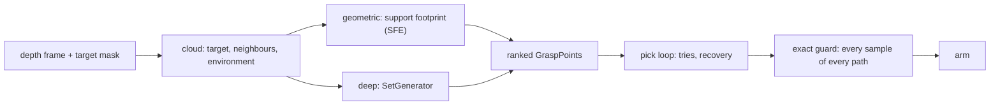

# The learned grasp network (`src/robot/grasping/deep`)

How the deep generator turns a point cloud into grasps, layer by layer, with the numbers the code
holds. This page is for answering "how is the network built?" precisely, and for saying what it can
and cannot add to the analytic generator.

[Workaholic-Willy](../README.md) | siblings: [`grasping-math.md`](grasping-math.md),
[`safety-math.md`](safety-math.md) | package: [`grasping/deep/`](../src/robot/grasping/deep/README.md)

**What it is.** A 6-DoF grasp generator you train on your own parts, selected with one config key
(`robot.grasping.calculator: deep`) in place of the analytic generator (`geometric`). It proposes
grasps; it never decides that a motion is safe. Every proposal goes through the same pick loop, the
same candidate filter and the same exact guard as an analytic grasp.

**What it is not, today.** No trained weights ship in this repository, the owner's cell runs
`calculator: geometric`, and the learned generator has never touched hardware. It is not yet proven
to generalise: the best full run so far did not beat "straight down" on objects it never saw
([Status](#status)). So a cell grasps with trained weights only once their own proof has passed
(`deep/promotion.py`, the owner's decision of 2026-10-09), and nothing can pass one yet. Every other
number below is a shape of the model or a setting of the trainer; none is a grasp-success result.

---

## 0. Where it sits



The two generators fill the same seam (`compute(...)` returns ranked `GraspPoint`s), so the pick
loop, the recovery, the camera world and the guard do not know which one ran. A cell selects one; the
factory never falls back from `deep` to `geometric`, because a cell that silently ran the analytic
generator would report every number under the learned one's name.

## 1. The input: one sample

Built by `corpus/sample.build_sample`, the same function in training and at runtime, so the two cannot
drift apart (a train/serve skew is how a model scores well offline and proposes nonsense in a cell).

| Field | Shape | What |
|---|---|---|
| `points_m` | (N, 3), N = 8,192 | the cloud in **metres**, xy mean removed, the support height subtracted from z: the net never sees where the table was |
| `features` | (N, 5) | per point: the unit surface normal (3), `is_target`, `is_object` |
| `supervise` | (N,) | which points carry a label; only these may be scored |
| labels | (G,) | grasp centre, approach (signed, into the object), closing axis (antipodal), width |

The object is voxelised at 3 mm and the environment at 6 mm, cropped to the object's box plus 150 mm,
as the corpus generator does (`datagen.corpus.clouds`). One training unit is one object, not one
scene.

## 2. The backbone: attention along a space-filling curve

`net/serialized_backbone.py`, plain PyTorch, no compiled extension (a customer trains on their own
box, and a dependency that needs a CUDA compiler there is a product defect). Attention over 8,192
unordered points is quadratic, so the cloud is given an order first:

1. Each point gets a **Morton (Z-order) code**, 10 bits per axis: 1,024 cells per axis, 0.59 mm on a
   600 mm workspace, finer than the 3 mm voxel, so no two points tie.
2. The points are **sorted along the curve**, which puts sequence neighbours next to spatial
   neighbours.
3. **Attention runs inside fixed windows** of 512 consecutive points: cost `O(N x window)` instead of
   `O(N^2)`. Torch's `scaled_dot_product_attention` runs it with flash attention.
4. **The curve changes from block to block**: the blocks cycle through six axis orders,
   `(x,y,z), (y,z,x), (z,x,y), (x,z,y), (y,x,z), (z,y,x)`, so consecutive blocks group the points
   differently and information crosses window borders.

| Setting | Default |
|---|---|
| width (feature channels) | 384 |
| depth (transformer blocks) | 12 |
| attention heads | 6 |
| window | 512 points |
| MLP ratio | 4 |
| position encoding | `linear`: xyz projected once at the input |

The output is one 384-wide feature per point, at **full resolution**: nothing pools the cloud down,
because the next stage chooses seeds per point. The design borrows a published idea (serialised
point transformers) and simplifies it: Z-order curves under permuted axes in place of Hilbert curves.
Whether that costs anything is not measured, and no result of this encoder may be read as one of the
published encoder.

## 3. Where: the graspability field

A small head (hidden width 64) turns every point's feature into one logit: **where a grasp is worth
attempting**. It is trained with binary cross-entropy on the supervised points (weight 1.0 in the
total loss). The seeds are drawn from it, 64 per sample in training, as a flat list of
`(batch, point)` pairs with no padding. The field is detached where the seeds are drawn, so the pose
loss never trains the "where" head by the back door.

## 4. The hand as an input: 14 numbers

`net/gripper.py`. The gripper is not a constant baked into the weights; it is an input, so one net can
serve several hands. The representation is a **swept volume**: at two opening states, the box the
fingers sweep as they close (3 extents and 3 centre offsets each, 12 numbers), plus two added here:

- `pad_span_mm`, the contact patch along the approach (38.0 mm on the 2F-85): a pad modelled as a
  line understates the opening a grasp needs;
- `friction_coefficient` (0.5 on the 2F-85, a 26.6 degree cone): the one number the antipodal verdict
  moves with.

A 32-wide encoder embeds the vector. The choice follows a published ablation: the 12-number swept
volume scored 0.528 mAUC against 0.432 for a TSDF of the gripper and 0.349 for a learned point
encoder (arXiv 2606.00998). For one parallel jaw most of the 14 numbers are constant, and a net handed
the same numbers in every sample learns to ignore them; the corpus is therefore stamped with several
jaws, and `eval/gripper_differential.py` measures whether the proposals actually move when the hand
changes.

## 5. How: the K-slot head

`net/slot_head.py`. A seed usually admits **several** different grasps, and a head with one output
averages them, and the average of two good grasps is usually not one. So each seed gets **K = 4
slots**, each one grasp:

```text
  seed feature (384)  +  gripper embedding (32)
        -> shared trunk, width 256                       one per seed
        -> slot mixing (affine by default)  +  slot query k (32, learned)
        -> output layer -> slot k's 14 numbers:          K = 4 per seed
              approach    3   a direction, normalised at decode
              director    6   the closing axis, sign-free (below)
              offset      3   from the seed to the grasp centre, x 0.04 m
              width       1   0.070 m +- 0.05 m
              confidence  1   a logit: "is there a grasp in this slot"
```

**The learned query per slot** is the standard fix for a known instability of set prediction: without
it nothing ties slot k to any particular grasp, and under the matching below the slots swap modes
between steps and learn the average. With it a slot specialises and keeps its specialisation.
`slot_mixing` chooses how the query enters (`affine` by default; `film` and `mlp` are arms).

**The closing axis is written as a director**, not a vector. A parallel jaw turned 180 degrees about
its approach is the same grasp, so `+c` and `-c` are both right, and one regressed vector settles
between the two, which is no valid pose. The head emits the six numbers of the symmetric traceless
matrix `M(v) = v v^T - I/3`, which is the same for `v` and `-v`: the ambiguity is gone from the output,
not papered over in the loss. Measured outside this repository on a 2F-85, a sign-free representation
scored 79.0 % in simulation and 70.0 % on a real robot, against 65.5 % / 53.6 % for a rotation matrix
and 58.3 % / 55.9 % for a quaternion (arXiv 2410.04826). `||M||` falling short of its target norm is a
free confidence estimate.

**The width is not clamped in the head.** It is conditioned on the hand, and clamping it to that hand's
aperture would make the conditioning look alive while proving nothing. The decoder clamps it (8).

## 6. The learning signal

`train/step.py`, per seed:

1. **Gather the seed's labels** (`net/set_targets.py`), L of them, in the sample's frame.
2. **A K x L cost** (`net/set_loss.grasp_set_cost`): the angle between approaches and between closing
   axes, the offset error and the width error.
3. **Hungarian matching** (`net/assignment.optimal_one_to_one`): each slot is compared with at most
   one label, chosen per seed and per step. This is what lets four slots learn four different answers
   instead of four copies of the average one; slot 0 means nothing by itself.
4. **The loss** of the matched pairs, plus a **confidence target** that teaches an unmatched slot to
   say "no grasp here", plus the graspability term of 3.

| Training setting | Default |
|---|---|
| optimiser | AdamW, learning rate 1e-3, weight decay 1e-4 |
| schedule | cosine annealing over the run's epochs |
| gradient clipping | norm 5.0 |
| batch | 4 samples, 64 seeds each |
| recipe `v1` | refit on every unit after the folds; a collapse alarm at 1 degree of held-out seed spread |
| tier `smoke` | 2 epochs, 400 training units, no refit: proves the chain closes, says nothing about quality |
| tier `full` | 36 epochs, hours on one GPU; a floor, not a ceiling |

**Folds are cut over asset groups**, never over scenes: every variant of one object lands in one fold,
so a held-out number is about objects the net never saw. Before a run costs anything,
`GeneratorTraining.probe()` measures the corpus: `oracle_ceiling` (a head handed the labels' own
grasps; its top-1 is 1.0 by construction, above what the shipped head can express, which ties the
offset to half the width and scored 0.894 with the same grasps on 129 corpus units in the 2026-10-09
review), `baseline_floor` (four heads that learned nothing: `random`, `top_down`, `normal`,
`normal_inset`) and the approach headroom. `memorisation_probe` (the seen-unseen gap against an
untrained net's) needs trained weights, so it runs at the end of each fold, and nothing acts on its
result. A **hit** is a top-1 slot within 15 degrees and 20 mm of a real label; `top_down`, every slot
straight down at the seed, is the arm to beat.

## 7. The generative head: an arm, off by default

`net/generative_head.py`. K slots bind at most K of a seed's labels, so the slot head's coverage cannot
reach 1.0 where a seed admits more. The generative head models the distribution instead: a
**denoising head over the pose** (approach 3, closing axis 3, offset 3, width 1), conditioned on the
seed feature and the gripper; given a noised grasp and its timestep it predicts the noise, and sampling
walks that backwards, as many times as a caller wants. Translation and rotation run on **separate noise
schedules**, because an offset is metres and an axis a direction. It replaces the slot head rather
than joining it, so the comparison runs on identical seeds and folds. **Nothing about it is measured
yet**: the only claim it supports is that the shape is buildable.

## 8. From slots to grasps in a cell

`set_decode.py` and `calculator.py`, under `calculator: deep`:

| A slot's output | becomes |
|---|---|
| approach | normalised; it points into the object |
| director | its top eigenvector, Gram-Schmidted against the approach: the closing axis (its sign is arbitrary) |
| seed + offset | the grasp centre, back from the sample's frame to the scene's, metres to millimetres |
| width | clamped to what the cell's gripper can open to |
| confidence | the score, through a sigmoid |

The proposals are made **on the target only** (every training sample masked its loss to a target, so
the field means nothing elsewhere), put through the same geometric rejection as the analytic
candidates (a collision with the scene, the table, a width the hand cannot open to), with the same
counters, so the recovery routes on the same reasons; then ranked by that score and handed to the pick
loop as ranked `GraspPoint`s. From there nothing is different from an analytic grasp: the tries, the
camera world and the exact guard on every sample of every motion. The calculator never raises: a
failure returns a `GraspResult` with a typed reason.

## 9. Size

**21,506,799 parameters** at the defaults; `SetGenerator(SetTrainingPlan().model).parameter_count`
measures it. Almost all of it is the backbone (12 blocks of width 384); the graspability and slot
heads are small.

## 10. Not to be confused: the ranker

`deep/ranker/` is a different product: a gradient-boosted tree that **re-ranks the analytic
generator's candidates** from their features. On a cell it runs in shadow (`deep_ranker` in the
robot config): it logs what it would have ranked first (`deep_ranker_would_change_top1`) and changes no
order and no decision.

## 11. What a trained network can and cannot add

The analytic generator on the grasp bench (2026-10-06) clears a mat of 20 parts 20/20, the bin's
single scenes 10/10, clutter 10/12 and a tray of 12 7/12. What stops it now is mostly not a missing
idea of where to grasp:

| What stops a pick today | Does the network help? |
|---|---|
| a grasp the calculator offers and the guard refuses 0.1 to 1.6 mm short (a tray's wall, a dense bin's standoff) | **no**: the calculator's world and the guard's disagree, a geometric consistency fix (a millimetre more slack, the guard's own hand meshes in the calculator) |
| no room at all: the open hand does not fit beside a wall or between two parts | **no**: a network cannot make room; a push, another approach, another hand (a narrower pre-open on a position-controlled Robotiq, a suction cup) can |
| a part the support-footprint geometry describes badly (curved, hollow, irregular) | **not shown**: learning grasps from labelled examples of your own parts is what the network is for, and no run has shown it yet ([Status](#status)) |
| which of several valid grasps holds best on the real part | **not shown**: it would take a run that passes its proof in simulation and then on your cell, and none has |
| time: the fine orientation search costs about 3.4 s per part on the bench | **likely**: one forward pass replaces the search; not measured on a cell |

So the geometric generator is close to its limit where the space is really too tight, and the
remaining geometric levers are consistency between the calculator and the guard, not new
orientations. The network is meant to be the lever for grasp quality on real, irregular parts and for
speed; that it is one is not shown yet. It needs a corpus of your own parts
([datagen/](../datagen/README.md)), a `full` training run and a proof of that run that passes before a
cell may select it, and the factory refuses it for a cell until then.

## Status

| Capability | Evidence |
|---|---|
| From a simulated corpus to trained weights the factory loads for evaluation | measured in simulation |
| From a published corpus to the same weights (`PublicCorpus`) | the import writes the format the loop reads, and a smoke run closes on it |
| Grasp quality of a trained generator | not shown. The best full run so far did not beat "straight down" on objects it never saw: +0.017 top-1 over `top_down`, 95 % interval [-0.0004, +0.039], over 54 held-out objects (the 2026-10-09 review). The pipeline is not yet proven to generalise, and a customer's own run gets its own proof before a cell uses it |
| The corpora it was measured on | a known data defect, being fixed: in every MuJoCo-rendered corpus the jaw labels of scanned meshes sit about 45 mm (median) off the geometry the camera rendered. Every held-out object of that run is such a mesh, so its number cannot tell a working model from a broken one until the labels are fixed |
| A cell grasping with trained weights | refused until the promotion record beside them says their proof passed at `active` (2026-10-09); nothing writes one yet (`deep judge`, `deep promote`, coming) |
| The learned generator on a physical cell | never touched hardware; the owner's cell runs `calculator: geometric` |

The training route from a CAD export to a model a cell selects is
[train_your_own_generator.md](runbooks/train_your_own_generator.md); the package's own page is
[`grasping/deep/README.md`](../src/robot/grasping/deep/README.md).
