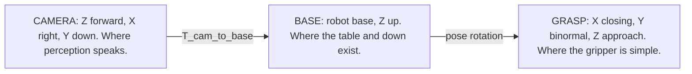

# The math behind `src/robot/grasping`

How a sentence and a depth image become a 6-DoF pose the arm can execute. This page states every
formula the stack evaluates, and next to each one the way it fails.

[Workaholic-Willy](../README.md) | sibling: [`safety-math.md`](safety-math.md) | package:
[`grasping/`](../src/robot/grasping/README.md)

The safety layer's math is closed form and answers whether a motion may run. The grasping layer's
math answers a harder question, where the gripper should go, and almost every step there is an
estimate over noisy data. This page exists so that the pipeline reads as "apply the formula" rather
than "re-derive it", and so that each step's failure mode is written beside it.

**Conventions used throughout.** Positions are millimetres, orientations are XYZW unit quaternions,
every pose is tagged with a `Frame`, rotations are right handed, and angles are radians internally.
`norm(v)` is the Euclidean norm, `v_hat = v / norm(v)`, `dot(a, b)` is the scalar product, and
`clip(x, a, b)` saturates.

---

## 0. Three frames, and why the choice is not cosmetic



Each frame makes one thing trivial and another thing wrong:

| Frame | Trivial in it | Wrong in it |
|---|---|---|
| CAMERA | back projection, masks, the 2D silhouette | horizontal, the table, down |
| BASE | the support plane, gravity, the workspace box | anything derived from image axes |
| GRASP | the jaw's own geometry, a box test on three axes | everything else |

Every frame defect this stack is built to prevent has one shape: a quantity computed in one frame
and read as though it were in another. Section 3 is the largest example. The countermeasure is
structural rather than a convention: geometric objects carry their frame tag, so `SupportPlane`
states which frame its `normal` and `offset_mm` are expressed in, and a table height in BASE cannot
be silently compared against a depth in CAMERA.

---

## 1. Pixels to points, back projection

Given the pinhole intrinsics `K = [[fx, 0, cx], [0, fy, cy], [0, 0, 1]]` and a depth `Z` at pixel
`(u, v)`, the camera-frame point is

```
X = (u - cx) * Z / fx
Y = (v - cy) * Z / fy
Z = Z
```

Only pixels inside the segmentation mask are back projected. Invalid depths (`NaN`, infinities, and
anything at or below zero) are discarded before the `[min_depth_mm, max_depth_mm]` band and before
voxel downsampling, so a hole never becomes a point at the origin. `min_depth_mm` defaults to
`1.0`; the upper bound and the voxel size are both optional.

The order matters and it is not obvious. Filtering the band first would keep `Z = 0` holes, because
they fail the band only after being counted, and downsampling first would let one bad point survive
as a voxel representative. Discard, then band, then downsample is the only order in which a hole
cannot reach the cloud.

Code: [`src/robot/grasping/geometry/pointcloud.py`](../src/robot/grasping/geometry/pointcloud.py) and
[`src/robot/grasping/geometry/filters.py`](../src/robot/grasping/geometry/filters.py)

---

## 2. Points to surface, local-PCA normals

For each point `p`, take its neighbours within `radius_mm` (default 15 mm, at least
`min_neighbors = 6`, at most `max_neighbors = 64`, nearest first), centre them, and form the sample
covariance

```
C = transpose(Pc) * Pc / (k - 1)      where Pc = P - mean(P) and k is the neighbour count
```

`C` is symmetric positive semi-definite, so `eigh` returns ordered eigenvalues
`lambda0 <= lambda1 <= lambda2` with orthonormal eigenvectors. The surface normal is the
eigenvector of `lambda0`, the direction of least variance, which is the one the local patch does not
extend along.

Two derived quantities ride along:

```
curvature  kappa = lambda0 / (lambda0 + lambda1 + lambda2)     in [0, 1/3]
planarity        = 1 - clip(kappa, 0, 1)
support          = min(1, k / (2 * min_neighbors))
confidence       = planarity * support                          in [0, 1]
```

**Orientation disambiguation.** PCA gives a normal up to sign. Under `orient_towards_camera`, the
sign is chosen so that `dot(n, c - p) >= 0` for camera position `c`.

`kappa` is a proxy, not a curvature. It is an eigenvalue ratio: good for ranking patches by
flatness, meaningless as a metric radius. The orientation rule is a heuristic and not topology: on a
thin shell seen edge on it can point into the object. Both limits are load bearing downstream, where
`confidence` and `kappa` become the antipodal stability term of section 4.

Code: [`src/robot/grasping/geometry/normals.py`](../src/robot/grasping/geometry/normals.py)

---

## 3. The support plane, and the frame defect it prevents

A parallel jaw closes across an object that is standing on something, so almost every real grasp
closes in the plane the object rests on.

A generator that derives its closing axis from the mask's principal axis has a 2D image-space
direction, and lifting it to 3D by zeroing the camera-frame `z` lands it in the image plane:

```
a_cam = normalise([a_2d.x, a_2d.y, 0])        this lands in the IMAGE plane
```

The image plane equals the support plane only for a camera looking straight down the support normal.
Under any tilt the axis leaves horizontal by roughly that tilt, and a tilted closing axis on a box
does not land on two opposing faces; it lands on a face and an edge, which is a non-antipodal
contact pair.

The correction is one projection: remove the component along the support normal `u_hat`, expressed
in the camera frame.

```
a_level = normalise(a_cam - dot(a_cam, u_hat) * u_hat)
```

`u_hat` is passed in as the support-plane normal and is not assumed to be BASE `+Z`. That is what
lets a tilted tray or a bin floor be handled by the caller without touching this function. A
degenerate input, meaning an axis parallel to `u_hat` such as a grasp closing straight down onto the
table, returns the axis untouched rather than inventing a direction.

Code:
[`src/robot/grasping/generation/_camera_geometry.py`](../src/robot/grasping/generation/_camera_geometry.py),
`CameraGeometry.level_axis_to_support_plane`

---

## 4. Contact search, the antipodal criterion

Two surface points `(p_a, p_b)` with normals `(n_a, n_b)` form a candidate parallel-jaw pair. Let
the closing axis be `a_hat = normalise(p_b - p_a)`. Three terms are computed, each in `[0, 1]`:

```
opposition      = clip(dot(n_a, -n_b), 0, 1)                     do the faces face each other?
axis_alignment  = 0.5 * (abs(dot(n_a, a_hat)) + abs(dot(n_b, -a_hat)))
                                                                 does the jaw close along the normals?
stability       = clip(conf * curv_factor, 0, 1)
                  conf        = clip(0.5 * (c_i + c_j), 0, 1)
                  curv_factor = clip(1 - 10 * 0.5 * (kappa_i + kappa_j), 0, 1)
```

A pair is admitted only if `opposition >= normal_opposition_threshold` (default `0.8`, so the
normals are within about 37 degrees of exactly opposed) and
`axis_alignment >= axis_alignment_threshold` (default `0.5`). Admitted pairs are then blended:

```
score = clip(0.45 * opposition + 0.35 * axis_alignment + 0.20 * stability, 0, 1)
```

The `10 *` in `curv_factor` is the sharpest constant in the pipeline. It means a mean patch
curvature above `0.1` zeroes the stability term outright. And when `find_antipodal_pairs` is handed
a raw `(N, 3)` normals array instead of a `SurfaceNormals` bundle, both `conf` and `curv_factor`
collapse to `1.0`: the stability term becomes a constant and stops discriminating between pairs. It
does not raise. The pairs simply get worse.

These weights are hand-tuned priors, deliberately. The calibrated success model of section 13
re-weights the same signals as independent features, so this layer stays a cheap deterministic
pre-filter. Learning the prior itself needs a real grasp-outcome corpus.

Code: [`src/robot/grasping/contacts/antipodal.py`](../src/robot/grasping/contacts/antipodal.py)

---

## 5. Support-footprint enumeration, the other generator

The antipodal search asks which two surface points oppose each other. Support-footprint enumeration
asks a different question: what is this object's footprint on the support plane, and where can a jaw
close across it? It plans in BASE, because the support plane and down are BASE concepts, and rotates
its candidates into CAMERA once, at the seam. It is the default proposal stage
(`robot.grasping.geometry.stage`), and it needs both a BASE-frame support plane and a CAMERA to BASE
transform; without either it does not run and the silhouette stage stands.

Its score blends five measured physical margins, each a fraction of a budget the plan did not spend,
with no tuned constants:

```
cone_slack   = 1 - worst_contact_angle / cone_half_angle       depth inside the friction cone
width_margin = 1 - span / jaw.aperture_mm                      aperture left over
table_margin = min(1, (lowest_point - support_height) / 20)    fingertip off the table
upright      = max(0, dot(-approach, z_hat))                   how top-down the approach is
centred      = 1 - min(1, abs(t_enter + t_exit) / max(span, 1))  anchor centred in the span

score = 0.35 * cone_slack + 0.20 * width_margin + 0.20 * table_margin
      + 0.15 * upright    + 0.10 * centred
```

These candidates are deliberately not re-ranked by the geometric scorer of section 9. The breakdowns
are built with this stage's own score as `total_score` directly, and `stability_score` and
`reachability_score` are left at `0.0` and said so, because a single blend of physical margins does
not decompose into the calculator's three categories and splitting it into those buckets would be an
invention. The real margins ride along in `metadata` instead.

Code: [`src/robot/grasping/generation/support_footprint.py`](../src/robot/grasping/generation/support_footprint.py)
and
[`src/robot/grasping/generation/_support_footprint_stage.py`](../src/robot/grasping/generation/_support_footprint_stage.py)

---

## 6. Contact pair to grasp pose, constructing the frame

A `GraspPose` is a full `SE(3)` frame whose rotation columns are `[closing, binormal, approach]`.
Given the closing axis `x_hat` and a preferred approach direction `a`, the construction is a
Gram-Schmidt with a handedness fix:

```
x_hat = normalise(closing_axis)
z_hat = normalise(a - dot(a, x_hat) * x_hat)   approach, projected perpendicular to the closing axis
y_hat = normalise(cross(z_hat, x_hat))         binormal
z_hat = normalise(cross(x_hat, y_hat))         re-derived, so the triad is exactly orthonormal

R = [x_hat | y_hat | z_hat],  and if det(R) < 0, flip y_hat and rebuild
```

If the preferred approach is parallel to the closing axis the projection collapses; the generator
then walks a list of fallback approach axes and raises only if every candidate is dependent. It
never guesses a direction.

`GraspPose` validates on construction: finite entries, `transpose(R) * R = I` and `det(R) = +1`, and
scores in `[0, 1]`.

**Rigid transforms must re-orthonormalise.** `transform_grasp_pose` composes the pose with a
calibration matrix and re-orthonormalises the result by SVD Procrustes, because the two validators
hold different tolerances on purpose: `validate_transform` admits orthonormality within `1e-4`,
since a real calibration matrix carries numerical slack, while `GraspPose` re-validates at `1e-6`.
Without the cleanup, inherited slack trips the strict gate and raises in the middle of a pick.

Code: [`src/robot/grasping/planning/pose_generation.py`](../src/robot/grasping/planning/pose_generation.py) and
[`src/robot/grasping/planning/reachability.py`](../src/robot/grasping/planning/reachability.py)

---

## 7. The gripper envelope, a box test in the grasp frame

The candidate pre-filter asks whether the end effector fits. Scene points are transformed into the
grasp frame, where the gripper is a small set of axis-aligned boxes:

```
q = transpose(R) * (p - t)      a world or camera point p becomes a grasp-frame point q
```

A point collides if and only if it lies inside any gripper box, inflated by `collision_margin_mm`:

```
abs(q_x - b_x) <= h_x + m  and  abs(q_y - b_y) <= h_y + m  and  abs(q_z - b_z) <= h_z + m
```

Table clearance is the minimum signed distance from the support half-space to any envelope corner:

```
clearance = min over corners of dot(corner - p_plane, n_hat_plane)
```

The clearance is a distance along the plane normal, and the finger pad's thickness runs along the
closing axis. For a top-down grasp the closing axis is horizontal, so subtracting a finger thickness
from a vertical clearance is a category error that puts short objects out of reach for no physical
reason. A gripper may set its fingertip on the table; it may only not go through it.

The envelope is also what sets the floor on object height. With the shipped parallel-jaw geometry
the fingertip reaches `fingertip_depth_mm` (default 28.72 mm) below the anchor, so clearing
`support.min_clearance_mm` (default 5.0 mm) needs an object at least 33.72 mm tall for a top-down
grasp, even with the grasp sitting on its very top edge. That is gripper geometry rather than a
threshold: shorter parts need suction or a different end effector.

Code: [`src/robot/grasping/collision/gripper_model.py`](../src/robot/grasping/collision/gripper_model.py) and
[`src/robot/grasping/collision/table_collision.py`](../src/robot/grasping/collision/table_collision.py)

---

## 8. Force closure, the two-contact certificate

For two point contacts with Coulomb friction coefficient `mu`, Nguyen's (1988) criterion for force
closure is that the line `v` joining the contacts lies inside both friction cones:

```
-dot(v_hat, n_a) >= cos(arctan(mu))   and   dot(v_hat, n_b) >= cos(arctan(mu))
```

and the threshold has a closed form that avoids the transcendental entirely:

```
cos(arctan(mu)) = 1 / sqrt(1 + mu * mu)
```

The certificate reports `cos_alpha_a = -dot(v_hat, n_a)` and `cos_alpha_b = dot(v_hat, n_b)`, both
clipped to `[-1, 1]`, and

```
margin = min(cos_alpha_a, cos_alpha_b) - cos_threshold      certified iff margin >= 0
```

This proves force closure under a contact model. It is not a wrench-space proof and it is no
substitute for hardware force feedback. It ships off by default and is used as a transparency
signal.

Code: [`src/robot/grasping/scoring/force_closure.py`](../src/robot/grasping/scoring/force_closure.py)

---

## 9. Scoring, four axes and one blend

Every scorer is pure and never rejecting, because hard rejection is a calculator and safety concern.
Each axis is itself a normalised weighted sum of components.

**Geometric**, is this a good grasp on this shape?

```
width_fit = clip(1 - abs(w - mid) / half_range, 0, 1)       mid = 0.5 * (w_min + w_max)

geometric = (0.40 * antipodal + 0.25 * normal_opposition
           + 0.25 * axis_alignment + 0.10 * width_fit) / sum_of_weights
```

**Stability**, will it stay held?

```
table_clearance = clip((clearance - required) / good_margin, 0, 1)

stability = (0.35 * confidence + 0.25 * contact_stability
           + 0.30 * collision_free + 0.10 * table_clearance) / sum_of_weights
```

**Reachability**, can the arm plausibly get there? This is geometry only and not a real IK query.

```
workspace_margin = clip(min_face_margin / good_margin_mm, 0, 1)
approach_align   = clip(1 - theta / max_angle, 0, 1)     theta = angle(approach, preferred)

reachability = (0.70 * workspace_margin + 0.30 * approach_align) / sum_of_weights
```

**Feasibility**, meaning IK quality, approach path and corridor risk. It is present in the telemetry
layout at weight `0.0` by default, with every sub-signal defaulting to a neutral `0.5`.

The top-level blend:

```
total = clip(0.50 * geometric + 0.35 * stability + 0.15 * reachability
           + 0.00 * feasibility, 0, 1)
```

Ranking sorts descending with a deterministic tie-break by input index, so equal scores never
reorder from one run to the next.

The default `feasibility = 0.0` is what makes `total_score` identical to the three-axis blend. Every
advanced re-ranker in this stack is fenced the same way: the shape ships, and the weight is a
separate deliberate decision. Raising it means setting `robot.grasping.feasibility.weight`, which
the [config reference](grasping-config-reference.md) covers along with the mode gate in front of it.

Code: [`scoring/`](../src/robot/grasping/scoring/README.md)

---

## 10. Suction, seal and wrench

A suction grasp has no aperture and no antipodal pair. It has one sealable contact and a press
direction. Two independent models multiply.

**Seal.** Lay concentric rings over the cup footprint in the plane perpendicular to the approach.
For each ring vertex take the nearest surface point within `rim_support_radius_mm` (default 6.0 mm)
and measure the magnitude of its out-of-plane offset, which is the deformation `d` the elastic rim
must absorb. The outer ring is the seal perimeter and the leak path.

```
flatness          = clip(1 - max(d) / deformation_threshold_mm, 0, 1)   threshold default 3.0 mm
perimeter_support = share of outer-ring vertices that found any support at all
alignment         = abs(dot(approach_hat, surface_normal_hat))          1.0 when no normal is given
align             = clip((alignment - floor) / (1 - floor), 0, 1)       floor default 0.5

seal = flatness * perimeter_support * align         in [0, 1]
```

The alignment floor of `0.5` is about 60 degrees, past which a tilted approach earns no credit at
all, because it cannot seal.

**Wrench.** The vacuum force follows from pressure times area, and the elastic ring resists tilting
up to a bending moment:

```
F_vac  = vacuum_kpa * 1000 * A_cup                 newtons, with A in square metres
M_max  = F_vac * r_cup * moment_arm_factor
M_req  = norm(cross(lever, m * g)) * 1000          newton-millimetres, g = 9.81 m/s^2

resist = clip(min(pull_ratio, shear_ratio, M_max / M_req), 0, 1)     the TIGHTEST margin
```

Defaults are `vacuum_kpa = 50.0`, which is inside the 40 to 70 kPa a typical industrial cup pulls,
and `moment_arm_factor = 1.0`. The final quality is:

```
quality = seal                    no payload declared
quality = seal * resist           payload mass and centre of mass known
```

`resist` is the tightest of three margins and not their average. A cup that can hold the weight and
resist the shear but not the tilt does not hold, and averaging would hide exactly the failure that
occurs.

The seal model is analytical: it reads about 1.0 on a flat top and about 0 on a curved or edge
contact, and it has been exercised in simulation. Real vacuum fidelity, meaning air leak, material
porosity and pressure dynamics, is not modelled and has never been validated against hardware. The
Isaac surface gripper is binary and models no seal at all.

Code: [`src/robot/grasping/suction/seal.py`](../src/robot/grasping/suction/seal.py) and
[`src/robot/grasping/suction/wrench.py`](../src/robot/grasping/suction/wrench.py)

---

## 11. Uncertainty, seven channels into one number

The seven typed channels (`depth_confidence`, `mask_confidence`, `occlusion_corridor_risk`,
`feasibility_margin`, `verification_residual`, `topology_risk`, `semantic_confidence`) are fused as
a convex combination of remapped values:

```
U = sum_i(w_i * m_i(u_i)) / sum_i(w_i)     over channels where u_i is not None and w_i > 0
```

`m_i` is a per-channel monotone remap, fitted offline by pool-adjacent-violators (isotonic)
regression against a labelled replay. Monotonicity is the point: a remap that could reorder a
channel would change what the channel means, not just its scale.

A missing channel is skipped and not zero filled. Zero filling would make an unobserved signal read
as maximally certain, and the fusion would grow more confident the less it knew. When every channel
is missing or zero weighted, the snapshot says so rather than returning a number.

The two channels that are not always produced, `topology_risk` and `semantic_confidence`, ship at
weight `0.0`; an operator opts one in by raising its weight.

Code: [`src/robot/grasping/uncertainty.py`](../src/robot/grasping/uncertainty.py) and
[`calibration/`](../src/robot/grasping/calibration/README.md)

---

## 12. Multi-view, deciding two blobs are one object

Fusing clouds across cameras needs an answer to whether camera B's blob is the same object as camera
A's. Three metrics are available and the default is `overlap`:

```
centroid : clip(1 - norm(c_target - c_candidate) / max_centroid_mm, 0, 1)
box_iou  : axis-aligned bounding-box intersection over union
overlap  : count of p in target with a candidate point within neighbour_mm, over count of target
```

A camera must clear `min_score` (default `0.30`) to contribute; below it the camera contributes
nothing for that object, exactly as an occluded camera does. Fusing the wrong object is worse than
fusing one fewer view, because it invents a contact face the generator cannot distinguish from a
real one. `neighbour_mm` defaults to `12.0`, which is larger than a stereo camera's depth noise at
working distance and smaller than the gap between two touching objects.

`centroid` is the trap in this set: it never abstains, so when the target is absent from the other
view it takes a neighbour instead and welds that neighbour's far surface into the cloud the
generator plans on. `overlap` is the only metric that uses the surfaces themselves.

Assignment across a whole view is solved globally with `linear_sum_assignment` rather than greedily,
so one candidate cannot be claimed twice.

Voxel decimation, when enabled, keeps one real observed point per cell:

```
key(p) = floor(p / voxel_mm) as integers,  keep the first index of each unique key
```

That is not a cell centroid. A centroid is a point that was never observed, and the `overlap` metric
is a statement about observed points, so substituting centroids would silently change what the
metric measures. Decimation applies once per cloud and to the `overlap` metric only; the fused cloud
handed to the generator is rebuilt from the full-resolution clouds.

Code: [`src/robot/grasping/multiview/association.py`](../src/robot/grasping/multiview/association.py)

---

## 13. Learning on top, and the one property that decides everything

Two learned layers sit above the geometry, both default off.

**The success model**, `P(success | features)` over a locked 23-feature vector:

```
x -> impute missing entries with the training mean -> standardise or traverse -> sigmoid
  -> isotonic calibration -> p_hat
```

Three model families share that shape: a logistic regression, a gradient-boosted tree ensemble
evaluated by a vectorised numpy traversal, and a ReLU multi-layer perceptron. All three finish with
the same isotonic map, and the map is last because a raw model output is a ranking rather than a
probability, while every downstream fence (blend weight, promotion threshold) is stated in
probability units.

**The pairwise ranker**, trained on `(winner, loser)` pairs formed within a group:

```
P(i beats j) = sigmoid(dot(w, x_i - x_j))
```

The consequence nobody notices until the model sits at exactly `0.0`: a pairwise ranker differences
features within a group, so a feature that is identical for every member of a group contributes
exactly zero, however well populated it is. Scene-level, pick-level and object-level quantities are
all in that class. Of the 15 declared ranking features, only a handful describe the individual
grasp; the rest are scene telemetry that cancels. A missing key maps to `0.0` silently, which looks
the same from the outside.

`python -m src.robot.grasping.rl check-dataset` exists to answer this before a training run rather
than after: it reports occupancy at both levels and judges them differently.

Code: [`scoring/success_probability/`](../src/robot/grasping/scoring/success_probability/README.md),
[`src/robot/grasping/rl/ranking_policy.py`](../src/robot/grasping/rl/ranking_policy.py) and
[`src/robot/grasping/rl/readiness.py`](../src/robot/grasping/rl/readiness.py)

---

## 14. Out to the robot

The pose leaves the grasping layer in the BASE frame. For a fixed camera that is one static
composition; for a wrist camera it is recomposed from the live TCP every frame:

```
eye-to-hand :  T_cam_to_base                                          static, from calibration
eye-in-hand :  T_cam_to_base = T_cam_to_tool composed with T_tool_to_base(q_now)
```

A frame lacking a usable `T_cam_to_base`, with no resolver to supply one, fails closed: there is no
motion on an unresolved camera-frame grasp.

From there [`safety-math.md`](safety-math.md) takes over with the workspace box, joint limits, IK
quality, self collision, the payload envelope and motion continuity, under the same rule: no data
means no motion.

Code: [`src/robot/grasping/motion/frame_resolver.py`](../src/robot/grasping/motion/frame_resolver.py) and
[`calibration/`](../src/calibration/README.md)

---

## 15. What this math does not know

| | |
|---|---|
| Whether the grasp survives a lift | Every criterion here is about the moment of closing. Force closure under a contact model is not a dynamics proof, and shake or lift is a physics measurement rather than a formula. |
| Reachability | The reachability axis of section 9 is a workspace box and an angle. Real reachability is an IK query against the arm actually bolted to the table. |
| Concave shape | The analytic reference in [`datagen/grasps/`](../datagen/grasps/README.md) authors many object kinds as a small set of convex solids, so anything it grades is graded as convex primitives. |
| Real sensor noise | Real depth returns holes inside a mask and leaks at mask edges. The robustness the stack carries was developed against rendered depth, which is a starting point and not a proven answer. |
| Whether the prompt named the right object | Grounding is a separate question, answered separately, and the phrase grounder answers it badly on attribute prompts: it returns a confident wrong object rather than abstaining. See [`models/vlm/`](../src/models/vlm/README.md). |

---

## See also

- [`safety-math.md`](safety-math.md) for the other half: workspace, FK, the Jacobian and its
  singular values, capsules and exact meshes
- [`grasping-config-reference.md`](grasping-config-reference.md) for every knob these formulas read,
  and the mode gate in front of it
- [`grasping/`](../src/robot/grasping/README.md) for the architecture these formulas live in
- [`datagen/grasps/`](../datagen/grasps/README.md) for the independent analytic reference that
  grades the output
- [`geometry/`](../src/geometry/README.md) for the frame-safe `Pose` and `Transform` algebra
  underneath
