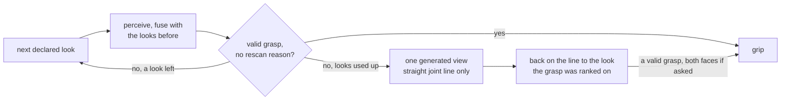

# 5. Assembling and running the pick loop

You have a config tree that validates ([01](01-configuration.md)), perception models that load
([02](02-models.md)), a camera-to-base transform ([03](03-calibration.md)) and an arm whose safety pipeline
is anchored ([04](04-robot-and-safety.md)). This guide puts those pieces into one object and makes
something leave the table.

```python
from willy import Cell, PickRun, Recording, load_tree

cell = Cell.rehearsal(load_tree("console_dummy").robot)   # a dummy arm and a synthetic scene
run = PickRun.from_cell(cell, runs=1, recording=Recording.off()).execute()
print(run)                                                 # what happened, and the rule it passed
```

That runs on a laptop with no GPU, camera or robot, and it is
[`examples/simulation/01_rehearse_a_pick.py`](../../examples/simulation/01_rehearse_a_pick.py). At a real
cell the same campaign starts from `Cell.from_tree(load_tree())`
([`examples/real_robot/12_pick_with_the_camera.py`](../../examples/real_robot/12_pick_with_the_camera.py)).

This page traces the default pick stage by stage, says what each stage may refuse and where the telemetry
record comes from, and lists which advanced layers exist, which are off, and what turns each one on. The
default pick is open-loop. A **wrist camera looks around** before it grips, with no switch to set
(section 5.1), and **recovery** can skip a failed part or push a boxed-in one (section 6.4). The most
expensive mistake here is believing a feature is active because a YAML key exists for it, so read section
7 before you report a number.

## Prerequisites

| # | Requirement | How to check | Guide |
| --- | --- | --- | --- |
| 1 | The config tree validates | `python -m src.config` (exit 0) | [01](01-configuration.md) |
| 2 | You know which keys exist | `python -m src.config where grasping --limit 500`, or [`config/all_keys/`](../../config/all_keys/) | [01](01-configuration.md) |
| 3 | A `PerceptionSource`: anything with `.acquire() -> PerceptionFrame` | see below | [02](02-models.md) |
| 4 | Camera intrinsics, and a `FrameResolver` for BASE-frame grasps | a calibrated intrinsics file, or `get_intrinsics()` on an RGB-D handle | [03](03-calibration.md) |
| 5 | An arm whose vendor SDK is present | `python -m src.robot.drivers.doctor` | [04](04-robot-and-safety.md) |
| 6 | For the simulator: both motion engines anchored | `python -m src.robot.safety.planning --check` | [04](04-robot-and-safety.md) |

On prerequisite 3: one real-camera adapter ships, `RealSenseVisionPerceptionSource`, which
`build_real_components` in `src/robot/execution/autonomous_grasp/cells.py` constructs for a physical cell.
Everything else that implements `acquire()` is simulated or synthetic. For another camera the adapter is
yours to write, and the contract is small: a depth map in millimetres, a 3x3 intrinsics matrix, and
segmentations that each carry a boolean `.mask`.

Shell blocks are Windows PowerShell from the repository root, with POSIX differences noted where they
matter.

## 1. The two constructors

`AutonomousGraspService` has two, and both are live.

`from_robot_config(robot_cfg, calculator=..., perception=...)` is the config-driven path. It reads
`robot.grasping`, builds the arm and gripper through the vendor registry, resolves the grasp mode and the
attempt budget, builds a sub-policy for each enabled block, computes an `EffectiveGraspingConfig`, applies
the orchestrator overlays, and turns on record logging when the config names a path. It accepts `arm=` and
`gripper=` for what config cannot express: a live device handle, such as a simulator gripper that shares
its arm's session.

`from_components(arm=..., calculator=..., perception=...)` takes objects you already built and reads no
config at all: `effective_config` stays `None` and no overlay runs.

| Caller | Constructor | Why |
| --- | --- | --- |
| `build_real_cell` and `build_rehearsal_cell` in `src/robot/execution/autonomous_grasp/cells.py` | `from_robot_config` | a whole cell in one call: physical, or a desk rehearsal |
| `Cell`, `python -m src.robot.execution.real_cell` and the operator console | `from_robot_config`, through those two builders | the program, the terminal and the browser drive one construction |
| `run_multiview_pick.py` with `--boot config`, its default | `from_robot_config` | the simulator booting the way a real cell boots |
| `datagen/rl/occupancy.py` | `from_robot_config` | features from the real stack, not from a copy of it |
| `run_m1_pick`, `run_m2_pick`, `run_dense_pick`, `run_attribute_pick` and `run_eih_pick` | `from_components` | the simulator gripper needs a session the vendor registry cannot reach |

Check the list against the code: `git grep -n "from_robot_config(" src datagen scripts api`, and the same
for `from_components(`.

### 1.1 Which one to use, and what the other one costs

Use `from_robot_config` for anything meant to be operated: a real cell, the console, a rehearsal, or a
simulation run whose numbers should say something about a real cell. Use `from_components` when you hold
objects config cannot describe and want no config path at all, which in practice means the simulator
runners and one-off probes.

If all you want is a cell, call neither directly. `Cell.from_tree(load_tree(), prompt=...)` gives four
ordered steps, `preflight()`, `build()`, `safety()` and `connected()`, and `build_real_cell` and
`build_rehearsal_cell` underneath build the calculator, the perception adapter and the frame resolver for
you. The contract is in the [execution README](../../src/robot/execution/README.md) and the
[autonomous_grasp README](../../src/robot/execution/autonomous_grasp/README.md).

With `effective_config` at `None` and no overlays applied, these stay off whatever the YAML says:
uncertainty fusion, the drift and out-of-distribution watchdog, latency budget enforcement, the service
recovery loop, and every orchestrator setting the overlays would have made. That is what "the caller
supplies everything" means, and it means a measurement taken on `from_components` describes the runner's
own wiring, not a configured cell.

## 2. The default open-loop pick, stage by stage

This is the chain when every `grasping.*` block sits at its shipped default. Call trees and signatures are
in the [autonomous_grasp README](../../src/robot/execution/autonomous_grasp/README.md) and the
[pick loop README](../../src/robot/grasping/loop/README.md); the formulas are in
[grasping-math.md](../grasping-math.md).

| # | Stage | Where it lives | What it can refuse, and why |
| --- | --- | --- | --- |
| 0 | mode check | `service.py`, `_pick_inner` | `MODE_NOT_AVAILABLE`: a per-call `mode=` needs another sampler |
| 1 | perceive | `pick_loop.py`, `_execute_pick` | `NO_PERCEPTION` for a frame with no segmentations. Each retry acquires a fresh frame. A wrist pick handed looks perceives at each look instead, fused (5.1) |
| 2 | resolve the frame | `_best_result_over_segmentations` | one `frame_resolver` call per iteration: all masks in a frame share one TCP pose |
| 3 | generate and rank | `calculator.compute_result` per segmentation, then `_closing_along` | a typed failure reason (below); each mask is computed with the other masks as clutter, and the best score wins. A program's `closing_axis` then keeps only the grasps along it, none left being `no_valid_grasp`; else the cell's natural orientation turns each the nearer way round (5.2) |
| 4 | route the failure | `_execute_pick`, `_RESCAN_REASONS` | a reason in `_RESCAN_REASONS` becomes `rescan`, a fresh frame without motion; any other `exhausted`. A wrist pick handed looks never rescans where it stands: its next view was its next look (5.1), so it ends `exhausted` |
| 5 | execute | `src/robot/grasping/motion/execution_policy.py` | `CAMERA_FRAME_REJECTED` for a grasp not in BASE while `require_base_frame_grasp` is on, before any waypoint |
| 6 | move | the same, `_drive_to` | the arm's route and its `SafetyPreflight` (below); a refusal comes back as `MOTION_FAILED` |
| 7 | close and check | the same | `OBJECT_NOT_DETECTED` when the gripper implements `ObjectDetectingGripper` and reports nothing held |
| 8 | log | `service.py`, `_maybe_log_record` | never refuses: a logging failure cannot break a pick |

The typed failure reasons of stage 3 are `empty_mask`, `no_valid_depth`, `no_candidates_generated`,
`all_collided`, `all_table_conflict`, `all_out_of_workspace`, `ik_failed` and `topology_risk_rejected`.

**What the calculator sees** (`grasping.scene_obstacles`, on for a cell). It holds every object the camera
saw beside the part as an obstacle, named by a prompt or not: everything within 250 mm of the part's mask
grown about 5 mm, depth-step pixels trimmed, less what the part stands on (the supports,
[04](04-robot-and-safety.md) 5.5) and the declared bodies' bands. A part whose every grasp meets one of them
is `all_collided`, the one failure a blocker or a push answers (6.4); one standing lower over its support
than the hand needs (about 28 mm for the Hand-E) is `all_table_conflict`, "too short for this hand"; one
whose only obstacles are its own fragments is `no_valid_grasp`. The calculator says which in one sentence,
in `robot.log` and in the telemetry (`no_grasp_said`), and the support-footprint search counts its refusals
by cause and by what it met (`seen_fingers`, `seen_corridor`, `declared_fingers`, `declared_corridor`,
`own_fragments`, `table`, `span`, `cone`, `prism`, `aperture`, `unseen_corridor`). On the owner's five
recorded looks of a folding rule in a pile (2026-10-02) the calculator had offered three grasps each, every
one with an open finger in a neighbour; with the rule on it offers none and says `all_collided`.

**Side grasps** (`grasping.side_approaches`, on; the owner, 2026-10-01: equal by geometry). The
support-footprint search offers every tilt the hand fits at, scored by the room each keeps from what the
camera saw, and vertical wins a tie, every score within 0.001 of the best of its run counting as one: a wall
12 mm beside a 40 mm cylinder puts a grasp tilted 30 degrees away from it first, with the vertical one still
listed, and a face's normal read off a noisy footprint no longer hands a 15 degree tilt the rank. A grasp 15 degrees or more off vertical is offered
only through space a depth ray saw. The policy lifts every grasp straight up (BASE +Z, `retreat_mm`), and
`Robot.pick` lifts a grasp more than 10 degrees off vertical straight up too, by the standoff and at least
60 mm; an empty hand backs out along its approach.

**The next grasp of the same look.** Where a try was refused by a guard or the planner before anything was
sent (`self_collision_rejected` and its kin, or the planner's own no-plan sentence) and every pose it did
reach kept the open hand's jaw region out of the part's keep-out box, the attempt hands the policy the
look's next grasp, up to twelve in all, every candidate the calculator offers (`GRASPS_TRIED_PER_ATTEMPT`); with `both_faces` only the best. Before
each, a stop asked for and the controller are read, and a wrist pick that sent a motion goes back to its
look on a judged move. A toggle is never switched between tries. The box is judged at the poses a try
reached, not along the planned move to them. At a 10 mm standoff the open jaws stand inside the part's box
(a measured double: the jaws 19.5 to 40.5 mm up, the box's top at 55), so a try that reached its standoff
ends the tries; at 60 mm they stay over it. Each try is a row of `PickAttempt.tries` and a log line ("try 2
of 6 ..."), each refused one at WARNING.

Stage 6 depends on what the arm says about straight lines (`KeepsLines`). An arm that keeps them (a cuRobo
UR or simulator arm, an ik UR, the dummy, the simulator mock) drives a planned move to the standoff, one line
to the grasp and line lifts. An arm that keeps none, such as a simulator on ik or RMPflow, is refused
before the jaws open as `MOTION_FAILED` with status `unsupported` and the arm's reason. An arm that does not
say keeps the interpolated approach. Inside `move()`, the driver's `SafetyPreflight` refuses with a
`[safety:<guard>/<reason>]` message, and the service maps the policy's `MOTION_FAILED` to
`EXECUTION_FAILED`.

Between stages 3 and 5 sit the optional layers: the shadow success probability, the ranking blend, the
uncertainty rerank and the learned-ranker shadow. At defaults each is a no-op that records a skip reason
and returns. Section 7 says what turns them on.

Three things about this chain are easy to get wrong.

**Safety is not in the pick loop.** `SafetyPreflight` is built inside each arm driver and called from that
driver's `move()`. The UR, KUKA and simulator drivers build one; the dummy driver carries none and simply
drives. A run on a dummy arm proves the perceive, generate, rank and dispatch chain, and nothing about the
guards. A test double that implements only `move_to` and not `move` bypasses safety entirely, because
`_drive_to` falls back to the bool surface. If you write a fake arm, implement `move()`.

**A fixed close width bites at the grasp point.** `close_width_mm` is a policy value unless
`_resolve_close_width` derives one, and a fixed narrow close will not lift a wide part. The failure looks
like a grasp-quality problem.

**The jaws open before the approach.** The policy `from_robot_config` builds opens the jaws to the hand's
`max_width_mm` before the first motion (`pre_open_width_mm`: 85 mm on the 2F-85, 49.99 on the Hand-E), so
a close onto a wider part never reaches the gripper as an opening. `from_components` does the same when it
builds its own policy, which it does only with a `frame_resolver`. A policy you pass in keeps what you set,
and `None` there leaves the jaws where the last close left them.

A hand that toggles on one output with no sensor (`jaw_io` with `actuation: single_toggle`) is the
exception: it is never switched before the arm moves, whatever `pre_open_width_mm` says, because a change
of its output there moves jaws nothing reads. It was asked at connect whether its jaws stand open, and the
program counts its own changes from that answer, one per command. A pick that starts with the jaws
believed closed, or with the output switched by hand since the last command, asks the same question again
instead of switching, and with nobody at a terminal to answer, or an abort, it ends `GRIPPER_FAULT` before
any motion ([06](06-grippers.md)).

## 3. The smallest working pick

No GPU, no camera, no robot: the config-driven path on a dummy arm and dummy hand, with a synthetic one-box
scene. What it exercises is the wiring.

```powershell
python -m src.robot.execution.real_cell --rehearse --profile console_dummy --runs 2
```

Abridged, from a run on the shipped tree:

```
=== 1. CONFIG === vendor=dummy (rehearsal) profile=console_dummy (--profile)
  ... 0 blocking, 6 warnings, 0 deferred to the bench.
=== 2. BUILD === from_robot_config
  arm      DummyRobotArm
  gripper  DummyGripper
  safety     UNGATED   DummyRobotArm
=== 3. CONNECT === arm first, then gripper
=== 4. PICK === 2 run(s)
  outcome    SUCCEEDED                    mode=auto
  camera     0 of 3 motion(s) vouched; camera world  UNPLANNED  DummyRobotArm has no planner
  layers     (none)
=== 5. DOWN === gripper first, then arm, then cameras
RESULT: 2/2 succeeded
  rule: every attempt must succeed  ->  PASS
```

Read four things out of that. The warnings are the default state of a freshly configured cell, each
printed with its fix. `layers (none)` says what section 2 says: at defaults nothing advanced is wired. The
connect order is arm first, because activating a gripper can drive digital I/O. And the safety line says
the dummy arm gates nothing, so this proves wiring, not guarding.

The rehearsal keeps your tree and swaps in a dummy arm and a synthetic scene. Without `--profile console_dummy` the base tree's
Robotiq is asked for on a dummy arm, and the connect is refused with `NoRealGripper` and exit 1: a cell
whose hand cannot be built does not come up.

`--check` runs stage 1 alone and touches nothing; `--dry-run` builds without moving. The exit codes and the
stage table are in the [real_cell README](../../src/robot/execution/real_cell/README.md), and the bring-up
procedure in [real_cell_first_pick.md](../runbooks/real_cell_first_pick.md).

## 4. A worked example in the simulator

The simulator runs the whole pick path with no hardware at hand. It is not a separate config tree; it is the
`sim` profile of `config/`. Put `--profile` on the subcommand rather than in the
environment, because `$env:WILLY_PROFILE` stays set for the whole shell and every later command then reports
simulation values.

**Gate on the motion-stack probe first.** It runs without the simulator in milliseconds. You want the
planner reported as available and the reading `fully anchored`. Exit 1 means something is missing, and
`require_motion_stack` in the simulator bootstrap refuses a cell configured for an engine it cannot find
([04](04-robot-and-safety.md)).

```powershell
python -m src.robot.safety.planning --check --profile sim
python -m src.config decisions --profile sim
```

**Then launch.** Use one file-redirected `cmd /c`, because PowerShell `>` writes UTF-16 and corrupts the log,
and a compound command hangs the boot. Run one simulator process at a time, so stop the previous one before
relaunching. Create `logs\` first: it is not committed, and on a fresh clone the redirect fails before the
simulator boots, which reads like a launch failure.

```powershell
New-Item -ItemType Directory -Force logs | Out-Null        # POSIX: mkdir -p logs
$ISAAC = "<your isaac-sim install>\python.bat"
cmd /c "$ISAAC -m src.willy_sim.run_m1_pick --runs 10 > logs\m1.log 2>&1"
```

Expect one `RUN n: ...` line per attempt and one gate line with the pass count. Harder scenes follow the
same pattern, in rising difficulty: `run_m2_pick` (real vision, takes `--prompt`), `run_eih_pick`,
`run_dense_pick --vision`, `run_multiview_pick --mode sides` and `run_industrial_bin_pick`. The runner
inventory and the gate rule are in the [willy_sim README](../../src/willy_sim/README.md).

The same known-pose gate from Python, under the simulator's interpreter
([`examples/simulation/03_isaac_pick_rate.py`](../../examples/simulation/03_isaac_pick_rate.py), which
checks the interpreter first):

```python
from willy import run_gate

result = run_gate(runs=10, headless=True, mode="easy")
print(f"{result.passed} of {result.runs} picks passed, gate passed: {result.gate_passed}")
```

Two traps. Several runners declare `def main() -> None` and always exit 0, so read the gate line, not the
exit code. And `run_m2_pick` forces the model library offline, because the simulator's runtime closes the
HTTP client and an online boot crashes, so a machine with no cached detector weights fails rather than
downloading them ([02](02-models.md)).

## 5. The retry loop, and clearing a whole bin

**`BinPickingOrchestrator.run()` executes one grasp and returns one `PickReport`.** Despite the name it is
not a bin-clearing loop. Clearing several objects is your loop over `service.pick()`.

What the orchestrator adds over a bare perceive, compute and execute: a bounded retry loop that
re-perceives each time, routing by failure reason, arbitration between segmentations, one frame-resolver
call per iteration, multi-camera fusion when it is configured, a wrist camera's looks (5.1), per-pick
state hygiene, and a typed report with the whole attempt trail. The reason-to-action table is in the
[pick loop README](../../src/robot/grasping/loop/README.md).

For clearing, `service.set_target_label(label)` sets a hard label target: only that segmentation is
executable, and the rest stay as neighbour clutter so the collision filters still see them. `None` clears
it. Then loop, and stop on a terminal outcome:

```python
from willy import Cell, load_tree
from src.robot.execution.autonomous_grasp import AutonomousGraspOutcome as Outcome

EMPTY = {Outcome.NO_TARGET, Outcome.NO_VALID_GRASP}           # the bin looks empty
STUCK = {Outcome.EXECUTION_FAILED, Outcome.VERIFICATION_FAILED}

cell = Cell.from_tree(load_tree(), prompt="a red cube")
cell.build()
tray = cell.robot.tool_down(300.0, -250.0, 140.0)             # BASE, inside your workspace, the cell's natural axis
with cell.connected() as live:
    stuck = 0
    for _ in range(20):
        report = live.service.pick()                  # re-perceives from scratch every time
        print(report)
        if report.gripper_fault or report.outcome is Outcome.UNSAFE_RECOVERY_REFUSED:
            break                                     # the hand, or a push that stopped, needs a person
        if report.outcome in EMPTY or report.outcome is Outcome.CANCELLED:
            break
        stuck = stuck + 1 if report.outcome in STUCK else 0
        if stuck >= 3:
            break                                     # stop and diagnose (section 9)
        if report.outcome is Outcome.SUCCEEDED:
            print(cell.robot.place(tray))             # the service picks; placing is yours
```

The service does not place. `cell.robot` is the same arm and hand as a `Robot`, and `Robot.place` places a
held part at a known pose in BASE, a straight line in and out ([06](06-grippers.md)).

A gripper-level "nothing held" surfaces here as `VERIFICATION_FAILED`; there is no
`AutonomousGraspOutcome.OBJECT_NOT_DETECTED`. It is the execution policy's own check after its close,
read off the gripper's `is_object_detected` and `hold_evidence` (a Robotiq's gOBJ), the only
verification a pick runs since the separate post-grasp verification stage was removed on 2026-09-29. `CANCELLED` is not a failure: an operator stopping the run
between attempts is a decision, not a missed grasp, and counting it as `EXECUTION_FAILED` would poison the
pick rate. A stopped or powered-down controller also reads `CANCELLED` at this level; the lower-level
`report.pick_report.outcome` keeps `CONTROLLER_NOT_OPERATIONAL`, which belongs to the `PickOutcome`
enumeration, not to this one.

`PickOutcome.GRIPPER_FAULT` is the other state of the cell rather than of the grasp: a hand that needs a
person. The gripper raised while it was commanded, or a hand that toggles with no sensor would not start
the pick, because it believed its jaws closed and nobody at a terminal said otherwise, or a person
aborted, or a push found nobody can say where that hand's jaws stand, or found a gripper that measures its
width not connected or unreadable, or a toggle's count was found so before `next_target` drove the looks
again (6.4). At this level it reads `EXECUTION_FAILED`, and `report.gripper_fault` says why, so the loop
above breaks on it rather than counting it as stuck. A `PickRun` campaign stops on it rather than
perceiving again.

After a push that stopped where the arm stands, the service itself refuses every later `pick()`
(`UNSAFE_RECOVERY_REFUSED`, nothing asked or moved) until a person decides: `service.start_campaign()`,
which every `PickRun` calls, or `service.acknowledge_needs_person()`. **The console clears it only on a
person's word.** Its pick run and its task read the latch before they start a campaign and never clear it:
`POST /v1/pick` answers `409 needs_person`, a run that meets the latch ends `recovery_needs_person` with
nothing commanded, and "Zelle ist frei" (`POST /v1/cell/acknowledge`) is the one thing that clears it.

### 5.1 A wrist camera looks around

A wrist camera sees what the arm points it at. So a wrist pick **looks**: the arm goes to each look in
turn, the camera perceives there, and every look is **fused** with the ones before it. What the looks are
for is a **safe grasp point**, never a whole scan of the part. Multi-view with arm motion is a wrist
camera's alone: a fixed camera never moves to see more, and fixed cameras fuse with each other where they
stand (`fusion.geometry`, section 7).



**Where it looks from.** Looks are joints, `JointPositions.deg(...)` as the pendant shows them, or
`"home"`, visited in order: the program's (`PickRun.from_cell(cell, ..., look=[...])` or
`service.pick(look=...)`), else the cell's `robot.look_joint_positions_deg`
([01](01-configuration.md)), else home. `PickRun` and the console always hand a wrist pick its looks. A
bare `service.pick()` with no `look=` perceives from where the arm stands, and rescans there, as it always
did. The arm reaches each look with its own judged verb: `move_to_joints`, the straight joint line first
and a guarded plan around it, or the gated home. Nothing is said to the hand before or between looks.
**Order the looks so the part's open side comes first**: the early stop rewards the look that shows the
most.

**The early stop.** After every look the grasp is computed again on everything the looks saw of the part,
so a better grasp on more of the part is taken. The looking stops at the **first look whose grasp is valid
and carries no rescan reason**. An uncertain grasp, or none, goes on to the next look. Looks whose
detector calls the part by different labels make its grasp uncertain, and the pick looks on. Once a look
ranks a valid grasp, its part is kept: a later look finds it by association, and a look that misses it is
left out and said. One INFO line per pick says where the looks ended and how many of the looks that saw
the part called it what the judged look calls it: `label agreed in N of M looks`. It changes nothing; only
a disagreement acts.

**`both_faces`.** Off by default, and the fast choice. `PickRun.from_cell(..., both_faces=True)`,
`service.pick(both_faces=True)` or `locator.look_around(..., both_faces=True)` asks that **both jaw
contact faces of the chosen grasp were seen before the jaws close**: the switch for safety-critical parts.
A wrist pick then looks on until a view shows both, its generated view included. Where none does, nothing
is gripped: the attempt reads `faces_unseen`, the service `no_valid_grasp`, and the failure line names the
face, `the contact face at jaw 2 of the chosen grasp was not seen from any view`. A fixed camera cannot
look around, so it grips only a grasp its cameras showed both faces of, and ends the same way otherwise.
The grasp gripped is the one whose faces were judged: the reranks and the approach check's fall-back to
another candidate stand down. With `both_faces`, the way round comes from the cell's natural orientation
(`robot.natural_closing_axis`) and one axis to close along from the program's `closing_axis` (5.2): both
act before the faces are judged, so the faces judged are the faces gripped. The simulator's twist,
`GraspMotion(align_closing_to_base_x=True)`, turns every grasp after the judging, onto faces nobody judged,
so asking for it with `both_faces` raises `ValueError` before anything moves. A suction cup has no jaw faces
to see.

**A refused look.** A look a guard or the planner refused **before anything was sent** is skipped, said as
a WARNING, and counts as used up: the pick goes on with its next look and the views fused so far, and the
one generated view may still follow. A pick that reaches **none** of its looks ends `look_refused`, with
nothing perceived and nothing else commanded; the service reads `execution_failed`. Three more things end
the looking there, with nothing else commanded: a look motion that failed once it may have been commanded,
a look motion its verb refused before any command, and a controller that stopped on the way. A camera that
cannot vouch for the cell on the way is a fault of the cell, as on every motion of a pick.

**A look in the planner's cushion band.** A look the planner's padded spheres refuse while the exact guard
accepts it, the owner's LOOK[0] and LOOK[1] among them, runs: the exact guard decides the arm's own pairs
([04](04-robot-and-safety.md), section 6). The arm reaches it and leaves it on straight lines, as every look
tries first. A **planned** move out of it or into it takes a straight leg of **at most 20 degrees per joint**
to the nearest pose both authorities clear, automatically, then cuRobo plans. The generated view and the move
back never take a leg. On the GPU probes' cell, which carries no wrist housing, LOOK[1] sits at the cap: the
nearest wrist_1 turn both clear is +19.5 and its leg is +20.0. Whether a look of your cell keeps a leg is what
its own screen line says. Every look is screened where it is taught, where the planner starts at the desk and
where a campaign starts, one line each. What to do, line by line:

- `clear`: nothing.
- `in the planner's cushion band` ending `Nearby, both clear: (...) deg`: **it runs**, and a planned move
  takes its leg. Nothing to re-teach while the line names that pose.
- `in the planner's cushion band` naming no nearby pose: **straight lines only**. If planned moves have to
  reach it or leave it, re-teach it by hand where both clear it and screen it again; the screen names no pose
  to copy.
- `beside the boxes the camera saw`: **straight lines and moveL with a hand known empty and open**; only the
  camera's boxes refuse it on the planner's world, and the exact guard decides them. Nothing to do for a look.
  A planned move into it or out of it is refused, and so is any move while the hand carries a part or cannot
  say it stands open ([04](04-robot-and-safety.md), section 6).
- `ERROR`: **nothing drives there**. Re-teach it at the nearby pose where the line names one, otherwise by
  hand elsewhere, and screen it again.

**The one generated view** is the last resort. Once every declared look is used up, reached or refused,
and the grasp is still not safe enough, the pick may generate **one** more view. It turns the look that saw
the part about the part, toward the **jaw contact face of the chosen grasp that no view showed**. With no
grasp, it turns toward the side no look faced. It may turn up to half a turn, smallest turn first, three
lines at most, each turn screened by the arm before it moves and driven on the **straight joint line
alone**, never planned by cuRobo ([04](04-robot-and-safety.md), section 6: 150 degrees of travel per
joint, half a turn from home, a WARNING past 120 degrees). It is perceived and judged as a look. No view is
generated where no look saw anything, where both faces were seen already, on an arm without the verbs (the
simulator's, the desk arm's), or where the planner world does not hold the frames of the pick; an INFO
line says why.

**The move back.** Where the grasp was ranked on another look than the one the arm stands at, the arm goes
back there on the straight joint line, held to the same cap. Refused, the approach starts from where the
arm stands, planned and judged as every approach is, and a WARNING says so.

**Under the decision gate.** With `grasping.decision` on, a wrist pick looks around first
(`BinPickingOrchestrator.look_around()`, a wrist camera's alone: on a fixed camera it raises `ValueError`
with nothing moved), the gate decides on the grasp the looks judged, and on `GRASP_NOW` the pick goes on
with that judgement (`go_on_with`) without looking again. A refusal ends the pick with nothing gripped.

**Everything the looks saw feeds the pick.** Every frame the wrist camera takes **from the first look the
arm stands at** stays in the arm's planner world until the pick ends, however it ends, twelve at most, so
every motion of the pick is judged against all of them. The pose the pick started from is not held, and a
first look refused before anything moved starts no hold. The part's fused cloud is the cloud its grasp is
computed on, the target the planner world leaves out and the centre the report gives. The support plane is
refined from all the views, the neighbours of every look go into the collision filter, and points seen at a
grazing angle (past 75 degrees of incidence) are thinned before a look is fused.

**The hand-eye check.** Two looks of one part measure the surface they share in the same place, up to
depth noise. The pick prints the median distance on its `hand-eye` line, and above **6 mm** a WARNING says
the hand-eye calibration may have drifted. Nothing is changed for it ([03](03-calibration.md), 3.4).

**What the report says.** `print(report)` adds a line for each of these, only where it applies:

| Line | Says |
|---|---|
| `looks` | the looks perceived from, and which were fused into the grasp's cloud |
| `skipped` | a look refused before anything was sent, and why (`telemetry['looks_skipped']`) |
| `faces` | whether each jaw contact face of the chosen grasp was seen, and `both required` under `both_faces` |
| `generated` | the one generated view and how far it turned about the part |
| `approach` | the move back was refused, so the approach ran from where the arm stood |
| `hand-eye` | the hand-eye check, with the drift warning above 6 mm |

The same values are fields of the report (`looks`, `looks_fused`, `jaw_faces_seen`, `generated_view_deg`,
`hand_eye_gap_mm`, `both_faces`) and, `both_faces` aside, of each `PickRun` attempt, which adds
`views_file` where `record_views` kept the looks. The console's `pick_result` event carries `looks` and
`looks_fused`, and `jaw_faces_seen`, `generated_view_deg`, `hand_eye_gap_mm` and `refused_look` where set.

**What the log says.**

| Level | The line says | Means |
|---|---|---|
| INFO | `the looks stop at look ...; label agreed in N of M looks` (or where else they ended) | the one account per pick of where its looks ended; nothing acts on it |
| WARNING | `closing_axis '-y': none of the N grasp candidate(s) closes within 30 deg of it` | the program's closing axis left the part no grasp (5.2) |
| WARNING | `look ... was refused before anything was sent` | skipped; the pick goes on to its next look or the generated view |
| INFO | `no view is generated: ...` | why, where one was due |
| WARNING | `generated view ...: the arm drove there on the straight joint line only` | a generated move past 120 degrees, said once the arm stands there |
| WARNING | `moved back to look ... on the straight joint line only` | a move back past 120 degrees |
| WARNING | `the move back to look ..., which saw the part, was refused` | the approach starts from where the arm stands |
| WARNING | `the looks measure the part's shared surface ... more than 6.0 mm` | check the hand-eye calibration |
| ERROR | `the pick reached none of its looks` | `look_refused`: nothing perceived, nothing else commanded |
| ERROR | `the motion to look ... was refused before any command` | nothing was sent, and the looking ends there |
| ERROR | `the motion to look ... failed once it may have been commanded` | the arm may have moved part of the way; nothing else is commanded |
| ERROR | `... not seen from any view: both_faces asks for both before gripping` | `faces_unseen`: nothing gripped |
| INFO | `no grasp: ...` (the calculator's sentence) | why the part got no grasp: a neighbour, the support, too short for the hand (section 2) |
| WARNING | `try 2 of 6 (rank 1) motion_failed: ...` | a grasp refused before anything was sent; the next of the same look follows where the hand kept out of the part's box (section 2) |
| WARNING | `try 1 of 6 (rank 0) judged from where the arm stands, nothing moved: ...` | the grasp's standoff, line in or lift would be refused; nothing moved, and the next grasp follows (6.4) |
| INFO | `not taken away as a blocker: ...` | why each neighbour beside the part is no blocker (6.4) |
| INFO | `clear the blocker (set_aside): ...` | a neighbour was taken away and the arm looked again; any other code says why none was (6.4) |
| WARNING | `the world refused near ...: N of the M box(es) it holds lie within 300 mm of it: ...` | the boxes the planner held where it refused, nearest first ([04](04-robot-and-safety.md), section 6) |

These lines reach `robot.log` beside each module's own file (`pick_loop.log`, `grasp_service.log`,
`pick_run.log`, `generated_view.log`), and every handling verb that fails leaves a WARNING with its message
there (`handling.log`): the owner's cell kept the reason of a failed pick in no file (2026-10-01).

**Keep the views: `record_views`.** `PickRun.from_cell(..., record_views=True)` keeps each pick's looks
for training: one `.npz` per pick under `logs/robot/views`, named after the pick's record (`attempt_id`),
with each look's colour and depth, the tool pose stamped at its shutter, the lens, CAMERA to BASE, and the
fused target cloud. Off by default. A fixed camera has no looks to keep, and a file that cannot be written
is said while the campaign goes on. The layout is in
[`record_views.py`](../../src/robot/execution/record_views.py).

**Locate first, then pick.** A program that locates before it picks
([`examples/real_robot/13`](../../examples/real_robot/13_pick_and_place_with_the_camera.py)) looks around
with `locator.look_around(prompt, looks, robot=robot, both_faces=False, record_views=False)`: the same
fused looks, early stop, generated view and move back, answering with a `Located`. Name a
`closing_axis=` there, once: the looks judge the grasps along it, and the part's scene takes it (5.2). Its
per-look INFO line ends `label agreed in N of M looks` too. Its frames stay held in the planner world, from
the first look the arm stands at, until `Robot.pick` ends, the next look around or the disconnect; the next
look around lets go of them before it moves (`LivePlannerWorld.holds_pick_views`). A place's target has no
grasp to judge, so it is found look by look, and the first look that sees it answers. The part's hang for
the set-down is measured from `scene.part_bottom_mm`: the declared table, lowered to where two or more
looks measured the part's foot, never raised, so the part is never pressed in. A pick whose report says
`another_candidate_may_follow` (its first motion refused before anything was sent, or the carried lift
refused and the empty hand backed out) left the jaws open; example 13 then looks around again and takes
`scene.grasps().other_than(refused).best`, which leaves out a grasp within 10 mm and 15 degrees of one
already refused, up to three times.

### 5.2 Which way the jaws close

A parallel jaw grips the same two faces either way round: two wrist turns half a turn apart about the
approach, the jaws swapped. Two things choose the way round, and both choose **before anything judges the
grasp** (stage 3), so the target choice, the looks' judgement and jaw faces, the reranks, the approach
check and the push read the grasp that is gripped, and `both_faces` works with either.

**The cell's natural orientation.** `robot.natural_closing_axis` names how the hand and its camera
naturally stand ([01](01-configuration.md)): a name `Pose.tool_down` takes (`x`, `-x`, `y`, `-y`,
`radial`, `-radial`, `tangential`, `-tangential`) or a taught pose's quaternion `[x, y, z, w]`, of which
only the heading of its tool +X on the base XY plane counts. **Every camera grasp** then takes the wrist
half-turn whose tool +X lies nearer that direction at its place, and so does every push (6.4). **Grasps stay
free**: any closing direction, any tilt, none left out. Unset, nothing is turned. The owner's cell sets
`"-y"` in its own profile on the cell PC, where its wrist D415's image stands upright; nothing in `config/`
sets it, and without it a cell behaves exactly as before. A fixed pose through the cell follows it too:
`robot.tool_down(x, y, z)` closes along it, along base x where the cell names none
([04](04-robot-and-safety.md)).

**A program's closing axis.** `GraspMotion(closing_axis="-y")`, the same values, is an opt-in filter:
only grasps whose closing axis **heads within 30 degrees** of it, either way round, are taken, each turned
the named way round. **Choose, don't twist**: the heading counts, the tilt stays free. While it is set the
ranking asks the calculator for 36 candidates and keeps as many along the axis as it keeps without one (12
by default), as `Scene.grasps` does. It wins over the natural orientation, and a pick none of whose grasps
closes along it ends `no_valid_grasp`, its failure line naming the axis and the 30 degrees.
`Cell.from_tree(tree, motion=GraspMotion(closing_axis="-y"))` hands it to every pick of the service and of
`PickRun`; `Scene.grasps(closing_axis=...)` and `locator.look_around(..., closing_axis=...)` take it for a
located part, whose scene keeps the axis its looks judged and refuses another. There is no config key for
it: it is a program's choice.

**The simulator's twist.** `GraspMotion(align_closing_to_base_x=True)` turns every grasp about base Z after
the judging, onto faces nobody judged. Beside `both_faces` or a `closing_axis` it raises `ValueError` before
anything moves, and beside it the natural orientation turns no grasp; a push still takes its way round.

Where either changed a result, the grasp overlay (`last_debug_image_png`) is drawn again over the grasps
kept, each the way round it closes.

### 5.3 What the planner's camera world holds

The camera world is a **height map** of what the cameras saw
([`height_map.py`](../../src/robot/safety/planning/height_map.py)): each object laid on a grid in its own
turn, every cell keeping its highest seen point, cells of like height merged into boxes. Every box is
**turned about base Z the way the object stands** and runs **from the bench to its top plus 8 mm**
(`perceived.margin_mm`):

- an **open bin** is its walls with its **inside free**, so the hand reaches into it;
- a **low part beside a tall one** keeps its own height;
- a **turned object** is a turned box, and needs no squaring to base X/Y.

cuRobo and the exact guard hold the same boxes; the guard keeps 3 mm from them, as from the arm itself and a
declared fixture ([04](04-robot-and-safety.md), 5.5). **Where only these boxes refuse the planner's world,
the exact guard decides them**, so a bin the camera saw stands about 30 mm from the shoulder housing (the
guard decides from about 26) where the planner's own spheres alone wanted 50 to 60
([04](04-robot-and-safety.md), section 6). That holds with a hand known empty and open: while the hand
carries a part or cannot say it stands open, and for a planned move into or out of a pose beside the bin, the
planner keeps its 50 to 60, and a grasp there judges its lift carrying before it closes. Where the robot's own
body hides part of an object beside what the cameras saw, the hidden stretch stands as high as what was seen
beside it; what no camera saw at all stays free.

**Never through the robot itself.** The hand hides most where it stands: down at a part it hides the floor
round its own fingers from the wrist camera. A hidden stretch, and the stretch the robot hides between two
objects, is lowered wherever the robot's body stands in it or hangs less than twice the margin over it, until
its box keeps a margin under the robot; lowered to the floor it is gone. A wall runs on into what the hand
hides only where its last two cells stand at one height: a tray's wall and a small part beside it are two
things, not one wall. It runs on as thick as it was seen, not as thick as a cell, and not through the robot
standing in the run itself; beside the hand it still runs on, a wall 6 mm from the fingers being the wall the
self filter took for the hand. On the grasp bench (2026-10-06) a tray's wall filled across to the part through
the fingers, and a part's row ran on into the cell the fingers stood in; every way out was refused.

**The fingers and what they may come to.** A box of a neighbour part the detector named holds the fingers to
its measured surface, the box less its margin (`perceived.fingers_touch_parts`, the owner's "Finger dürfen
streifen"), and lets them 3 mm past it (`perceived.finger_contact_mm`, the owner's "3 mm" of 2026-10-06): the
descending finger may shove the neighbour aside that far, and the open Hand-E needs 15 mm beside a part rather
than 18. The calculator plans them a millimetre short of that, and the whole hand a millimetre further from any
other box than the guard keeps, as the guard's boxes, built from more frames and merged to fit the slots, stand
a little apart from its own: on a tray the line down to four grasps in a row was refused 0.2 to 0.7 mm short.
A finger comes to 1 mm of what a support reads, the mat or the bench (`perceived.finger_floor_mm`, the owner's "bis
auf 1 mm, solange er sie nicht berührt" of 2026-10-06; `grasping.support.min_clearance_mm` 1 to match): the guard
lowers a support solid's top for the fingers by the band, the allowance and its own distance less that millimetre,
and keeps its distance from what is left, so a part 13.5 mm tall is the Hand-E's least. A part thinner than the band
the reading swallowed is the support's, and a finger comes as near it. A support's solid holds the fingers at the guard's distance from the reading and
its excess, not from the solid's top a band and the allowance higher (`perceived.fingers_to_the_support_reading`,
the owner's "wir müssen tiefer gehen", both of 2026-10-05). Every other link keeps the guard's distance from the
whole box, and a box nobody named stays whole for every link.

**64 boxes, merged to fit.** `safety.planning_world.perceived.max_boxes` defaults to **64**, and the planner
reserves **1 + declared + 64** box slots when it starts: **restart the planner after changing it**, and after
updating to this version (65 slots on a cell that declares only its bench). Past the budget the boxes of one
object merge into the box that holds them, the least added volume first, down to one box per object, and the
refresh line says `N box(es) merged into the boxes holding them to fit the slots`. The volume counts the more
the nearer the merged box comes to the motion's goal (twice at 100 mm, five times at 50), so the boxes far
from the hand merge first and those beside the fingers stay as seen; a straight line's world is built about
its lower end, where the hand passes the parts, the goal of a line down and the start of a lift. What still does not fit
refuses the motion, naming `safety.planning_world.perceived.max_boxes`: an obstacle the planner never
received is one it routes straight through. The world's render adds `N cell(s) the robot hid from the cameras
stand as high as what was seen beside them` and a line for every box that may be the robot seen off its
model.

### 5.4 The console's task: pick, place, return

A **task** is the console's unit of work, and the library's verb: pick a part, set it down, go back, and look
again, once or until nothing matching is left. The console's Start runs exactly this, and a program runs it
the same way:

```python
from willy import Cell, JointPositions, PlaceAt, TaskPlan, load_tree, run_task


class Said:
    """What a program hears from a task: each event's sentence, and nothing that stops it."""

    def event(self, name, /, **data):
        print(name, "-", data.get("said", ""))

    def pick_done(self, part, pick, report):
        print(f"part {part}, pick {pick}: {report.outcome}")

    def stop_after_part(self):
        return False

    def halted(self):
        return False

    def abandoned(self):
        return ""


cell = Cell.rehearsal(load_tree("console_dummy").robot)   # a dummy arm and a synthetic scene
cell.build()
with cell.connected():
    report = run_task(cell.service, TaskPlan(object="", place=PlaceAt(pose="drop_left")), hooks=Said(),
                      poses={"drop_left": JointPositions.deg(-60, -95, -120, -55, 90, 0)})
print(report)   # task FINISHED, 1 part placed, the arm back home
```

- **Where it goes.** `PlaceAt(pose=...)` is a taught pose, and it says where the part's **bottom** is let go:
  the tool goes there raised by the part's hang, the grasp height over the declared support, so every error
  goes toward more air; with no grasp pose, `safety.planning_world.payload.length_mm` stands in.
  `PlaceAt(camera="blue bin")` is a bin the camera finds: before the first pick the task visits its looks
  and keeps the bin (its rim the 95th-percentile height, its footprint and opening from the walls' tops),
  then drops each part at rim + hang + air (20 mm, `air_mm=` 10 to 50); a grasp within 5 degrees of
  vertical is turned about the vertical along `robot.natural_closing_axis`. The bin is checked again before
  every drop;
  moved more than min(100 mm, half its diagonal), another footprint or another rim, it is lost: the part
  goes back where it was gripped (`service.put_back`), the arm returns, and the task asks.
- **What it picks.** `object` is the phrase the detector grounds, asked for every such part in a box of its
  own on a cell that grounds a phrase (`task.EACH_SEPARATE`: "each separate green part"), each mapped back
  onto the object named. An empty one, with `pick_anything`, grounds every part (`task.EVERY_PART_PHRASE`,
  "each separate object"), every one a target and called "object" where its words allow. On a mat of 20
  parts Qwen3-VL-4B grounded one box for "object", "all objects" or "every object" and all 20 for "each
  separate object", one of the two green parts for "green part" and both for "each separate green part",
  and both red ones and no orange one for "each separate red part" (2026-10-06). A part the detector names keeps the fingers' rules for parts beside it (5.3), the
  push's 1 mm and the blocker's way into the bin (6.4); a part it does not name keeps the whole rule. The
  grounder writes up to 2048 tokens, about 40 boxes, and keeps the whole boxes of an answer cut off
  mid-list; the 512 it wrote before held 10 to 15. A look takes longer for it: 15 to 28 s for 20 parts on
  this box's RTX 5080 beside the bench, against 2 s for one.
- **How long.** `scope="once"` ends when the part is placed and the arm is back; `"until_empty"` after two
  empty looks in a row. Three failed picks in a row end it where the arm stands, 100 parts end it
  `part_limit`. Its own drop area stays out of its picks for the whole task: the bin's footprint, and 150 mm
  about a pose drop for "until empty".
- **The order.** The service's needs-a-person latch first (`recovery_needs_person`, nothing moved, the latch
  kept), then every taught pose it will use screened before any motion (`pose_refused`), then the picks.
  Benign ends return to `return_to`; a problem leaves the arm where it stands and commands nothing more, an
  output included. A toggle hand changes DO0 exactly twice per part.
- **The hooks** say each step (`event`, the console's event stream) and each pick (`pick_done`), and are
  read between the motions: `stop_after_part` lets the part in hand be placed first, `halted` and
  `abandoned` stop before the next motion.
- **What it refuses** before anything moves raises `TaskRefused` with the console's code: `unknown_pose`,
  `route_refused`, `carried_part_not_modelled`, `object_required`, `closing_axis_refused`, `bad_request`,
  `push_distance_refused`, `camera_target_unavailable`. Every end after the start is the `TaskReport`.

The console wraps it with its gates, the hands-off countdown and the stop record, so after a problem stop
the arm stays where it stood until a person says the cell is clear and chooses Restart or Home, also across a
restart of the server ([`api/README.md`](../../api/README.md), [04](04-robot-and-safety.md) section 8). The pick
refusals a task meets in the console are the same codes, in the order the console checks them.

## 6. Grasp modes and presets

### 6.1 The three modes

Each has a fixed behaviour profile in `src/robot/execution/autonomous_grasp/config.py`.

| Mode | Sampling | Recovery actions allowed |
| --- | --- | --- |
| `easy` | single object | **none**, a guarantee rather than a default |
| `auto` | auto | `rescan`, `next_target` |
| `dense_clutter` | dense | `rescan`, `next_target`, `nudge_target` |

`robot.yaml` ships `default_mode: "auto"`. `resolve_grasp_mode` accepts aliases (`single`,
`single_object`, `dense`, and `None` for `auto`) and raises `ValueError` on anything else, so a typo never
runs the wrong sampler.

`closed_loop` and `dense_autonomous` were removed on 2026-09-29 with the two-scan pre-grasp refinement
they ran (the standoff move, the second frame and the bounded correction), which no shipped config
switched on and no physical arm ran. A tree, a preset or a call that still names one, or its alias
`closedloop` or `autonomous`, is refused with the mode to name instead: `auto` for `closed_loop`,
`dense_clutter` for `dense_autonomous`.

The table is an **outer gate**: an action runs only where the mode lists it **and**
`recovery.allowed_actions` names it, and `allowed_actions` cannot widen the mode. `next_target`, a rescan
that skips the part that failed, joined `auto` and `dense_clutter` the same day; it moves nothing itself.
`nudge_target`, **the push**, moved from `dense_autonomous` to `dense_clutter` and stays there alone, so
`auto` recovery never touches a part; it runs only on a wrist camera's pick, and its fixture box is
**optional**. `container_agitate` is in no mode, and a config that names it without a declared
container is refused at load. `next_viewpoint` left both profiles the same day, merged into `rescan`,
which is what it did once nothing moved the camera for it; a `recovery.allowed_actions` that still names
it is refused, `removed on purpose: use rescan`. What each action does is 6.4.

### 6.2 The per-call override is restricted on purpose

A per-call `pick(mode=...)` changes the behaviour profile only. It cannot rebuild the runtime, which was
bound to a sampling mode at construction, so a mode with another sampler is refused with a typed
`MODE_NOT_AVAILABLE`. The three modes each have their own sampler, so a service stays in the mode it
was built in: you cannot move between modes at call time.

### 6.3 The two presets

Two partial `grasping:` overlays ship in [`config/grasping_presets/`](../../config/grasping_presets/),
each short enough to read in full. `easy.yaml` sets `default_mode: easy` and turns recovery and uncertainty
off, and `dense_clutter.yaml` sets the dense mode with both on; its recovery allows `rescan` alone, so
`next_target` and the push stay off until your own `recovery.allowed_actions` names them. A third,
`verification_heavy.yaml`, set `default_mode: closed_loop` and was deleted on 2026-09-29 with that mode.
**The config loader does not load them.** They are library objects:

```python
from willy import Cell, load_tree
from src.config.schema.robot import RobotConfig
from src.robot.grasping.replay import apply_preset
from src.robot.grasping.replay.presets import validate_preset

validate_preset("dense_clutter")               # merge, re-validate, raise on a bad key
tree = load_tree()
merged = apply_preset(tree.robot.model_dump(mode="python"), "dense_clutter")
robot = RobotConfig.model_validate(merged)     # always do this: apply_preset does not validate
cell = Cell.from_robot_config(robot, app_config=tree.app_config, data_dir=tree.root)
```

That is what "grasping presets bypass schema validation" means: `apply_preset` merges outside the schema,
so a misspelled key survives, and `validate_preset` is the wrapper that catches it. The mechanism,
including the fact that the preset directory resolves from the repository rather than from your `--data`
tree, belongs to [01](01-configuration.md).

One trap in the preset table: `recovery.apply_modes` ships as `auto` and `dense_clutter`, so a
`recovery.enabled: true` in a mode outside that list stays inert. `validate_preset` refuses a preset of
your own that still names a removed mode, with the mode to name instead, and one that still names
`next_viewpoint` or writes a removed block (`verification`, `dense_recovery`), with the sentence that says
what to do.

### 6.4 Recovery: rescan, the next target, and the push

`robot.grasping.recovery` is what a pick does after an attempt failed. It ships `enabled: false`, runs
only in its `apply_modes` (`auto` and `dense_clutter`), and plans only the actions both the mode (6.1) and
`recovery.allowed_actions` name. `easy` never recovers.

| Action | What it does | Modes |
| --- | --- | --- |
| `rescan` | perceives again and ranks afresh; moves nothing | `auto`, `dense_clutter` |
| `next_target` | a rescan that **skips the part that failed**, for another part of the same label | `auto`, `dense_clutter` |
| `nudge_target` | **the push**: slides a boxed-in part aside with the open jaws, inside a wrist camera's pick attempt | `dense_clutter` |
| `container_agitate` | shakes a declared container; refused at load where none is declared | none |

**A refusal before anything moved falls through** to the next action for the same failure. It stays in
the trail, spends no budget and never re-runs the pick. A motion that failed once the arm moved ends the
loop. A loop that ran an action and had none left reads `recovery_exhausted`; a pick that found nothing
keeps `no_target`.

**Rescan on a wrist cell.** A pick handed looks has had its rescans: its looks and its one generated view.
Recovery takes `rescan` out of that pick's actions and says so at INFO, so a rescan never repeats the
looks; only `next_target` runs them again, for another part of the label. A look-less wrist pick and a
fixed camera rescan where they stand.

**The next target.** The part that failed gets an **exclusion zone**: its BASE XY centre, a radius of 30
mm or half its footprint diagonal, whichever is larger, for this pick and the next two. The next attempt
skips every part of that label whose centre lies in a zone, and never takes another object. On a wrist
cell it runs the look sequence again for the new part, with the early stop and at most one generated view.
It also follows a `motion_plan_refused`: the new part's motions are judged in full. Where only excluded
parts of the label are left, the pick stops and says so.

**Before the looks run again.** Before `next_target` drives a wrist pick's looks again, a toggle's count
is read (`why_toggle_count_unknown`, nothing asked or sent). One **nobody can vouch for** ends the pick as a
**gripper fault** before any look is driven again: nothing moves, `report.gripper_fault` says why,
`telemetry['re_pick_refused']` says the re-pick never ran, and `PickRun` and the console run stop on it. A
re-pick that drives no look, a fixed camera's or a look-less wrist pick's rescan, reads nothing more: its own
check before the arm moves asks where the jaws stand, as at every pick start ([06](06-grippers.md)).

**Every grasp is judged before the arm leaves for it.** Where the policy can (the owner's cuRobo UR), the
move to a grasp's standoff, its line in and its lift as if the jaws held the part are judged from the look
first. On URSim (2026-10-03) a lift that turned wrist 1 out of the cable window was refused only once the
hand stood at the part; judged ahead it moves nothing, and the next grasp of the same look follows. A
part every grasp of which was refused that way is treated as one every grasp of which collided. The line in
is judged first, from the standoff's nearest configuration, before the route there is planned: where the
exact guard refuses it at a part that hangs on the flange (a finger, the housing, the wrist camera, wrist 3)
against a fixture, every configuration's line is refused the same and the route is never planned. The route
costs seconds; on the grasp bench (2026-10-06) a bin's corner spent 17 s a grasp on routes whose line then
failed 0.07 mm short at wrist 3.

**Push, or clear a blocker: the owner's switch** (`recovery.critical_parts`, 2026-10-03; a console run
sets it for itself under *Kritische Teile*). Off, the default: a boxed-in part is **pushed first**, and
the push may rearrange the scene; a blocker is cleared where no push plans. On: **nothing is pushed**, and
a blocker is cleared instead. Both answer a part that failed `all_collided` and one whose every grasp was
refused ahead.

**Clear the blocker** (the owner, 2026-10-02: "entweder das Objekt verschieben oder ein anderes Objekt
nehmen, was im Weg liegt"). Where the push below may run (the same gate: `nudge_target` allowed in
`dense_clutter`), a part has a neighbour taken away: a separate object among what the calculator saw
beside it, on what the part stands on (where no look saw its foot, the support seen round it says so: a
look from almost straight above leaves a block's sides out), narrower than the hand opens, whose removal
the calculator, asked again with its pixels left out, says frees a grasp of the part or spares one of its
refusals. Where no one removal frees a grasp, the calculator is asked once with every candidate left out,
and where that frees one, the nearest goes first. Its grasps are tried best first, each judged from the
look before the arm leaves for it, at most `recovery.blocker_grasp_tries` (3). On an arm that models a
carried part it reaches no further past the fingertips than the
planner models one (`safety.planning_world.payload.length_mm`; `blocker.TOO_LONG_TO_CARRY` otherwise),
because between the close and the release only the planner holds it. It is gripped by the policy like any
part, with the part back in the camera world and the blocker held out of it, set down by the place verb on
a free spot the camera saw (150 mm from the part, nothing seen within the hand's reach plus 20 mm, inside
the workspace, let go 3 mm over where it stood relative to its support) or at
`BinPickingOrchestrator.blocker_place` (`blocker.taught_place("Müll")`), and the arm goes back to its look
and looks again. There is **no budget**, but a rule: the clearing goes on only while each removal spares
some of the part's refusals, and stops with a typed reason (`blocker.FREED_NOTHING`, `NO_FREE_SPOT`,
`NO_GRASPABLE_BLOCKER`, ...) where one freed nothing, no spot is free or no blocker can be gripped; a
blocker once set down is never taken again. A removal that spared nothing by the count is followed by one more
where that one frees a grasp of the part outright: two posts either side of a part each free nothing alone,
and the count is a new look's (the grasp bench, 2026-10-06). A refusal before anything moved lets the attempt go on,
and so does a grasp refused once the arm stood over the blocker while the hand is known empty and open
(`why_not_known_open`: its line in, or its lift judged as if carrying): the arm goes back to its look on a
judged move first, the blocker still held out of the world as on the way down (the open jaws stand round
it), and that blocker is not tried again. Any other stop once something moved ends the pick where the arm
stands, the blocker maybe in the hand, and needs a person as a stopped push does. Each clearing is an
attempt with `action: clear_blocker` (`blocker: set_aside` or the stop's code) and in
`orchestrator.blockers`. A task that takes every part into one place takes a blocker as the part its pick
takes (`recovery.blocker_into_the_place`, on, the owner's "direkt weggepackt" of 2026-10-06; the console's
**Blocker direkt wegpacken**): gripped, lifted and reported picked (`blocker: taken_as_the_pick`), set down by
the task where its parts go, and the part it blocked is picked next. No free spot is asked for, and only a part
the detector named is taken so: a wall of the tray the part stood in passed every other test. Off, or in a
task that names an object, it is set aside as above ("nur umgelegt"). Nothing in a region the task keeps out,
its bin among them, is ever a blocker. Depth alone cannot part objects that touch: on the owner's pile every cluster was
55 to 80 mm across, too wide for the hand, so nothing there was taken. And the hand needs room round a
blocker: a neighbour within about 31 mm leaves the Hand-E's part no grasp, and one within about 20 mm
leaves the hand no room to grip that neighbour either, so a part boxed in that tightly stays boxed
(URSim, 2026-10-03: an L of two 30 mm blocks 28 mm from a 30 mm block was cleared, the same L 8 mm away
was not).

**The push** (`nudge_target`, `dense_clutter` only) runs **inside a wrist camera's pick attempt**, after
the looks judged the grasp, where the part, its neighbours, the keep-out and every frame of the pick are
at hand, and only where the parts are not critical. **A fixed-camera cell never pushes.**

- **When.** The grasp failed `all_collided`, every grasp was refused ahead, or its approach was blocked
  where `approach_validation` is on, and a neighbour stands within 25 mm of the part in the fused clouds
  of the looks. Never for
  `no_valid_grasp` or `no_candidates_generated`: nothing there says a neighbour is in the way. A part a
  program's `closing_axis` refused carries `no_valid_grasp` alone, so it is never pushed, while a
  boxed-in neighbour of it still is.
- **Only where allowed.** `recovery.enabled`, the mode in `apply_modes`, `nudge_target` in
  `allowed_actions`, the parts not critical, a budget left, and an attempt left to pick the part from
  afterwards (`max_attempts: 1` never pushes). **No fixture needed**: a declared `recovery.fixture` only
  narrows the push box.
- **What pushes.** The outer face of the leading finger, **jaws open**, along the closing axis. The jaws
  never change: the push reads the hand and never writes it, and nobody is asked. A toggle's count that
  says closed, or a measuring hand more than 2 mm short of fully open, means no push. A toggle's count
  **nobody can vouch for** when the push reads it, once its plan and budgets passed (DO0 switched at the
  pendant mid-pick, or unreadable), **ends the pick as a gripper fault**, as the toggle's own refusal ends
  one, and so does a width-measuring gripper found **not connected** there, or whose width read fails (a
  Robotiq whose socket stopped answering): nothing more moves, `report.gripper_fault` says why, and
  `PickRun` and the console run stop on it ([06](06-grippers.md)). A push refused before that read falls
  through, and the count is read again before `next_target` drives the looks again.
- **Where to.** The planner takes the direction that gains the most clearance from the neighbours, every
  object the looks and the calculator saw beside the part among them, a push that touches nothing but the
  part first. **The push may rearrange the scene** (the owner, 2026-10-03: "Er darf die Szene ruhig dolle
  verändern"): the part may shove a lower neighbour ahead of it, and the fingers may brush one beside
  their stroke. The fingers come down **10 mm** from every neighbour, **1 mm** from a part the detector
  named (as a grasp's do, the owner's "wie beim Greifen" of 2026-10-06), on table the camera saw; the housing
  keeps the camera world's margin plus the line clearance (25 mm shipped) from every neighbour tall
  enough to reach it, and such a neighbour stays in the guard's world, the fingers keeping the same from
  it. A neighbour the push shoves counts where it ends, so driving one along in front of the part opens no
  room. Every neighbour the push may touch is held out of the camera world **whole** while it runs, a box
  of its own: a box round the stroke alone left the rest of a 60 mm block for the world to box again, and
  the guard refused the push at 4.5 mm (URSim, 2026-10-03). Whatever moves, the part and what it shoves,
  lands 15 mm inside an **automatic push box**: the extent of the surface the part stands on where the
  camera world found one (read on its own local plane), else the workspace box intersected with the table
  the camera saw, shrunk by 30 mm, or a declared container's interior. **Nothing is pushed over an edge**:
  every landing keeps 45 mm of table the camera saw round it, a shadow or a dip among it counted as
  ground, the edge of what was seen never. The fingertip rides at half the part's height above the
  support, kept between 10 and 20 mm, and never under a support solid's top plus the guard's distance plus
  1 mm; a push whose finger would pass over the part is refused. A part under 15 mm tall, one not resting
  on the support and one that reaches up to the palm are not pushed. Where no look saw the part's foot,
  the table seen round it says whether it rests there: no edge of what was seen within 15 mm of it, a
  quarter of that ring the table itself, and no table seen under it.
- **How far.** 30 mm (`recovery.fixture.push_distance_mm`) unless asked: `push_mm` on `PickRun` or the
  API request asks for up to `recovery.fixture.max_nudge_mm`, 50 mm by default and at most. Longer, or
  under 10 mm, is refused with a sentence, never shortened; the console answers
  `422 push_distance_refused`. Where nobody asked and 30 mm frees no direction, the planner tries 40,
  then 50 mm, up to `max_nudge_mm`; a distance a person asked for is never lengthened. Of 160 measured
  scenes (2026-10-03), the rearranging push planned 39, most often a round part beside one neighbour;
  the push of 2026-10-02 planned none of them.
- **How.** First the whole push is judged from where the arm stands: the move to P0 and every line, each
  from where the one before ends (`refused_ahead`, nothing moved). Then like a grasp approach to 80 mm
  above where the finger comes down, and four judged straight lines: down, the push at 25 mm/s, 5 mm
  back, up ([04](04-robot-and-safety.md), section 6). Every pose
  closes the way round nearer the cell's natural orientation where it names one (5.2), else nearer where
  the tool stands. Before each line, and once the arm is up, the controller, a toggle's count and the
  pick's stop check are read again: a stop asked for (halt now in the console) ends the push there,
  nothing more commanded, not even the move back, and a person decides. Then back to the look like a grasp
  approach (to a view the pick generated, on the straight joint line alone), look again, fused with the
  pick's frames, and judge again.
- **Before the arm leaves the look.** A controller found stopped, or unreadable, ends the pick
  `controller_not_operational`, and a hand nobody can vouch for (a toggle's count, a width-measuring
  gripper not connected or unreadable) ends it as a gripper fault, both with nothing commanded. Any other
  refusal before motion lets the attempt go on.
- **Once the arm left the look.** A P0 refused before anything was sent falls through. So does a **down
  leg refused before it was sent** (the lead's ruling, pending the owner): the arm goes back to the look
  first, and the round trip counts against the budgets. A down leg refused with a status not known as
  "nothing sent" (`unsupported`, `connection_error`, `controller_rejected`) **stops**, a safe stop whose
  rate URSim will measure. Any other refusal, failure or protective stop, and a toggle's count nobody can
  vouch for before a contact leg or once the arm is up (DO0 switched while the push drives), **stops the
  arm where it is**: the pick reads `unsafe_recovery_refused`, or the controller's stop. Nothing else
  moves, no escape is planned, and **the campaign ends**. The service then refuses every pick until a person
  decides: a new `PickRun`, or the console's "Zelle ist frei" and then Home, whose first motion is the planned
  move home. **Clear the cell first**, since the next pick drives the arm from where it stopped to its first
  look.
- **Budgets.** One push per part, two per pick, five per campaign. A spent budget means no more pushes,
  never a stop.

The service's recovery loop never plans a `nudge_target` step: the push runs only inside the pick
attempt, and a nudge another caller's loop plans is refused before anything moves
(`refused_push_runs_in_the_pick`).

**Check two things at the cell before the first push.** Every TCP point of a push stays 20 mm above the
workspace's `z_min` and 20 mm inside its other faces: the base tree's `z_min: 100` refuses every push on a
table level with the robot's base, so give your cell its own box. And the push needs table the camera saw
wherever the part may land: a shadow among it counts as ground, the edge of what was seen never does, and
the fused looks of a wrist pick, or a declared container, see past the part.

## 7. What is built, what is off, and what turns it on

These blocks under `robot.grasping` carry their own `enabled` switch, and every one ships `false`:
`decision`, `feasibility`, `ordering`, `recovery`, `uncertainty`, `success_model`, `performance`,
`fusion`, `approach_validation` and `deep_ranker`. `verification` and `dense_recovery` were removed on
2026-09-29, and a tree that still writes either is refused at load. Check it
with `python -m src.config where enabled --tier all --limit 500`: every `robot.grasping.*` row reads
`bool, default False`, with one exception. `fusion.cameras.*.enabled` defaults `True`, but that is the
per-entry flag on the multi-camera map, and the map is empty by default.

The shipped [`config/robot/robot.yaml`](../../config/robot/robot.yaml) leaves every one of these switches
at its schema default. Its `grasping:` block sets the always-on tunings plus `default_mode`,
`max_attempts` and `record_log_path`.

So: **the decision gate, recovery, multi-camera fusion, the uncertainty rerank, the ranking blend, the
learned ranker, the learned success model, latency budget enforcement and the reinforcement-learning
shadow are all built, all exercised, and all off.** The separate post-grasp verification stage is gone:
the service called it only from the two-scan refinement, and both were removed on 2026-09-29. The hold
a pick reports comes from the execution policy's own check after its close, in every mode.
The simulator runners switch several on per command-line flag in runner code rather than in config,
which is why a simulation result can involve a decision engine while `grasping.decision.enabled` is still
false. The same statement from the code's side is in
[`src/robot/grasping/README.md`](../../src/robot/grasping/README.md); if the two ever disagree, that one
wins.

**The looks of a wrist camera are not a config block and have no switch.** A pick handed looks goes
through them whatever the config says, and `PickRun` and the console always hand a wrist pick its looks
(5.1).

### 7.1 Where to look for a specific block

[grasping-config-reference.md](../grasping-config-reference.md) is the account of the `robot.grasping`
blocks: which mode each fires in, the traps, and what has been measured. Read its mode gate and its traps
before enabling or measuring anything. Two of its facts invalidate a result without a sound. Of the
mode-gated blocks, `easy` reaches only `success_model`, and several blocks collapse every key to its off
value outside their `apply_modes`. And several ship their operative weight at `0.0`, so `enabled: true`
alone computes a signal and multiplies it by nothing. For keys and defaults, use
[`config/all_keys/`](../../config/all_keys/), generated from the schema and valid on its own.

### 7.2 `ordering.enabled` is wired, and still reorders nothing

`apply_orchestrator_overlays` in [`builders.py`](../../src/robot/execution/autonomous_grasp/builders.py)
sets `runtime.orchestrator.target_ordering` from the block, gated on `apply_modes`, and the orchestrator's
selector reads it. But `enabled: true` alone changes no order: `ordering.unlock_weight` ships at `0.0` and
no YAML raises it, so the graph is built and the score it feeds is multiplied by zero. Two things are
missing: a non-zero weight, and a scene where picking order matters enough to measure.

### 7.3 What config cannot reach, and how to check what landed

Some inputs live on the `GraspCalculator`, a caller-supplied argument to both constructors. Config reaches
three of them by carrying them on the orchestrator and passing them per call: `gripper_geometry` becomes
`gripper_model`, `occlusion` becomes `corridor_config`, and `feasibility` becomes `feasibility_config` plus
its weight.

Config cannot supply the **IK service**. No key names one, and without it unreachable candidates are never
dropped and the `rejected_ik` counter stays at zero. The implementations are vendor-neutral and ship in
[`src/robot/execution/ik_service.py`](../../src/robot/execution/ik_service.py): `RobotArmIKService` wraps
any `RobotArm`, `CachedIKService` quantises and caches it, and `URAnalyticIKService` is an offline analytic
solver. Passing one to the calculator is a line in your own boot script.

The schema refuses to load a switch it knows is unwired, and that list lives in the code:

```powershell
python -c "from src.config.schema.robot.grasping_schema import RobotGraspingConfig as G; print(G.UNWIRED_SWITCHES)"
```

Then check what was built rather than trusting the YAML, because several loaders return `None` on purpose.
The service fields worth checking are `effective_config`, `decision_engine` and
`shadow_router`; on `service.runtime.orchestrator` they are `fusion_geometry_config`,
`approach_path_policy`, `target_ordering`, `frame_resolver`, `gripper_model` and
`corridor_config`. Each is `None` when it did not land.

## 8. Record logging

Off by default, which is why the soak, KPI and reinforcement-learning layers consume simulated and
synthetic data rather than production data. There are four ways to ask for it: `recording=` on
`PickRun.from_cell` (`Recording.to_file(path)`); `robot.grasping.record_log_path` in YAML, which only
`from_robot_config` reads; `record_log_path=` on `from_components`; or `service.enable_record_logging(path)`
at run time. The shipped `robot.yaml` sets it to `null`, and the simulator runners take
`--record-log <path>`.

**What lands.** One `json.dumps(..., sort_keys=True)` line per `pick()`, appended, with the parent
directory created and the whole write wrapped so a logging failure cannot break a pick. The record is a
`GraspAttemptRecord`: four mandatory fields (`timestamp`, `attempt_id`, `mode`, `final_outcome`), a
summary per stage that is `None` when the stage did not run, and a free-form `extra` bag. The frozen
contract is in the [telemetry README](../../src/robot/grasping/telemetry/README.md); changing it means
updating the KPI, taxonomy and reinforcement-learning consumers together.

Three things are worth knowing. `safety_rejected` in `extra` is set from membership in a fixed outcome
set, so a metric can count safety refusals without matching strings. The record's own `verification`
block, beside `extra`, is written only from a simulator runner's ground-truth lift, labelled as such, so
a simulated lift is never taken for a real verification; a live record has none. And `camera_world` with
`camera_world_reason` name the weakest camera world behind the attempt's typed motions (`planned`,
`declined`, `unplanned` or `missing`, with an empty reason on `planned`); both are absent when no typed
motion stated one, and a runner's own `extra` cannot overwrite them.

**What the looks add.** A pick that looked carries `looks_visited` in `extra`, and `looks_fused`,
`jaw_faces_seen`, `hand_eye_gap_mm`, `generated_view_deg` and `both_faces` where they apply; a fixed
camera's look the arm did not reach is left out of `looks_visited`. Each key is added only where set, so a
record of a pick handed no look on a fixed camera is the record it always was. The frames themselves are
not in the record: `record_views=True` keeps them beside it (5.1).

**What consumes it.**

```powershell
python -m src.robot.grasping.replay --records logs\attempts.jsonl        # rollup, never fails
python -m src.robot.grasping.replay --records-gate logs\attempts.jsonl   # the real gate, can fail
python -m src.robot.grasping.replay --sim-soak-report logs\attempts.jsonl --sim-min-attempts 50
```

`--records-gate` compares your log against the committed baseline thresholds, which include a minimum
attempt count in the thousands. A bring-up that logged tens of attempts is therefore red on the attempt
floor alone: honest, and useless as a signal. Point `--thresholds` at your own bring-up file, or use
`--sim-min-attempts` with the simulation gate, and say which you did when you quote the result. Do not fix
a red gate by dropping the metric.

`--soak-report` is a **synthetic contract self-check, not a quality measure**, and its own `--help` says
so. The outcome distribution is authored, so a pass proves that the telemetry, KPI, taxonomy, budget and
watchdog pipeline is consistent. It says nothing about whether the robot picks things up, and it stays
green through a broken cell. For a quality signal use `--records-gate`. Details are in the
[replay README](../../src/robot/grasping/replay/README.md).

## 9. Troubleshooting

`pick()` does not raise on an ordinary "no grasp" outcome; it returns a typed report. `print(report)`
shows it. Then read `report.outcome`, `dict(report.telemetry)`, and the attempt trail on
`report.pick_report.attempts`, where each attempt carries an index, an action and typed reasons.

**Nothing moved.**

| Outcome | Cause | Fix |
| --- | --- | --- |
| `mode_not_available`, reason `per_call_mode_requires_different_sampling_mode` | `pick(mode=...)` asked for another sampler | rebuild with that mode (6.2) |
| `no_target` | the frame carried no segmentations | perception, not grasping: check the prompt, and that the camera is not returning black ([02](02-models.md)) |
| `missing_camera_frame` | a valid candidate existed in the camera frame, and the policy refused it | declare the primary rig's `camera.cameras.rigs[<id>].extrinsics` ([03](03-calibration.md)) |
| `decision_fail_closed`, `uncertainty_fail_closed` | the decision gate refused a grasp it did not trust: `low_confidence` for a grasp less confident than the threshold (a record logged before 2026-09-29 carries `reobserve_planner_unavailable` for it), `uncertainty_fail_closed` or `channel_disagreement` for the fused uncertainty. A refusal never sends the camera to look again: a wrist pick's looks ran before the gate decided | improve what the camera sees, or lower the thresholds knowingly |
| `drift_blocked_auto`, `ood_blocked_auto` | the watchdog locked autonomous operation | read the drift and out-of-distribution telemetry; do not bypass it |
| `execution_failed`, attempt action `look_refused` | a wrist pick reached none of its looks: a guard or the planner refused every one, and the ERROR line names each refusal | fix the looks, or what refuses them; a look motion that may have moved says so in its own ERROR line (5.1) |
| `no_valid_grasp`, attempt action `faces_unseen` | `both_faces` asked for both jaw contact faces and no view showed both; the failure line names the face | add a look that faces that side, or leave `both_faces` off where the part is not safety-critical |
| `no_valid_grasp`, the failure line names `closing_axis` | the program's `closing_axis` left the part no grasp within 30 degrees of it (`PickAttempt.withheld`) | name an axis the part's grasps close along, or none; the natural orientation turns grasps and never refuses one (5.2) |

**Which camera world stood behind the motions.** Every printed report has a `camera` line, and
`report.pick_report.camera_worlds` holds one stamp per typed motion of the last attempt, read weakest first
through `camera_world`. On a dummy arm, an `ik` cell or the simulator mock every stamp reads `UNPLANNED`
with the driver's reason, as in the rehearsal of section 3. That is the correct answer, not a fault. On a
cuRobo cell:

- No camera world wired and nothing declined: every planned motion is refused before planning. The pick
  ends `execution_failed`, status `unsupported`, stamp `MISSING`, with a message starting
  `Refused before planning: this cell plans with cuRobo, no live camera world is wired`.
- A calibrated rig that gives no world: the cell does not build, and the checklist's `camera world` row
  says so first.
- A declined motion reads `DECLINED`, and where a live world is wired (`safety.planning_world.enabled`) a
  declined planned motion is refused before planning.
- A wired world is built from every enabled RGB-D rig that declares its calibration, the primary first.
  One of them that cannot answer stops every planned motion.

A wired world leaves out the space between the open jaws at each motion's goal: the hand's registry jaw on
the declared TCP, with no padding. A part between the fingers is then no obstacle at the goal, while a post
where a finger closes still is. A part wider than the fingers keeps its box, so the pick also holds its
target out of the world for the whole attempt. A `PLANNED` stamp says what was left out
(`kept out: goal region left out N point(s)`); no recorded run reads `PLANNED`. The grasp record carries
the weakest stamp as `extra.camera_world` and `extra.camera_world_reason`.

**The arm refused.** A safety rejection surfaces as `execution_failed` with a motion message prefixed
`[safety:<guard>/<reason>]`. Guard order and verdicts are in [04](04-robot-and-safety.md). Two things
belong here: `enforce: false` on a guard removes it at construction, so its surface is gone rather than
quiet; and on a cell that runs `ik`, blind IK proposes self-colliding branches that the guard then rejects,
which looks exactly like bad grasping. Run the motion-stack probe before you blame the grasps. A refusal on a
box the cameras saw names it, its corners, turn and size, and the joints the arm stood at; `it may be the
robot itself` there means the calibration puts the arm off its model: recalibrate
([04](04-robot-and-safety.md), 5.5). A pose beside the base that the planner refuses for its world runs where
only the camera's boxes refuse it and the exact guard accepts them. It stays refused where the bench or a
declared bin refuses it, while the hand carries a part or cannot say it stands open (`the hand is not known
to be empty and open (...)`: a count that says closed or that nobody can vouch for, a width short of open, no
hand handed to the arm), and for a planned move into it or out of it: the refusal names the planner's world
and why it stands. Give the bin room, about 30 mm from the shoulder housing, more while carrying
([real_cell_first_pick.md](../runbooks/real_cell_first_pick.md), Diagnose 10). **A grasp that backed out**
reads `execution_failed` with `the retreat, judged at the part as if the jaws held the part ... would be
refused: ...` (the policy's own outcome is `carried_retreat_refused`): at the part, with the jaws still open,
its lift carrying would be refused, so they stayed open and the arm went back up the line it came down; the
pick goes on to its next part. Give the bin the 50 mm a carried part needs, or declare it. The check, the lift
and the line back up are judged against the world the line down was judged in, with no new frame, each leaving
the region between the jaws out at the part (the owner, 2026-10-06; [04](04-robot-and-safety.md)): a refresh at
the part had refused every way back up. **An arm held after a
close** (a plain close, or a grasp whose lift, judged again as it starts, refused what the check before the close
let through: a part measured wider, a lift in steps) reads `... at sample 0 of ...: the
planner's world; it stands: a part is carried` or `... the hand is not known to be empty and open (...)`:
nothing moves; release the part (`Robot.release`), and the arm leaves empty-handed.

**A push stopped.** `unsafe_recovery_refused` after a push means the arm stopped where the push left it,
often beside the part at table height, and nothing else moved; `Nobody can say where the jaws stand` in
its sentence means the count went unknown while the push drove, most often DO0 switched at the pendant.
The campaign ends there, and the service refuses every later pick, saying `not started: a recovery stopped
where the arm stands`. A person looks at the cell, clears it, and starts a new run; nothing retries on its
own (6.4).

**The hand needs a person mid-pick.** `execution_failed` with `gripper_fault`. A last attempt `push` /
`refused_jaws_unknown`: the push found nobody can vouch for the hand, a toggle's count (most often DO0
switched at the pendant while the pick looked) or a width-measuring gripper not connected or unreadable.
`telemetry['stage']` `before_the_re_pick`, with `re_pick_refused`: `next_target` found the count so before
it drove the looks again, and that re-pick never ran. Nothing moved after either. Look at the jaws, then
connect again: a toggle's connect asks where they stand, and a width gripper is reconnected.

**No candidates.** Read `attempt.reasons` and the calculator's telemetry line, which carries
`candidates_silhouette`, `candidates_geometry`, the `rejected_*` counters, `final` and `best_score`. On a
fresh bring-up check `no_candidates_generated` first: the generator returned nothing at all, which a jaw
too narrow can cause, and so can a mask with no usable geometry, no antipodal pair or no valid depth. If
poses were generated and every one fell outside the jaw range, check `robot.gripper.min_width_mm` and
`max_width_mm` against the part and check the pixel-to-millimetre scale. `ik_failed` is reachable only with
an IK service wired (7.3). Per-stage detail is in the
[generation README](../../src/robot/grasping/generation/README.md).

**It grabbed air.** `object_not_detected` is the honest path and what you want to see. `executed` with the
part still on the table means nothing checked: the gripper does not implement `ObjectDetectingGripper`, or
the cell names no end-effector (`gripper.vendor: none`), which connects ([06](06-grippers.md)). For the debug overlay, `render_debug_images` is `False` by default, so
`service.last_debug_image_png` stays `None` until you call `service.enable_debug_image_rendering(True)`.
The simulator runners do it behind `--debug-frames DIR`, and only the vision cells produce an image.

**A feature was turned on and nothing changed.** In order of likelihood: you are on `from_components` and
`effective_config` is `None`; the mode you ran cannot reach the block; you set `enabled: true` and left the
operative weight at zero; a constructor argument from a runner beat your config block; or you enabled a
consumer whose producer you did not wire. Read section 7, then
[grasping-config-reference.md](../grasping-config-reference.md).

## 10. Next steps for real hardware

**Where it has run.** A UR10 (CB3) with a D415 on the wrist and a Hand-E on one tool output (`jaw_io`,
`single_toggle`) has connected, moved with cuRobo (example 03), calibrated its wrist camera by hand in
freedrive against an ArUco marker (examples 09 and 10) and picked by camera through `PickRun` (example
12) and the `Locator` (example 13) ([real_cell_first_pick.md](../runbooks/real_cell_first_pick.md)). Of
the grippers, `jaw_io` and the Robotiq driver were measured with a UR; OnRobot and suction never touched
hardware. The wrist looks of 5.1, their generated view and the push of 6.4 have not run on a physical arm
yet, nor has the console's task of 5.4, which ran against URSim CB3 only, and the deep grasp network was never
trained. `--rehearse` drives
the whole path on a dummy arm, the KUKA driver never touched hardware, and Franka and ROS 2 are empty
registry slots that raise on `create_arm`. In order:

1. **Run the desk checklist and clear the blocking items.** `real_cell --check` reports each with its fix,
   and every one would otherwise surface at the bench as a different-looking failure. Details:
   [04](04-robot-and-safety.md); procedure: [real_cell_first_pick.md](../runbooks/real_cell_first_pick.md).
2. **Get a `PerceptionSource` for your camera.** A RealSense is covered by `build_real_components`.
   Anything else is yours to write, and it has to exist before anything else runs.
3. **Wire an IK service into the calculator.** Config cannot (7.3). It judges each grasp before the natural
   orientation or a `closing_axis` turns it half a turn; the arm's own guards judge the grasp executed.
4. **Anchor the motion stack.** Run `python -m src.robot.safety.planning --doctor` and
   `python -m src.robot.execution.real_cell --start-planner`, whose `look` lines screen your looks (5.1).
   The checklist blocks on its `cuRobo environment` and `exact mesh engine` rows when either engine is
   missing, and a UR that plans with cuRobo refuses a motion rather than falling back to blind IK
   ([04](04-robot-and-safety.md), section 6). Run the two GPU probes once on the cell PC, with the console
   and every other planner stopped: `scripts/curobo/probe_band_admission.py` and `probe_turned_boxes.py`.
   They build their own owner-like cell, a UR10 with a Hand-E and no wrist housing, so they test the PC's
   kernel and driver, not your cell's geometry. Restart the planner after every update: it reserves its box
   slots when it starts, 65 on a cell that declares only its bench.
5. **Turn on record logging from the first motion**, then gate with `--records-gate`, not
   `--soak-report`. Real records are the only thing that turns the soak, KPI and reinforcement-learning
   layers from a self-check into a measurement.
6. **Start in `easy`.** Its recovery allow-list is empty by construction, so it never produces recovery
   motion.
7. **Say where a wrist camera looks from.** A wrist camera sees what the arm points it at, so every pick
   of a wrist campaign first looks: `PickRun.from_cell(cell, ..., look=[JointPositions.deg(...), ...])`,
   joints in degrees read off the pendant, or once for the cell in `robot.look_joint_positions_deg`
   ([01](01-configuration.md)); with neither, home. The looks are fused, each with the ones before, until
   the grasp is safe (5.1), so **order them with the part's open side first**. The desk check's `looks`
   row flags a look that reads as radians. Every look is screened where it is taught, where the planner
   starts at the desk and where a campaign starts, one line each (5.1): **re-teach an `ERROR` look** at the
   nearby pose where its line names one, otherwise by hand elsewhere, and screen it again. A band look runs;
   one whose line names no nearby pose runs on straight lines only, and if planned moves have to reach it or
   leave it, re-teach it by hand where both clear it and screen it again. `both_faces=True` grips only once
   both jaw contact faces were seen, for safety-critical parts, and `record_views=True` keeps the looks for
   training. A fixed camera does not look around: its arm goes to the looks the program or the profile
   names, and the pick stops at the first look that finds something. `put_back=True` places each lifted part
   back where the tool closed on it, so one part serves a whole campaign
   ([`examples/real_robot/12`](../../examples/real_robot/12_pick_with_the_camera.py),
   [real_cell_first_pick.md](../runbooks/real_cell_first_pick.md), step 8).
8. **Say how the hand naturally stands.** Name it once for the cell, `robot.natural_closing_axis: "-y"`
   in your profile, as the owner's cell does: every camera grasp and every push then closes that way round,
   none left out, and `robot.tool_down` builds your fixed poses along it (5.2). Where a part must close
   along one axis, the program opts in: `Cell.from_tree(tree, motion=GraspMotion(closing_axis="-y"))`, 30
   degrees either way round, `both_faces` included, and a pick with no grasp along it ends
   `no_valid_grasp` naming the axis.
9. **Arm the push last.** Name `nudge_target` in `recovery.allowed_actions` only once `rescan` and
   `next_target` behave on your parts, set the workspace's `z_min` for your table first (6.4), and watch
   the first pushes with the pendant speed reduced and a hand on the vendor's stop. A push that stops ends
   the campaign, and a person clears the cell before the next run starts.
10. **Re-measure after every change, and never carry a planner margin to a robot nobody measured it on.** A
    thinner-linked arm reads as permanently self-colliding at a 10 mm margin and finds no plan at all. The UR
    family was measured at 4 mm, and a cuRobo cell starts its planner only with a committed evidence file
    for its margin ([04](04-robot-and-safety.md)).
11. **Bring the console last.** Its task, its halt and its way back are measured against URSim CB3; at the
    cell it follows [console_at_the_cell.md](../runbooks/console_at_the_cell.md), with a hand on the
    emergency stop for every first.

**Out of scope, and not reachable by wiring code:** certified functional safety. The planner's collision
awareness and the exact-mesh guard reduce risk in software. A real cell still needs the vendor's
safety-rated stop, hardware emergency-stop circuits, and ISO 10218, ISO/TS 15066 and ISO 13849 compliance.
A green simulation gate does not suggest otherwise.

## Where to look next

| For | Read |
| --- | --- |
| the service, both constructors, the cell builders | [autonomous_grasp README](../../src/robot/execution/autonomous_grasp/README.md) |
| the cell as one noun, and a campaign of picks | [execution README](../../src/robot/execution/README.md) |
| the same calls from a program | [`examples/`](../../examples/README.md) |
| the config-driven command line, its stages and exit codes | [real_cell README](../../src/robot/execution/real_cell/README.md) |
| the retry loop, reasons to actions, progress events | [pick loop README](../../src/robot/grasping/loop/README.md) |
| where a pick looks from, the generated view and the move back | [`looks.py`](../../src/robot/execution/looks.py) . [`generated_view.py`](../../src/robot/execution/generated_view.py) . [multi-view README](../../src/robot/grasping/multiview/README.md) |
| the camera world the planner and the guard hold, its height map and its budget | [planning README](../../src/robot/safety/planning/README.md) |
| rescan, the next target, the push and its budgets | [recovery README](../../src/robot/grasping/recovery/README.md) |
| candidate generation, the generators, the scoring axes | [generation README](../../src/robot/grasping/generation/README.md) . [scoring README](../../src/robot/grasping/scoring/README.md) |
| motion and gripper choreography | [motion README](../../src/robot/grasping/motion/README.md) |
| the record contract, and the soak and KPI command line | [telemetry README](../../src/robot/grasping/telemetry/README.md) . [replay README](../../src/robot/grasping/replay/README.md) |
| the simulator runners and their gate rule | [willy_sim README](../../src/willy_sim/README.md) |
| every `robot.grasping` block, its mode gate and its traps | [grasping-config-reference.md](../grasping-config-reference.md) |
| every key the schema accepts, with defaults | [`config/all_keys/`](../../config/all_keys/) |
| the formulas: back-projection, normals, antipodal search, scoring | [grasping-math.md](../grasping-math.md) |
| workspace, forward kinematics, Jacobian, capsules, mesh distance | [safety-math.md](../safety-math.md) |
