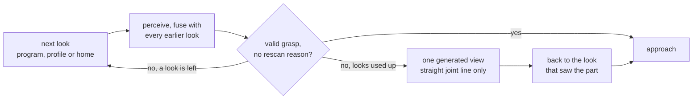

# Runbook: the first pick on a physical arm

**Scope.** The procedure that starts with an arm sitting powered off on a bench and ends with one
verified, logged pick. It is the hardware counterpart to
[`cell_bringup.md`](cell_bringup.md), which takes a cell from its configuration layer through a
simulator to an arm that answers. That one proves the configuration and the geometry, and this one
takes the same cell to metal.

**Where it has run.** A **UR10 (CB3)** with a **D415 on the wrist** and a **Hand-E switched over one
tool output** (`jaw_io`, `single_toggle`) has gone from a powered-off arm to camera picks through the
examples: connect and moves with cuRobo (example 03), the wrist calibration by hand in freedrive against
an ArUco marker (examples 09 and 10), and camera picks through `PickRun` (example 12) and the `Locator`
(example 13). Of the grippers, `jaw_io` and the Robotiq driver were measured with a UR; OnRobot and
suction never touched hardware. The fused wrist looks of 2026-09-29 (Diagnose 8), their generated view
and the push (Diagnose 9) have run only against the offline suite's doubles so far, the console and the
API have not run at the cell, and the deep grasp network was never trained. The exact guard deciding the
planner's self pairs, the band's legs and the turned camera boxes ran against the real cuRobo kernel on a
development GPU (2026-09-30, the two probes of Diagnose 6), not yet on the cell PC. The ordering below is
what makes a path nobody has run on your cell survivable: each step de-risks the next, and a step that fails
tells you which thing is wrong instead of only that it does not work.

**The one line version.** Do the desk work until `--check` is clean, prove the camera without the
robot, prove the robot without the camera, calibrate, then join them, and never skip a stage because
the previous one probably passed.

---

## Trigger

Any of:

1. A physical arm is on the bench for the first time.
2. The end effector, the coupling plate or the camera mounting changed. Each of those invalidates a
   measured value the stack depends on.
3. `python -m src.robot.execution.real_cell --check` reports blocking items.
4. The cell connects but rejects every motion, or executes motions that miss by a constant offset.
5. Picks are logged as successes while the gripper is visibly empty.
6. A wrist camera gets new looks, or a cell is about to push a part for the first time (Diagnose 8
   and 9).
7. This repository was updated on the cell PC: run the two GPU probes once with every other planner
   stopped, then restart the planner (Diagnose 6).

---

## Diagnose

Work top to bottom. Each stage has a command that answers it and a failure that looks like something
else.

### 1. Is the SDK installed?

```bash
python -m src.robot.drivers.doctor --require ur
```

Exit 0 means the vendor is ready. A miss names the modules that would not import, `rtde_control` and
`rtde_receive` on the UR path, and the fix is `pip install -r requirements.txt`, which pins
`ur_rtde`.

### 2. Is the configuration runnable at all?

```bash
python -m src.robot.execution.real_cell --check
python -m src.robot.execution.real_cell --check --profile ur3e
```

Against the shipped configuration tree as a UR cell this reports seven blocking items, and that is
the normal state of a fresh cell rather than a fault.

| Blocking | Why it stops you | What it looks like if you skip it |
|---|---|---|
| `tool frame`: `gripper.tool_frame.source` is `undeclared` | nobody has said where the grasp centre sits on the flange | a top-down grasp commanding z = 37 mm drives the flange there and the fingertips through the bench |
| `payload`: `safety.payload` has `enforce: true` and `mass_kg: 0.0` | `connect()` refuses, because pushing `setPayload(0.0)` would overwrite the controller's model of a mounted tool | you drive to the cell and cannot connect |
| `camera -> base`: no CAMERA to BASE resolver | grasps stay in the camera frame | every motion returns `INVALID_TARGET`, which reads as a cell that hangs |
| `camera world`: no live camera world for the planner | the base tree plans with cuRobo, and a cuRobo motion needs a live camera world or a decline; the pick service declines nothing | every pick motion is refused as `UNSUPPORTED` before it moves, naming the missing world |
| `planner margin`: `safety.self_collision.planner_margin_mm` is undeclared | the base tree plans with cuRobo, and a planner never starts without the clearance it keeps; undeclared is not zero | the first planned move is refused as `CONTROLLER_REJECTED`, before the arm moves |
| `carried part`: `safety.planning_world.payload.length_mm` is undeclared | the base tree plans with cuRobo, which models the part a grasp carries, and no length is implied for it | the attach is declined and every lift and transit after a grasp is planned as if the hand were empty; declare the length, or `enabled: false` for a cell that carries nothing |
| `hand`: `gripper.model` is unset | the exact-mesh guard checks the hand `robot.gripper.model` names, and the base tree names none so that no overlay inherits one | the cell refuses to build, naming the key |

A box without the cuRobo environment or without Coal blocks on two more rows, `cuRobo environment`
and `exact mesh engine`: they are facts about the machine the checklist runs on, and they clear
when the `ext_deps` install is on the box.

Four more items are reported as warnings and never block: an unset self-collision kinematics model,
no declared fixtures, no declared planning world, and no record log path.

Two rows are reported `[bench]` and never block, because no interface answers them:

* the controller must be powered, with brakes released, in Remote Control, with no pendant program
  owning it, because `ur_rtde` uploads a control script and is refused otherwise;
* the end effector's electrical side, named for the configured driver, whose row reads the pins and
  the address from the configuration. The Robotiq URCap opens port 63352 and is not any pip package;
  a vacuum tool needs its 24 V supply and its solenoid. The schema accepts I/O pins 0 to 7 on any
  bank and does not know how many outputs the bank you named actually has, so a pin the tool block
  does not carry validates cleanly and switches nothing. A `jaw_io` toggle with no open switch
  (`actuation: single_toggle`) cannot read its jaws, and nothing about them is kept between
  programs: once per program start, when the gripper connects and before the arm moves, the
  console asks whether the jaws stand open; the connect writes nothing. Answered closed, it offers
  one change of the output to open them, or stops. Every change of the output moves the jaws once,
  switched on or off, so from there the program sends ONE change per command and counts them: one at
  the part to close, one at the release to open, none before the arm moves at the start of a pick,
  and a pick that begins with the jaws believed closed asks again rather than switching. Never push
  the jaws by hand. Switching the output at the pendant while a program runs is noticed: the next
  command is refused with nothing sent, and the next pick asks where the jaws stand.

A `jaw_io` hand adds a warning, `jaw travel time`, while `close_settle_s` is the schema default
0.3 s and it is the only wait the driver has: with no switch to read, the arm moves on that long
after the edge, on a close and on an open, whether the jaws have arrived or not. A Hand-E on its
I/O coupling can take about 2 s. Time the full stroke both ways by stopwatch or video and set
`close_settle_s` to the longer, with a margin.

A blocking checklist does not necessarily stop you connecting. A cell with blocking items can
connect and then refuse every motion, which is the failure that reads as a broken robot. What
refuses the connect is the driver's own preflight, not this checklist.

`config/robot/robot.ur5e.yaml` is the worked example for a real bench. It leaves the first three of
those items unset on purpose and writes them out as commented blocks saying what to measure, so the
shipped refusals stay armed.

### 3. Does the whole software path work, with no hardware?

```bash
python scripts/checks/cell_bringup.py            # the config side, commands nothing
python -m src.robot.execution.real_cell --rehearse --runs 3
```

The rehearsal swaps the vendor to `dummy` and a synthetic scene in, keeps your profile chain,
gripper branch and grasping block, and runs the whole path in milliseconds. The runner's verdict
rule is unanimity, so three of three must succeed. This is the last thing that is free: if the
rehearsal fails, the fault is in the software and finding it at a bench costs a day.

A rehearsal continues past a blocking checklist on purpose, which is why `--rehearse --check` and
`--check` can exit differently on the same tree.

The rehearsal is not grasp-quality evidence. The dummy arm carries no safety preflight, and
`Cell.safety()` says so, so it proves the wiring and nothing about what would refuse a bad command.

### 4. Does the arm answer?

```bash
python scripts/checks/cell_bringup.py --live      # connects, reads back, commands no motion
```

This proves the network path, the SDK, the configuration and the controller state read. `connect()`
on the UR path is where four fail-closed checks run: the payload, the tool frame, the robot model
and the controller's active tool register. The model check asks the controller which model it is,
through the dashboard, and refuses a parsed, positive disagreement with `robot.ur.model`, on the
size class alone, because an e-Series simulator container reports `UR3` for a UR3e. It fails open on
absent evidence, because a false refusal is a cell that will not start, so also confirm `ur.model`
by eye against the label on the arm: the self-collision guard derives its link lengths from that
value and nothing raises if it is wrong.

**The gripper connect does move.** `GripperController.connect()` activates the hand, and Robotiq
activation is a calibration: the fingers travel their full range. That is deliberate, because the
alternative is that it happens lazily on the first commanded width, with the fingers already around
an object. Connecting is motion, which is also why a campaign connects once around N picks rather
than N times. Keep hands clear whenever a runner reaches its connect stage, and have the arm in its
starting pose. The example above touches only the arm and still moves nothing.

### 5. Does the camera answer, with no robot?

```bash
python -m src.robot.perception --prompt "<your object>"
```

One RGB-D frame, detected and segmented, with statistics printed and no robot involved.

Read the depth-hole fraction inside each mask. A D435 returns zeros on dark, shiny and steeply
angled surfaces, and a mask that is mostly holes still yields a confident grasp point computed from
whatever few pixels survived. The line reports the holes against the mask size and the resulting
grasp plane beside it, so you can see what the sensor measured and what the robot would drive to.
That is the honest health signal, and it is also the one thing most likely to differ from
simulation.

The fraction is measured on the streamer's output, so it is post-filter. Turning on
`camera.cameras.rigs.realsense.post_processing.hole_filling` makes a blind camera report close to
zero holes, honestly, because the filter really did fill them. That is why the key ships `false`: a
hole is a surface the sensor could not measure, and filling it invents surface at an invented
distance that a grasp is then planned against.

**Two cameras?** Read their serials and put one on each rig before enabling them. With two identical
D435s the serial is the only stable identity: `RealSenseRGBDStreamer` binds by serial and never
reads `device_index`, which is an OpenCV capture index and survives neither a reboot nor a replug.
Cameras that swap do not fail. They hand back a complete, plausible scene with the views exchanged,
so every fused position is mirrored and the pick goes confidently to the wrong place. The schema
refuses two enabled RGB-D rigs where either has no serial, and refuses a serial shared by both.
That is the guard, not an obstacle.

`config/camera/cam.eth2.yaml` is the worked two-camera layer, and it takes the serials from the
environment:

```bash
rs-enumerate-devices -s
export WILLY_CAM_LEFT_SERIAL=...  WILLY_CAM_RIGHT_SERIAL=...
WILLY_PROFILE=ur5e,eth2 python -m src.config                    # must still validate
WILLY_PROFILE=ur5e,eth2 python -m src.robot.perception --rig cam_left
WILLY_PROFILE=ur5e,eth2 python -m src.robot.perception --rig cam_right
```

**The primary camera is the rig `camera.cameras.primary_rig_id` names**, not the first one in the
list. The grasp is synthesised in its view, and a second camera adds its surface only where the cell
fuses it (Mitigate 4).

### 6. Can the planner actually plan for this robot?

Only relevant while `robot.ur.motion_planner` is `curobo`, which is the shipped value.

```bash
python -m src.robot.safety.planning --check --model ur3e --hand robotiq_2f85    # exit 0 means fully anchored
python -m src.robot.safety.planning --doctor --model ur3e --hand robotiq_2f85   # and that the engines actually load
```

The difference between the two matters here. `--check` is spawn-free: `cuRobo planner: AVAILABLE`
means the sidecar's Python exists on disk and nothing more, and the banner says so in the same
breath, because the robot descriptor `willy_{model}.yml`, one per arm with no hand in it, lives
inside the cuRobo installation in a separate environment this process deliberately does not spawn.
A UR3e with no `willy_ur3e.yml` passes that gate and fails later, inside the sidecar. `--doctor`
does spawn it, and reports whether the descriptor is present. Once the sidecar is up it reports the
descriptor's `_provenance` and hashes, and the driver refuses a descriptor built for another arm,
one that carries a hand, or one that records nothing; it then keeps the planner only on a
combination of arm, hand, plate, placement and margin that a committed evidence file measured (the
checklist's `planner margin` row says which file).

To list what descriptors exist by hand, in the cuRobo environment:

```bash
"$WILLY_CUROBO_PYTHON" -c "from curobo.content import get_content_root; import os, glob; \
  d = os.path.join(str(get_content_root()), 'configs', 'robot'); \
  print(sorted(os.path.basename(p) for p in glob.glob(d + '/willy_ur*.yml')))"
```

If your model is missing, build it with `scripts/curobo/build_ur_config.py`, on the box and against
the installed cuRobo version. **`"ik"` is no way round it.** `Robot.move`, `move_joints`, `home`,
`pick` and `place` refuse a UR on the ik planner before any command, because nothing plans its paths
against the camera world or judges them, and a wrist camera's looks go through the same verbs.

**Run the two GPU probes once on the cell PC before the first run**, and again after every update.
**Stop the console, the API and every other program that runs a planner first**, so one cuRobo sidecar runs
on the GPU at a time: a probe starts its own and never looks for one already running. Each probe starts the
planner through the driver's own start, which refuses a composed robot the committed evidence did not
measure, drives nothing (a recording controller stands in for the arm), and exits 0 when every expectation
held:

```bash
python scripts/curobo/probe_band_admission.py   # the exact guard decides the arm's own pairs; the band's legs
python scripts/curobo/probe_turned_boxes.py     # 65 box slots, the turned camera boxes, a plan in a full world
```

**The probes run a fixed owner-like cell**, built in code: a UR10 with a Hand-E on a 20 mm plate, the
committed evidence, the owner's LOOK[0] and LOOK[1] as fixed joints and no wrist camera, so **no
robobrain.eye housing**. They read nothing of the cell's tree: they prove the kernel, the sidecar and the
driver on this PC, and that LOOK[0] and LOOK[1] get their legs **on that fixed cell**. Whether the cell's own
looks keep theirs, with the housing on the arm, the look lines of `real_cell --start-planner` say
(Diagnose 8). LOOK[1]'s leg lands **exactly on the 20 degree cap**: its nearest clear pose is wrist_1 +19.5,
and the leg search, 1.33 degrees a step on two joints, takes +20.0.

`probe_band_admission.py` holds the owner's looks in the planner's cushion band, what stays refused (the
folded wrist, a box through the forearm, a joint past the planner's bounds, the Hand-E at the robot's own
base), the kernel's self term against the pair naming over a wrist_1 x wrist_2 torus, and the escape legs,
each at most 20 degrees per joint. `probe_turned_boxes.py` fills the 65 slots from a synthetic camera over a
turned bin and 48 parts, checks that the planner registers every box, that it holds the turn (the enclosures
meet its spheres where the turned walls clear them), where it clears the bin beside the shoulder housing
(recorded lines), and a plan out of the cushion band in that world. Where an application-control policy
refuses cuRobo's kernels, `--cpu-replica ext_deps/curobo/curobo/content` runs them on a CPU replica of the
sidecar instead. Every line it prints starts with `[replica]` and every log record it makes carries the same
tag; its `planner under test` line says CPU REPLICA, and its JSON names the replica. It plans nothing, so
`probe_turned_boxes.py` skips its plan in the full world and says so. The replica proves the driver's
decisions on the real geometry; only the GPU run shows the kernel itself.

**Restart the planner after an update.** It reserves 1 + declared + `perceived.max_boxes` (64) box slots
when it starts, so one started before an update holds the old 16.

### 7. Is the cell calibrated?

Not with a simulator runner. `run_eth_calibrate` under `src/willy_sim/` calibrates a simulated
camera against a simulated arm, which is useful for proving the routine and useless for this cell.
The real command is one per rig:

```bash
python -m src.robot.execution.real_cell.calibrate --rig realsense_d435 --freedrive --check     # touches nothing
python -m src.robot.execution.real_cell.calibrate --rig realsense_d435 --freedrive --dry-run   # builds the arm, opens the camera
```

Every run names where its stations come from, and one that names neither way is refused, `--check`
included, because nothing generates stations. `--fixed-poses PATH` visits stations you give (a JSON
of poses or of joints, each one judged before it runs), and `--adjust` beside it frees the arm at
each station it reached so you can fine-tune the view by hand; with a file, `--check` also reads it
and counts its stations. `--freedrive` has the arm moved by hand to poses where the software checks
the board is seen well. Then the sweep, which moves the robot: the same command without `--check`
or `--dry-run`. `examples/real_robot/07` to `10` run both ways for a fixed and a wrist camera.

The sweep takes the cell lock and connects the arm alone, with no gripper. While the operator console
holds this cell the sweep exits 1 and names the holder, so end the console's session first. A refused
connect exits 1 as well, and exit 3 is a sweep that raised.

It writes `eth_<rig_id>.json` under `calibration/real` and prints the rig block to paste into the
camera section, `camera.cameras.rigs[<rig_id>].extrinsics`. Run it once per camera. Until the primary
rig declares its block the cell has no camera-to-base transform, and a real cell is refused at build,
naming that key. A second camera also needs an entry naming its rig in
`robot.grasping.fusion.cameras`. Without one it never reaches the pick path: geometry fusion stands
down to a single view, and the build says so in one warning.

Measure the printed ArUco board before the first sweep. A wrong `--marker-length-mm` scales every
sample uniformly, so the solve converges and is uniformly wrong, which no residual will tell you. It
is the edge of the black square in millimetres, not the white border and not what the PDF was called.

The sanity check that beats any residual: command a known TCP pose, detect the marker, and confirm
that the camera-to-base transform predicts the arm's own forward kinematics to within a few
millimetres.

**Every camera needs its own calibration.** The grasp is synthesised in the primary camera's view, and
a surface no calibrated camera measured is a surface the finger placement is guessing at. A wrist
camera fills its gaps by looking again (Diagnose 8); fixed cameras fill them by fusing (Mitigate 4).

**Declare the wrist camera's housing at its real size.** On the owner's cell the D415 sits in a
robobrain.eye housing tilted about 45 degrees: its rig's `body` (`camera.cameras.rigs[<id>].body`, the
camera model, a `bracket` box and a `margin_mm`, [calibration-setup.md](../calibration-setup.md)) has to hold
that housing as it really is, not the bare D415. The body adds the camera's pairs to both models: the
planner loads it as a link, the exact guard checks it against wrist_2, every farther link and the cell, and
the self filter holds it. A cell with an enabled wrist camera and no declared body stops at the build, for
teaching as for picking (`WristBodyRequired`). A camera not calibrated yet cannot place its housing: example
11 then builds the arm without it and says no pose is screened.

### 8. Where does a wrist camera look from before it picks?

**Only a camera the arm carries (`eye_in_hand`) looks around: multi-view with arm motion exists only
there.** Fixed cameras fuse with each other without moving (Mitigate 4). A fixed camera's arm moves to
a look only where the program or the profile names one, and its pick stops at the first look that
finds something.

A wrist camera sees what the arm points it at. Left where it stands, it sees whatever that is: after a
connect, where the last program left the arm; in a campaign, the retreat above the last grasp, turned
by that grasp's yaw and nearer than a D415 measures. So **every pick of a wrist cell first moves to its
looks**: the program's (`examples/real_robot/12`), else the cell profile's, else home.

```python
LOOK = [JointPositions.deg(-90.0, -100.0, -110.0, -60.0, 90.0, 0.0),   # your own, off --where
        JointPositions.deg(-70.0, -100.0, -110.0, -60.0, 90.0, 0.0)]
run = PickRun.from_cell(cell, runs=5, recording=Recording.off(), look=LOOK, put_back=True)
```

```yaml
robot:
  look_joint_positions_deg:          # every pick whose program names no look, the console's too
    - [-90.0, -100.0, -110.0, -60.0, 90.0, 0.0]
    - [-70.0, -100.0, -110.0, -60.0, 90.0, 0.0]
  natural_closing_axis: "-y"         # how the hand and its camera naturally stand: the owner's UR10 cell
```



* **Joints in degrees, as the pendant shows them.** Jog the arm to where the camera sees the work and
  read the six joints off with `python -m src.robot.drivers.ur --profile <cell> --where`, or guide it
  there by hand with example 11. The arm arrives in exactly that configuration, the IK branch, the
  cable window and the camera's roll included, and a person has seen it there. A program writes
  `JointPositions.deg(...)`: a bare list of numbers is refused, because its unit cannot be told. The
  profile key is degrees only, with no radians twin. The loader refuses an empty list, a look with no
  joint or a value that is not finite, looks of different lengths or of a length unlike home's, and
  any value past 360 either way. `--check` warns on its `looks` row where every joint of a look lies
  within 6.3 of zero: that reads as radians. A program's looks override the profile's.
* **Every taught pose is screened**, by the exact mesh guard and the planner, and nothing moves for it:
  example 11 once each pose is held (the planner starts with the first pose, about a minute), `real_cell
  --start-planner` for `robot.look_joint_positions_deg`, and every campaign at its start, one log line per
  look. The lines read:

  | Line | Means | Do |
  |---|---|---|
  | `LOOK_1: clear: ...` | both clear it | nothing |
  | `LOOK_1: in the planner's cushion band: ... Nearby, both clear: (...) deg.` | only the planner's padded spheres refuse it, and the exact meshes keep at least 10 mm: it runs, straight lines run into it and out of it, and a planned move takes a straight leg of at most 20 degrees per joint to the nearest pose both clear, by itself | nothing while the line names that pose; it is there if you would rather teach it |
  | `LOOK_1: in the planner's cushion band: ...; no pose within 20 deg per joint of it clears both ...` | it runs on straight lines only; a planned move out of it or into it is refused | only where a planned move has to reach it or leave it: re-teach it by hand where both clear, and screen it again; the line names no pose to copy |
  | `ERROR LOOK_1: refused by the exact guard: ...` or `refused by the planner: ...` | no move goes there | re-teach it: at the `Nearby, both clear` pose where the line names one, else by hand where both clear; then screen it again |

  Teaching screens only on an arm that carries every wrist camera housing the tree declares, the arm
  example 11 builds with `Robot.from_tree`; elsewhere it screens nothing and says why in one line, and so
  does a desk start handed no camera section.
* **A look in the planner's cushion band** runs: the owner's LOOK[0] (forearm|wrist_2 1.2 mm deep for the
  padded spheres, 19.0 mm apart for the meshes) and LOOK[1] (2.75 mm deep, 18.4 mm apart). Straight lines
  reach and leave it; a planned move takes its leg, wrist_1 -4.0 and wrist_2 -1.3 degrees out of LOOK[0],
  wrist_1 +20.0 out of LOOK[1], measured on the GPU on the probe's cell, which carries no housing
  (Diagnose 6). LOOK[1]'s nearest clear pose is wrist_1 +19.5, so its leg sits **on the 20 degree cap with
  0.5 degree to spare**: a little more refusal around it, the housing's pairs or a look taught a degree
  deeper, can leave it with none. Its screen line on the cell says which. The generated view and the move
  back never take one.
* **The part's open side first.** Order the looks so the first one sees the side a grasp needs. It is
  often the only look a pick takes.
* **How the hand naturally stands.** `robot.natural_closing_axis` names the way round the jaws close
  where nothing else says. The owner's cell sets `"-y"` in its own profile on the cell PC: the tool +X
  along base -y, where its D415 image stands upright. A taught pose's `quaternion_xyzw` works as well,
  and only the heading of its tool +X on the base XY plane counts. Every camera grasp then takes the
  wrist half-turn nearer that direction, and so does every push: none is left out or tilted, the same two
  faces are gripped with the jaws swapped. A program's own `closing_axis` wins, and beside the
  simulator's `align_closing_to_base_x` no grasp is turned (a push still takes the natural way round). A
  value that names no axis is refused at load, naming the key. Unset, the default and every shipped
  profile's, the cell behaves exactly as before.
  `robot.tool_down(x, y, z)` builds the fixed poses of examples 03 and 05 along it.
* **Fused, with an early stop.** At each look the pick perceives, fuses the view with every earlier
  look, and once per pick with the fixed cameras, then computes the grasp again on all of it: the part,
  its support and the parts around it. It **stops at the first look whose grasp is valid and carries no
  rescan reason.** An uncertain grasp, looks that call the part by different labels, or no candidate go
  on to the next look. The goal is a **safe grasp point, never a full scan**: a better grasp found on a
  later look is taken, while other sides stay unseen.
* **A refused look is skipped.** A look a guard or the planner refuses before anything was sent is
  skipped with a WARNING, named on the report (`looks_skipped`), and counts as used up. A pick that
  reaches none of its looks, or whose look motion may have moved the arm or met a stopped controller,
  ends there with nothing perceived and nothing else commanded (`look_refused`).
* **One generated view, the last resort.** Once every declared look is used up and the grasp is still
  not safe enough, the pick may generate one more view: the judged look turned about the vertical
  through the part, toward the jaw contact face of the chosen grasp that no view showed, or toward the
  side no look faced when there is no grasp.
  - the smallest turn first, up to 180 degrees either way, at most 3 motions tried;
  - every turn screened before anything moves: inverse kinematics, the cable window, the workspace
    box, the joint limits and self-collision; no joint travels more than 150 degrees from where it
    stands, and none stands more than 180 degrees from home;
  - driven on the **straight joint line only**, judged against the camera world holding every frame of
    the pick. A line that is not clear skips that turn: **never cuRobo, never a retract, never a
    detour**;
  - a WARNING for every generated move past 120 degrees, of the turn or of any joint;
  - only on an arm that names its configurations and drives a joint line alone, the UR driver on
    cuRobo, with the pick's frames held in its planner world. The Isaac arm and the desk arm generate
    none and say why.
* **The move back.** Where the grasp was ranked on a look other than the one the arm stands at, the arm
  goes back there on the straight joint line, held to the same 150 degree cap. A refused move back is a
  WARNING, and the approach starts from where the arm stands, planned and judged as every approach is.
* **Every frame of the pick stays in the planner's world** until the pick ends, so every motion of the
  pick is judged against all of what the looks saw. The part's cloud, fused over the looks, is what the
  world keeps out for the grasp and where the attempt says the part is.
* **`both_faces=True`** (on `PickRun`, `service.pick` and `Locator.look_around`), off by default, is
  for safety-critical parts. The pick then looks on until both jaw contact faces of the chosen grasp
  were seen, the generated view included, and grips nothing where no view showed both: the pick ends
  `no_valid_grasp` naming the face, and a look around comes back refused. A fixed camera grips only a
  grasp its cameras showed both faces of. With it, the way round comes from `robot.natural_closing_axis`
  and one axis to close along from the program's `closing_axis` below: both act before the grasps are
  judged. The simulator's twist, `GraspMotion(align_closing_to_base_x=True)`, turns every grasp after the
  judging, so asking for both raises before anything moves. A suction cup has no faces to see.
* **`closing_axis="-y"`**, a program's opt-in on `GraspMotion`, `Scene.grasps` or `Locator.look_around`,
  keeps only the grasps whose closing axis heads within 30 degrees of it, either way round, each turned
  the named way round: choose, don't twist. The heading counts and the tilt stays free; the ranking asks
  for 36 candidates while it is set. A pick none of whose grasps closes along it ends `no_valid_grasp`,
  its failure line naming the axis and the 30 degrees.
* **`record_views=True`**, off by default, keeps each pick's looks for training: colour, depth, the
  tool pose at each shutter, the lens and the fused part cloud, one `.npz` per pick under
  `logs/robot/views`, named after the pick's record (`attempt_id`).
* **Rescans.** A pick handed looks has had its rescans, its looks and the one generated view, so a
  rescan never repeats them; only `next_target` runs them again, for another part of the label
  (Diagnose 9). A wrist pick handed no look, and a fixed camera, rescan where they stand.
* **Example 13's `Locator` looks around by the same rules.**
  `locator.look_around(prompt, LOOK, robot=robot, both_faces=...)` finds a part to grip: fused looks,
  the early stop, the one generated view and the move back, `both_faces`, refused looks skipped. A
  `closing_axis=` named there is kept on the `Located`, and the part's scene takes it and refuses another
  axis, so the grasp judged is the grasp gripped. A look
  whose part has no measured surface under its mask makes no part, and says so. The looks' frames stay
  held until `robot.pick` ends, the next look around or the disconnect. What a part is set down on is
  found look by look instead, the first look that sees it answering.
* **The hand-eye check comes free.** Where two looks saw the same face of the part, the pick measures
  how far apart they place it: the median distance from each point to the nearest point of the other
  look within 15 mm, where the two surfaces face the same way (normals within 30 degrees). Once per
  pick, from 20 shared points up. Above **6 mm** a WARNING says the hand-eye calibration may have
  drifted, a camera loosened on the wrist above all. Nothing is changed for it: check the mount and
  recalibrate ([calibration-setup.md](../calibration-setup.md), section 9). It cannot see a slide
  along a surface.
* **The depth mode sets how near the camera sees.** Intel gives a D415 a minimum depth of about
  **310 mm at 848 x 480** and **450 mm at 1280 x 720**, the schema's default (datasheet figures, not
  measured here). Nearer is a hole. On the wrist, stream depth at `depth_resolution: [848, 480]` and
  keep `color_resolution: [1280, 720]`: with `align_depth_to_color` every reader still gets
  1280 x 720. The driver logs the mode and its minimum at open, and warns for a D415 at 1280 x 720. A
  look tilted 45 degrees sees the near edge of its image closer than its centre: stand it back far
  enough for that edge.
* **Nothing is said to the hand before a look**: no release, no change of its output. With
  `put_back=True` each lifted part is placed back where the tool closed on it (the pick's standoff, a
  line in, the release, a line out), so the hand is empty at the next look and one part serves the
  campaign; a part that does not go back stops it. Without it the part rides to the next look. A hand
  opened by command opens there, before its approach; a toggle hand whose jaws the program believes
  closed asks at the start of the pick instead, before the arm moves.
* **Each attempt says what was computed**: where the object's seen surface is centred in BASE
  (`attempt.object_mm`), the pose the tool closed at (`attempt.grasp_pose`), and on a wrist pick the
  looks it perceived from and fused, which contact faces of the chosen grasp were seen, the generated
  view's turn and the hand-eye gap. `print(attempt)` shows them, so a look and a grasp can be checked
  against the cell with a ruler. The console's `pick_result` carries `looks` and `looks_fused`, and
  where set `jaw_faces_seen`, `generated_view_deg`, `hand_eye_gap_mm` and `refused_look`.

What the log says:

| Level | Line, abridged | Means |
|---|---|---|
| INFO | `look ...: a valid grasp with no rescan reason; the looking ends here` | the early stop |
| INFO | `the looks stop at look ...; label agreed in N of M looks` (or where else they ended) | one account per pick; nothing acts on it |
| WARNING | `closing_axis '-y': none of the N grasp candidate(s) closes within 30 deg of it` | the program's axis left the part no grasp |
| WARNING | `look ... was refused before anything was sent (...): it is skipped` | a refused look, used up |
| WARNING | `look ... calls its target ... and an earlier look calls the same part otherwise` | the labels disagree: the grasp is uncertain |
| INFO | `no view is generated: ...` | why no view was generated |
| WARNING | `generated view ...: the arm drove there on the straight joint line only, ... past 120 deg` | a long generated move, said once driven |
| WARNING | `moved back to look ... on the straight joint line only, ... past 120 deg` | a long move back |
| WARNING | `the move back to look ..., which saw the part, was refused (...)` | the approach starts where the arm stands |
| ERROR | `...: both_faces asks for both before gripping, so nothing is gripped` | `faces_unseen`: a contact face nobody saw |
| ERROR | `the pick reached none of its looks` / `the motion to look ... was refused before any command` | `look_refused`: nothing perceived, nothing else commanded |
| INFO | `hand-eye check: the looks measure the part's shared surface ... mm apart (median)` | the hand-eye check, healthy |
| WARNING | `the looks measure the part's shared surface ... mm apart (median), more than 6.0 mm` | the hand-eye check: the calibration may have drifted |

**Status.** The fused looks, the generated view and the move back are pinned by the offline suite
against doubles. They have not run in URSim or on a cell yet.

### 9. What does the cell do when a part is boxed in?

A failed grasp goes to **recovery** where the cell arms it (`robot.grasping.recovery.enabled`). The
grasp mode is the outer gate, and `recovery.allowed_actions` has to name an action as well:

| Mode | Recovery may |
|---|---|
| `easy` | nothing: never a recovery motion |
| `auto` | `rescan`, `next_target` |
| `dense_clutter` | `rescan`, `next_target` and the **push** (`nudge_target`) |

* **`rescan`** perceives again and moves nothing. A wrist pick handed looks has had its rescans, so
  recovery never repeats the looks for the same part (Diagnose 8).
* **`next_target`** skips the part that failed for another **of the same label**, never another
  object. It follows no candidate, no valid grasp, grasps that collided, and a motion the planner
  refused. The failed part's place is excluded in BASE XY, 30 mm about its centre or half its
  footprint's diagonal, whichever is larger, for this pick and the next two. On a wrist cell the new
  part gets the looks again, with the early stop and at most one generated view. When only excluded
  parts are left, the pick stops and says so.
* **The push** frees a boxed-in part: no candidate survived and at least one collided, or, where
  approach validation runs, every approach was blocked, and in both cases a neighbour was seen within
  25 mm of the part. It runs on a wrist camera's pick in `dense_clutter` only, with either grasp
  calculator, inside the pick attempt, after the looks were judged; a fixed-camera cell never pushes. It
  never follows no candidate or no valid grasp: nothing there says a neighbour is in the way.

| The push | |
|---|---|
| **Pusher** | The jaws stay **open**, and the outer face of the leading finger pushes along the closing axis. The push never changes the hand's output: a toggle's count is the same after it, and nobody is asked. |
| **Jaw count** | A count that says closed means no push. One that cannot say when the push reads it, once its plan and budgets passed (DO0 switched at the pendant while the pick looked, or its output unreadable), **ends the pick as a gripper fault**: nothing pushed or moved, and the campaign stops. A Robotiq over its socket, or any hand that measures its width, found not connected there, or whose width read fails (a socket that stopped answering), ends it the same way. Look at the jaws, then connect again: a toggle's connect asks where they stand, and a width gripper is reconnected. A push refused before that read falls through, and `next_target` reads the count before it drives the looks again: one nobody can vouch for ends the pick as a gripper fault before any look. |
| **During the push** | The count is read again before each contact leg and once the arm is up. DO0 switched while the push drives **stops the push where the arm stands**, the fingers possibly down beside the part: nothing more moves, not even back to the look, and a person decides (After a stop). |
| **Where to** | An automatic **push box**: the workspace box intersected with the table the camera saw, shrunk by the push plus 30 mm. The landing plus 15 mm stays inside it, and the hand comes down over seen table only. `recovery.fixture` only narrows it; a declared container is its interior. Expect sideways pushes: pushing a part straight away from a neighbour needs room for the open hand between them. |
| **How far** | 30 mm (`recovery.fixture.push_distance_mm`), never more than `recovery.fixture.max_nudge_mm` (50 mm, the hard cap). `PickRun.from_cell(..., push_mm=...)` or the console's request asks another distance: up to the ceiling as asked, above it refused, never shortened, under 10 mm refused (the console answers `422 push_distance_refused`). A cell config with `max_nudge_mm` under 10 or under `push_distance_mm` does not load: delete the old line to take 50 mm, or write 10 to 50 mm with a `push_distance_mm` no longer than it. |
| **How low** | Fingertips at half the part's height over the support, held to 10 to 20 mm. No push for a part under 15 mm tall, or one not resting on the support. Every TCP point stays 20 mm inside the workspace box, 20 mm above `z_min` included. |
| **Motion** | To 80 mm above the contact start like a grasp approach: the straight joint line first, cuRobo only when it is blocked. Then four judged straight lines: down at 50 mm/s, the push at 25 mm/s (0.1 m/s²), back 5 mm and up 80 mm at 50 mm/s. The wrist takes the way round nearer `robot.natural_closing_axis` where the cell names one, else nearer where it stands. Then back to the look (to a view the pick generated, on the straight joint line alone), look again, fused with the pick's frames, and judge again. |
| **How often** | 1 push per part, 2 per pick, 5 per campaign. Spent means no more pushes, and the campaign goes on. |
| **Falls through** | A refusal that sent nothing and touched nothing goes on to the next recovery action: the approach refused before it was sent, or the down leg refused before it was sent, the arm still in the air above the part. There the arm goes back to its look first, and the round trip counts against the budgets (the lead's ruling, pending the owner). |
| **Ends the pick** | Two refusals before the push end the pick with nothing commanded: a controller found stopped or unreadable (`controller_not_operational`), and a hand nobody can vouch for when the push reads it, a toggle's count or a width-measuring hand not connected or unreadable (a gripper fault, Jaw count row). |
| **Stops** | A down leg refused with a status not known as "nothing sent" (`unsupported`, `connection_error`, `controller_rejected`) stops there: a safe stop whose rate URSim will measure. Any other refusal or failure once the arm set off, and a count nobody can vouch for before a contact leg or once the arm is up, stops it where it is: `unsafe_recovery_refused`, and **the campaign ends and a person decides**. A protective stop is `controller_not_operational`, and the software never clears it. There is no planned escape. |
| **After a stop** | The service starts no further pick, with nothing asked or moved, until a new campaign: a new `PickRun`, a new console run, or `acknowledge_needs_person()` from a program. **Clear the cell first**: that campaign's first pick drives the arm from where it stopped to its first look. |
| **Needs** | A wrist camera, a cuRobo arm whose lines are judged, a live camera world, the hand connected and open (a toggle's count at open, a hand that measures its width within 2 mm of fully open), an attempt left to pick the part from afterwards (`max_attempts` above 1), and the steady gate where `safety.dwell` asks for it. |

Two facts decide whether a push is possible at all:

* **The table has to be seen around the part.** From one 45 degree wrist look the shadow behind the
  part usually refuses the push (`landing_over_unseen_table`): give the pick looks from more than one
  side. A part whose lower side no look saw is refused as well (`part_not_on_support`).
* **`z_min` has to allow it.** Every TCP point of a push stays 20 mm above
  `robot.workspace_limits.z_min`, while the fingertips come down to 10 to 20 mm over the table. A
  `z_min` meant as table clearance, as the base tree's 100 mm is, refuses the push (`below_z_min`):
  safe, and nothing is pushed. Check it against the table's height in BASE before the trial.

While the part moves, its swept path is held out of the camera world, and with it the neighbour points
closest to that path. The planner's own clearance guards the hand there; the camera and its bracket
are not in that model, so watch them on the first trials.

**The first push is a supervised trial.** In this order:

1. **Arm it** in the cell's layer:

   ```yaml
   robot:
     grasping:
       default_mode: dense_clutter
       recovery:
         enabled: true
         allowed_actions: [rescan, next_target, nudge_target]
         fixture:                              # BASE mm, yours: it only narrows the push box
           center_mm: [400.0, 0.0, 60.0]
           half_extents_mm: [150.0, 150.0, 60.0]
           push_distance_mm: 30.0              # the push nobody asks otherwise
           max_nudge_mm: 50.0                  # the most a request may ask
   ```

2. **Check `z_min`** against the table, as above.
3. **Looks from more than one side**, so the table around the parts is seen.
4. **A person at the emergency stop**, the pendant's speed slider turned well down, hands and cables
   clear.
5. **One push per campaign at first:** campaigns of one pick (`runs=1`) on a scene with one boxed-in
   part. A part is pushed at most once. Read the attempt and look at the parts before the next
   campaign.
6. **After a stop** the arm stands where it stopped, beside the part and low over the table, and
   nothing drives it away: the service refuses every pick until the next campaign. A person clears the
   cell, and a protective stop on the pendant, before starting it, since its first pick drives the arm
   from there to its first look.

**Status.** The push is pinned by the offline suite, with a fake arm and a fake live world that record
every call. It has not run in Isaac, URSim or on a cell yet.

### 10. Where can a bin stand beside the base?

The UR10's **shoulder housing** hangs about **52 mm over the base plate**, from **86 to 263 mm** out from
the base axis, and sweeps that ring as the base turns. An undeclared bin the cameras see beside the base is
its walls, each a box turned the way the bin stands, from the bench to its rim plus 15 mm, and its inside
stays free ([05](../guide/05-pick-loop.md), 5.3). **Turned bins need no squaring to base X/Y**: the planner
and the exact guard hold the same turned boxes.

| Who judges | Keeps a seen bin | Where it shows |
|---|---|---|
| the exact guard | **20 mm off a face**, about **26 mm across a rim edge** (a square bin 25.0 mm away is refused, 26.3 passes); a declared bin 10 mm from its measured geometry | a `[safety:self_collision/...]` refusal naming the box |
| the planner, cuRobo | its sphere cover reaches **25 to 29 mm past the shoulder housing**: at (0, -60, 80, -110, -90, 0) deg a bin with a 40 mm rim clears it from about **46 mm** (square) to **50 mm** (turned 30 degrees), a straight line, held 10 mm off, from about **55 to 60 mm** | the move is planned around, or refused naming the planner's world |

So **keep about 60 mm between a bin and the housing's ring** wherever the arm works with the housing beside
it; the guard alone would take about 26 across a rim edge. Or **declare the bin**: its walls as fixtures
(`safety.self_collision.fixtures`) at their measured place, boxes square to base X/Y, so a turned wall is
declared as the box that holds it. The exact guard keeps 10 mm to them, the planner holds them too, and
the cameras' points on them are taken as those fixtures, so both hold the real walls instead of boxes
grown by 15 mm. The planner's sphere cover still reaches 25 to 29 mm past the housing, and its clearance to
a declared bin was not measured. The world stays the planner's (the owner, 2026-09-30), and
`probe_turned_boxes.py` records the planner's side for its own synthetic bin (Diagnose 6).

- **Keep the ring under the housing clear of anything tall.** What the housing hides of a bin from the
  cameras stands as high as the bin's walls beside it, so a bin reaching under the housing is refused; a
  lone object the housing hides from every camera is not seen at all.
- **An undeclared bin's floor must stay inside the bench band**: `perceived.plane_clearance_mm` at least
  the floor plus 3 times the depth noise, 8 mm for a 3 mm floor at 1.5 mm of noise. Otherwise its floor
  comes back as boxes; declare the bin instead, as above, its floor as well as its walls, and the exact
  guard keeps 10 mm to its measured geometry.
- **A camera about 0.5 degrees off at 1 m lifts the bench out of its band**: slab boxes fill the 64 slots,
  and a slab beside the base can refuse the pose. Recalibrate, or raise `plane_clearance_mm` by the range
  times the error.

A refusal on a seen box names it: `box_centre_mm`, `box_size_mm`, `box_yaw_deg`, `box_corners_mm` and the
joints in degrees on the `rejected a PLANNED PATH` or `rejected joint move` line. `(N of its cells the
robot's own body hid from the cameras ...)` is the housing's shadow filled; `(all N of its points lie within
M mm of the robot's own links: it may be the robot itself ...)` is the arm seen off its model: check the
hand-eye calibration and the DH table ([04](../guide/04-robot-and-safety.md), 5.5).

---

## Mitigate

Fix in this order. Each is a configuration edit plus a bench measurement, so do the measurements in
one session, because three of them share the same setup.

1. **Weigh the whole assembly** and set `safety.payload.mass_kg`. Not the gripper alone, but the
   gripper plus the coupling plate, every cable and hose that rides on the wrist, and any workpiece
   the arm carries. No starting value ships on purpose: a gripper's datasheet mass is not this
   number, and a plausible default is how a cell ends up telling the controller about a tool it is
   not carrying. A genuinely bare flange is `enforce: false`, not a mass of zero. Bring a bench
   scale; it is a procurement item with a lead time.
2. **Measure the centre of gravity** from the flange, in the same session, and set
   `safety.payload.cog_mm`. Leaving it at `[0, 0, 0]` declares a multi-kilogram tool to be a point
   mass at the flange face. For a 3 kg tool whose centre of gravity sits 132 mm out, that is
   3.9 N m of wrist torque the controller does not model, both in the protective-stop calculation
   and in the gravity compensation behind `get_tcp_wrench()`. `connect()` refuses a declared mass
   left at an all-zero centre of gravity for exactly this reason, before it opens a socket.
3. **Measure the flange to grasp-centre transform**, same session, and set `gripper.tool_frame`:
   * `offset_mm`, where the grasp centre sits. `--check` holds it to the hand: along the declared
     approach it should be the registry's `grasp_centre_mm` plus the coupling plates, and the
     `grasp centre` row warns beyond 1 mm. Whichever of the bench and the registry file is wrong is
     the one to correct;
   * `rotation_quat_xyzw`, which flange axis the jaws close along. This half never crashes. Ninety
     degrees out produces run after run of logged successes with the jaws closing across the wrong
     object axis, and hand-eye calibration cannot catch it, because it solves for whatever frame
     `get_tcp_pose()` reports and returns an excellent residual either way;
   * `source`, either `"willy"`, where this driver composes flange to TCP and the controller runs a
     bare flange, or `"polyscope"`, where an operator set the TCP on the pendant and the driver only
     verifies it. Either way `connect()` derives what the controller is actually running and refuses
     a mismatch. The schema also rejects a declared source left at identity, so half a declaration
     does not pass either.
4. **Calibrate each camera** and declare the primary camera's artifact on its rig,
   `camera.cameras.rigs[<primary rig id>].extrinsics`, by pasting the block the calibration command
   prints; it is read whether or not `grasping.fusion.enabled` is on. To fuse every other camera,
   declare each on its own rig, name it under `grasping.fusion.cameras`, and set both
   `grasping.fusion.enabled: true`, which builds each named camera's CAMERA to BASE resolver, and
   `grasping.fusion.geometry.enabled: true`, which hands the fused surface to the grasp generator.
   Either one alone leaves the cell single-view.
5. **Declare the bench** under `safety.self_collision.fixtures`. With none declared there is no
   surface in the collision world, so nothing refuses a motion that goes through it. Declare
   `safety.planning_world` too, with a measured `support_plane` and `perceived.enabled`: a cuRobo
   cell plans every pick motion against the live world the calibrated cameras build, and the one-shot
   guard cannot stand in for it, because that guard judges a destination and not a path. Without that
   world a cell with a calibrated RGB-D rig refuses to build, and the `camera world` row blocks.
6. **Set `grasping.record_log_path`.** A bring-up with no telemetry cannot be diagnosed afterwards,
   and it gives the soak, KPI and offline learning tooling nothing to read.
7. **Set `safety.self_collision.kinematics_model`** explicitly to the arm you are holding.
8. **Teach the looks** of a wrist camera in the same session: jog or guide the arm to each, read the
   joints with `--where`, and write them into `robot.look_joint_positions_deg` (Diagnose 8). A clear look,
   and a band look whose line names a nearby pose, need nothing. Re-teach an `ERROR` look at the
   `Nearby, both clear` pose its line names, else by hand where both clear; a band look whose line names no
   nearby pose only where a planned move has to reach it or leave it, by hand where both clear. Screen every
   re-taught look again.
9. **Declare the wrist camera's housing at its real size** (Diagnose 7), and dress its cable tight along the
   arm, within about 10 mm and with no loops: the camera world keeps anything more than 15 mm off a link.
10. **After an update, run the two GPU probes once and restart the planner** (Diagnose 6): stop the console,
    the API and every other planner first, since each probe starts a sidecar of its own, then start the
    console again. A planner started before the update holds the old 16 box slots.

---

## Verify

In order, and do not skip forward on a probably:

```bash
python -m src.robot.execution.real_cell --check                 # 0 blocking
python -m src.robot.execution.real_cell --rehearse --runs 3     # 3/3, no hardware
python -m src.robot.execution.real_cell --dry-run               # builds, connects nothing
python -m src.robot.execution.real_cell --runs 1                # one pick, hand on the stop
python -m src.robot.execution.real_cell --runs 10 --profile ur3e
python -m src.robot.grasping.replay --records logs/<run>.jsonl  # roll up what happened
```

What passing means:

* the executed grasp reports `frame = base` rather than `camera`, which is the single sharpest tell;
* `connect()` logs the tool frame as verified within tolerance;
* an empty close is reported as a failure. Test that deliberately: command a pick at an empty
  table and confirm the run is reported as `verification_failed`. That is the execution policy's own
  check after its close, read off the gripper's object detection. A hand that measures no hold (a jaw
  on digital I/O with no feedback wired) cannot fail it: its successes print `hold not measured`, and
  the run says how many rest on the close command's word. There is no second check behind it: the
  separate verification stage and its `robot.grasping.verification` block were removed on 2026-09-29,
  because no pick ran them, and a tree that still writes the block is refused at load. A Robotiq on
  its socket reports gOBJ to this check, which is how its hold is verified;
* every failure is classified by the record's typed reason rather than by eyeball;
* a wrist pick names its looks on its attempt line (`looked from ...; fused ...`), with the contact
  faces of the chosen grasp it saw and the hand-eye gap.

Know which rule you are being judged by. This runner's default is unanimity: every pick must
succeed, which is stricter than the simulator gate, and it has no independent confirmation of its
own, so a cell that built a `NullGripper` would report success every time. The runner prints the
rule alongside the verdict. From Python the rule is an argument:
`PickRun.from_cell(cell, runs=10, rule=PassRule(fraction=0.8, confirm=...))`.

Exit codes: 0 the campaign passed, or `--check` and `--dry-run` were satisfied; 1 the preflight
blocked or the build or the connect refused; 2 the cell connected and the campaign did not pass its
rule; 3 a fault of the cell ended a pick, raised or reported.

---

## Rollback

* **Stop motion**: the physical emergency stop. Nothing in software outranks it.
* **Back out a configuration change**: every value above is a configuration key, so revert the YAML
  and re-run `--check`. Nothing here writes to the controller except `setPayload`, and that is gated
  on `safety.payload.enforce`.
* **Restore the controller's payload**: if a wrong `mass_kg` was pushed, set the correct value and
  reconnect, or set `enforce: false` and enter the payload on the pendant. The driver rolls the
  connection back on a failed push, so a failed push never leaves a half-set payload behind.
* **The tool frame**: `source: "undeclared"` returns the cell to refusing to connect, which is the
  safe state rather than a broken one.
* **A bad calibration**: point the rig's `extrinsics.artifact_path` back at the previous file. The
  real-cell calibration writes under `calibration/real` keyed by `rig_id`, and the simulator runners
  write under `logs/calibration/<robot_model>/`, so the two cannot overwrite each other and one arm's
  simulated run cannot overwrite another's. Copy an artifact aside before moving a camera.
* **The looks**: delete `robot.look_joint_positions_deg`, and a wrist pick whose program names no look
  looks from home again.
* **The push**: take `nudge_target` out of `recovery.allowed_actions`, or leave `dense_clutter`: no
  other mode pushes.
* **A push that stopped**: nothing moves the arm away by itself, and the service starts no pick. A
  person clears the cell and a protective stop on the pendant, then a new campaign starts; its first
  pick drives the arm from there to its first look.
* **A gripper fault at a push or before a re-pick**: a hand nobody can vouch for, a toggle's count or a
  width gripper not connected or unreadable. Look at the jaws, then connect again: a toggle's connect asks
  where they stand, and a width gripper is reconnected.
* **Everything else**: `--rehearse` still runs with no hardware attached, so you can always get back
  to a known-good software baseline without the robot.

---

## See also

- [`cell_bringup.md`](cell_bringup.md), the profile, the desk check, the simulator and the connect
  that come before this.
- [`docs/cli.md`](../cli.md), every command line above, by topic.
- [`your_own_gripper.md`](your_own_gripper.md), a gripper this repository never shipped, up to a
  planner that starts.
- [`real_cell` package](../../src/robot/execution/real_cell/README.md), what the runner does at each
  stage, and the calibration command in full.
- [UR driver](../../src/robot/drivers/ur/README.md), the SDK and the connect-time refusals.
- [`examples/`](../../examples/README.md), the same composition driven from Python: `real_robot/`
  in the order a cell comes up, where every file from the third on moves the arm, and `simulation/`
  for the rehearsal.
- [`src/calibration/`](../../src/calibration/README.md), the typed extrinsics and what each frame
  means.
- [The pick loop](../guide/05-pick-loop.md), the looks and recovery from the code's side, and the
  [grasping config reference](../grasping-config-reference.md), every `robot.grasping` block.
