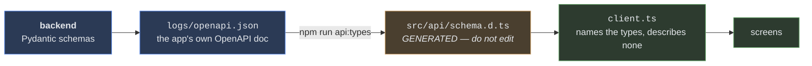

# 🖥 `frontend/` — the operator console UI

> **The browser face of the optional [`api/`](../api/api_README.md) layer.**
> React + TypeScript + Vite, built into `api/static/` and served by the same FastAPI process that
> drives the cell.

`React 19` · `Vite` · `TypeScript` · `oxlint` · `types generated from the backend's OpenAPI`

It is **optional in the same way `api/` is optional**: the library, every CLI and every existing test
run without it, and a backend with no `api/static/` directory behaves exactly as it did before this
directory existed — asserted in
[`tests/test_api_serves_the_console.py`](../tests/test_api_serves_the_console.py).

---

## 🪟 Two pages, on purpose

| page | what it is | who opens it |
|---|---|---|
| `index.html` → the **console** | five screens: Preflight · Cell · Pick · History · Config | whoever is bringing the cell up |
| `demo.html` → the **room view** | one instruction, one large narration, no navigation | a projector |

They are **separate bundler entries, not routes of one app.**

> [!IMPORTANT]
> The demo page cannot build a cell, cannot connect one, cannot write config and cannot reach the
> history. A page shown to an audience must not be one mis-click away from bringing a robot up.
> Keeping them apart *at the bundler level* is what makes that structural instead of a matter of
> discipline.

---

## 🚀 Running it

```bash
# 1 · the backend, against the hardware-free profile (no controller, no camera, no GPU)
python -m api --profile console_dummy

# 2a · development: hot reload, Vite proxies /v1 (and the WebSocket) to the backend
cd frontend && npm install && npm run dev          # http://localhost:5173

# 2b · production: build into api/static/, then the backend serves it itself
cd frontend && npm run build                       # http://127.0.0.1:8000
```

`WILLY_API=http://10.0.0.5:8000 npm run dev` points the dev proxy at a cell on another box.

Other profiles: `--profile ursim,ursim_ur3` (real UR controller software in Docker — see
[`scripts/ursim/`](../scripts/ursim)), or none at all for the shipped tree.

| command | |
|---|---|
| `npm run dev` | dev server on 5173, `/v1` proxied |
| `npm run build` | type-check, then bundle into `../api/static` |
| `npm test` | render every screen against captured payloads |
| `npm run lint` | oxlint |
| `npm run api:types` | regenerate `src/api/schema.d.ts` from `logs/openapi.json` |

---

## 🧬 Where the types come from



**Nothing describes a payload by hand.** A console carrying its own idea of what a `PreflightCheck`
looks like disagrees with the cell the first time the cell changes — and it disagrees *silently*.
Regenerate after any schema change:

```bash
python -c "import json,pathlib; from api.cell import Console, set_console; from api.app import create_app; \
set_console(Console(profile='console_dummy')); \
pathlib.Path('logs/openapi.json').write_text(json.dumps(create_app().openapi(), indent=2))"
cd frontend && npm run api:types
```

---

## 🎨 Why the code looks the way it does

**The API base URL is the empty string, in both modes.** In production the SPA is served by the
backend, so every request is same-origin; in development the Vite proxy reproduces exactly that. So
there is no host to configure — and therefore no build flag and no bookmark that can aim the console
at a different cell than the one whose server it was opened from.

**The console never writes its own summary of what happened.** Event rows render the backend's
`human` sentence verbatim. Two sentence-writers would drift, and the prettier one would win.

**The design tokens ARE the safety contract, so they live in one file.** `src/styles.css` is a
Tailwind v4 CSS-first theme: the palette is declared in `@theme inline` over runtime custom properties,
never in a JS config, because *one status has one colour* is a rule and a rule belongs in the file that
declares it.

**Two reds, separated by colour AND by form** — either alone is one coincidence away from failing:

| token | how it may be used | where it appears |
|---|---|---|
| `--alarm` | **tint only** — a surface at 13–17 % with a bordered edge, text stays `--fg` | every `block` status, everywhere |
| `--arm` | **fill only** — solid, white text, `button.danger` | exactly two controls: Connect and Pick |

Semantic colour never carries the text. A pill's tint groups it, its dot hues it, and the word stays in
the foreground colour — so a status survives both themes and a reader who cannot separate red from
green. The one place a gradient is allowed is the sidebar's brand mark.

**Contrast is a test, not a taste.** [`tests/test_console_contrast.py`](../tests/test_console_contrast.py)
recomputes WCAG AA for every text tier against every surface it can land on, **reading the numbers out
of `styles.css`** rather than duplicating them. It was written because the palette as first drawn put
three tokens below AA — `--fg-subtle` at 3.47:1 on `--panel`, and `--accent` at 4.48:1 as link text —
and `--fg-subtle` is what carries the DENOMINATOR under every figure on the demo page. A rate whose
denominator is hard to read is a rate presented without one. It also caught what the fix missed: a
link sits in a panel *head* (`--panel-alt`) and can sit in a caveat (`--inset`), not only on the page
ground.

**Light and dark are three states, not two.** An explicit choice stamps `<html data-theme>`; the
default stamps nothing and follows `prefers-color-scheme` live. `lib/theme.ts` cycles
`system → light → dark` and *removes* the attribute for `system` rather than resolving it, which is
what keeps the OS switch working while the tab is open.

---

## 🔒 The honesty rules this UI enforces

These are pinned as assertions in `src/screens/screens.test.tsx`, because they are exactly the
sentences a tidy-up pass would quietly remove.

| the rule | why the obvious alternative is worse |
|---|---|
| **A simulated arm says simulated.** | `TelemetryOut.simulated` is the only field that distinguishes a sim reading from a physical one — the numbers themselves are identical. So it is always on screen, on both pages. |
| **A missing measurement says "not offered by this driver"**, never a zero. | Sim, dummy and KUKA advertise no force/torque Protocol at all; a zero would read as a measurement. |
| **A blank controller state says "not asked".** | Mode and safety cost a dashboard round trip and are opt-in. Blank must never read as *fine*. |
| **An unmeasurable KPI is listed as unmeasurable.** | Hidden reads as fine, zero reads as bad, and both are wrong when the truth is *the records cannot say*. |
| **Stop does not stop the arm** — it declines the next attempt. | The button says so in those words, because a button labelled *Stop* on a screen is exactly what somebody reaches for instead of the mushroom. |
| **A lost event is shown as a gap.** | The server sends a `gap` frame with a count when the client slept past the ring buffer; the console renders it as a row rather than drawing a run that never had those steps. |
| **Preflight fixes are verbatim, per row.** | A checklist that says *wrong* without saying *do this* has only moved the guessing. |
| **The viewfinder names which picture it is showing.** | `live` · `rehearsal` · `overlay` · `held` are four different things that render as one rectangle. The badge is never hidden, and the sentence under it is the backend's, not one this UI composes. |
| **A held frame is dimmed, not blanked.** | When a pick takes the camera, the last image stays on screen greyed and marked `held`. Blanking reads as a fault; showing it undimmed reads as live. |
| **Zero counts are drawn, not hidden.** | Preflight's four tiles include the zeros: *0 blocking* is the answer an operator came for, and a tile that vanishes when empty makes them count the rest to be sure. |

---

## 🧪 What a real controller changed

The console was driven end to end against **URSim** (real UR controller software, UR3e) on
**2026-08-20**: preflight → build → connect-preview → connect → live telemetry → pick → history →
disconnect.

⛔ **It found a defect in this UI's own copy.** The Preflight banner claimed *"Connect will be
refused"* whenever any row was `block`. The run showed 1 blocking item — and the connect **succeeded**.
A blocking checklist item does not stop you connecting; it makes every later **motion** fail, which is
the failure that reads as a broken robot. The banner now says *"this cell is not runnable as
configured"* and a Caveat names where the connect refusal actually lives (`connect-preview.blocking`,
on the Cell screen, where the wording was already correct).

✅ **An empty warnings list was correct, not broken.** The `ursim` profile carries `gripper.vendor:
none`, and `motion_warnings` returns `()` for a `NullGripper` on purpose — warning about a finger sweep
that cannot happen teaches an operator to skip the warning that can.

---

## 🗂 Layout

```
src/
  styles.css               the token system: @theme, both themes, every shared class
  api/client.ts            the only thing that talks to the backend; typed from schema.d.ts
  api/events.ts            the run WebSocket: since_seq resume, gap surfacing, backoff
  api/schema.d.ts          GENERATED — do not edit
  lib/useAsync.ts          loading / error / stale, and the poll helper
  lib/theme.ts             system / light / dark, persisted; `system` follows the OS live
  lib/outcome.ts           outcome string -> pill tone, in ONE place
  lib/provenance.ts        sim driver vs sim controller vs real controller — never "physical arm"
  components/ui.tsx        status pills, panels, the error banner
  components/Viewfinder.tsx  polls /v1/camera; badges what the picture actually is
  prompt/pipeline.ts       ONE path for every prompt, and what it remembers about where it came from
  prompt/PromptInput.tsx   the shared box: type it or say it (+ prompt.test.tsx)
  prompt/recordWav.ts      microphone → 16-bit WAV, in the browser
  screens/                 Preflight · Cell · Pick · History · Config  (+ screens.test.tsx)
  demo/                    the room view: its own entry, layout-only stylesheet over the same tokens
```

> [!IMPORTANT]
> **Speech lands in the box; the operator still presses the button.** `prompt/` adds a microphone to
> the prompt on both screens that have one, and it deliberately stops there — a transcription fills
> the text field and nothing else. "Pick up the red cube" and "pick up the red cup" differ by one
> phoneme and by a whole grasp, so a spoken prompt is confirmed the same way a typed one is. The
> backend draws the same line: `POST /v1/voice/transcribe` returns TEXT and starts nothing.
>
> While the text is still as the machine heard it, the box **says so**, and stops saying it the moment
> the operator edits it. `pipeline.ts` carries the same `source` into its history, because "the
> operator asked for the wrong thing" and "the machine heard the wrong thing" look identical
> afterwards unless something wrote down which route the words came in by.
>
> ⛔ **The console encodes WAV itself** (`recordWav.ts`), and that is not gold-plating: **no browser
> records WAV.** `MediaRecorder` gives webm/opus in Chrome and Firefox and mp4 in Safari, and the
> backend decodes WAV with the standard library and everything else only with the optional `av`
> extra. Recording what the platform chose would have made the console's own microphone the one
> client needing a `pip install` on a machine where nothing else does.
>
> ⚠ **`getUserMedia` needs HTTPS or localhost.** A console opened at `http://192.168.1.50:8000`
> from another machine has no microphone at all — the browser does not expose the API, so there is no
> permission prompt and no error. The button is disabled with that sentence rather than left to fail
> on click.

> [!NOTE]
> **`lib/outcome.ts` exists because it did not.** Three screens each compared a `final_outcome` string
> by hand, and the History screen compared against `'success'` while the backend writes `'succeeded'`
> (`AutonomousGraspOutcome.SUCCEEDED`, and `replay/kpi.py` computes `pick_success_rate` off exactly that
> literal). Every successful logged attempt therefore rendered as a **warning** pill — the console
> reporting a worse result than the cell achieved, on the one screen an operator goes to for the record.
> The mapping is in one file now.

`api/static/` and `node_modules/` are git-ignored. A built bundle in git is a second copy of the
source that drifts from it silently, and it is one command to regenerate.

---

## 📚 See also

- [`api/api_README.md`](../api/api_README.md) — every endpoint this UI calls, and the rules behind them
- [`.ai-memory/frontend-plan.md`](../.ai-memory/frontend-plan.md) — the 16 decisions and the build order
- [`scripts/ursim/`](../scripts/ursim) — bringing up the controller software this was measured against
