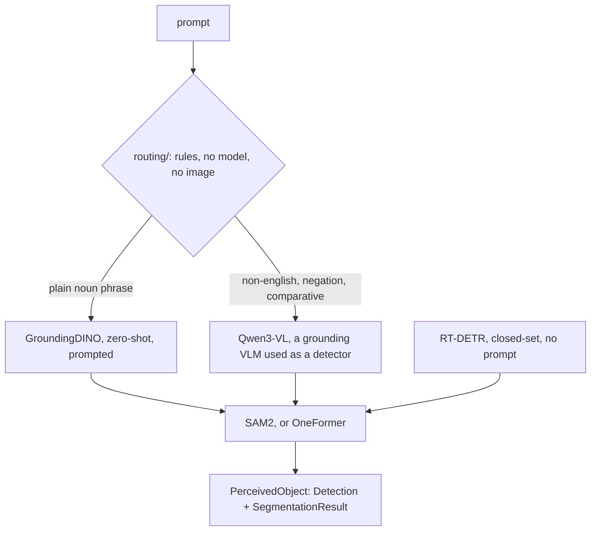

# Models

Every neural network the rest of the stack talks to: object detection, instance segmentation,
vision-language grounding, hand landmarks and speech to text, behind typed wrappers that return
frozen results.

Each wrapper is constructed from a typed config under
[`src/config/schema/models/`](../config/schema/models/), and every public result is a frozen,
slotted dataclass validated on construction. The default grasp-path stack is GroundingDINO
grounding a text prompt and SAM2 cutting the mask for each box it returns.

## What this package guarantees

- **No torch at import.** Every heavy import sits inside a build branch or a first-use path, so
  this package imports on a machine with no GPU, no weights and no CUDA.
- **BGR in, image-frame pixels out.** Callers pass OpenCV BGR arrays; each wrapper does its own
  BGR to RGB swap through [`src/utility/vision.py`](../utility/README.md). Do not swap channels
  before calling one.
- **One builder per stack.** `build_perception` is the only function that builds from
  `models.pipeline`. `PerceptionSpec.build()` calls it rather than repeating it, and
  `PerceptionSpec.resolve()` predicts its answer from the same refusal constants.
- **Refusals are named constants.** Every configuration this package will not build raises a
  message defined once in `factory.py`, so `PerceptionSpec.resolve()` can predict the refusal
  verbatim before a weight loads.

## The perception stack



The legal stacks, as [`config/models/object.yaml`](../../config/models/object.yaml) sets them:

| `pipeline.kind` | grounding | mask source |
| --- | --- | --- |
| `zero_shot` | `grounded_sam` (GroundingDINO) | `sam2` or `oneformer` |
| `zero_shot` | `vlm` (Qwen3-VL) | `sam2` or `oneformer` |
| `closed_set` | RT-DETR's trained classes | `sam2` or `oneformer` |

The two choices are independent: OneFormer takes a box exactly as SAM2 does, so either mask source
works under either grounding model, and which segments better is unmeasured here. What is refused
is a stack that cannot run. The schema rejects an explicit `router.enabled: true` unless
`zero_shot.backend` is `vlm`, and rejects it outright under `kind: closed_set`; the builder rejects
a kind whose model block is missing, before any weight loads.

## The public surface

| Path | Role |
| --- | --- |
| [`perception_spec.py`](perception_spec.py) | `PerceptionSpec`, the seven fields that decide a stack, as a value: `from_config` / `zero_shot` / `closed_set`, then `.build()`. `.resolve()` returns a frozen `PerceptionResolution` saying what `build()` would construct, and why, before a weight loads. Imports no torch. |
| [`factory.py`](factory.py) | `build_perception`, the whole stack in one call, from `models.pipeline` or from the legacy keys. `build_object_detector` / `build_segmenter` remain for hand assembly. |
| [`perception_backend.py`](perception_backend.py) | The `PerceptionBackend` seam, `perceive(image_bgr, prompt) -> tuple[PerceivedObject, ...]`, and `TwoStageBackend`, the detector-then-segmenter chain. Imports no torch. |
| [`routed_backend.py`](routed_backend.py) | `RoutedPerceptionBackend`: two backends behind one, chosen per prompt, both built lazily and sharing one segmenter. |
| [`routing/`](routing/README.md) | Which route a prompt needs, decided before any weights load. |
| [`vlm/`](vlm/README.md) | `Qwen3VLGrounder`, a grounding VLM used as a detector. |
| [`detection/types.py`](detection/types.py) | `Detection`, the shared frozen result: `box` as `(x0, y0, x1, y1)` with `x1 > x0` and `y1 > y0`, finite corners and centres, `score` in `[0, 1]`, non-empty `label`. |
| [`detection/zero_shot/detector.py`](detection/zero_shot/detector.py) | `GroundingDinoObjectDetector`, the default: open vocabulary, prompt driven. |
| [`detection/closed_set/detector.py`](detection/closed_set/detector.py) | `RtDetrObjectDetector`: fixed classes, runs without a prompt, and reads a prompt only as a class-name filter. |
| [`detection/closed_set/train.py`](detection/closed_set/train.py) | RT-DETR fine-tuning CLI: COCO in, `save_pretrained` plus `manifest.json` out. |
| [`segmentation/types.py`](segmentation/types.py) | `SegmentationResult`; `mask` is `uint8` of shape `(H, W)` with values in `{0, 1}`. |
| [`segmentation/realtime/segmenter.py`](segmentation/realtime/segmenter.py) | `Sam2Segmenter`, the default: one box in, one mask out. |
| [`segmentation/research/segmenter.py`](segmentation/research/segmenter.py) | `OneFormerSegmenter`: one universal-segmentation pass, then the instance matching the box. |
| [`handdetection/`](handdetection/README.md) | `PalmDetector` / `ThumbGestureRecognizer` / `HandFinder`. Optional and standalone; nothing on the grasp path builds them. |
| [`speech/speech_to_text.py`](speech/speech_to_text.py) | `WhisperSpeechToText`. Optional and standalone; the operator console reaches it over `POST /v1/voice/transcribe`. |
| [`_inference.py`](_inference.py) | `build_load_kwargs` / `finalize_model` / `autocast_ctx`, the shared torch load and optimise helpers. |

## Usage

```python
from src.config import load_config
from src.models.perception_spec import PerceptionSpec

cfg = load_config()
spec = PerceptionSpec.from_config(cfg.models)

print(spec.resolve().render())   # which stack, decided by which half of the config, and any refusal
backend = spec.build()           # calls build_perception, the one builder
objects = backend.perceive(image_bgr, "a green cube")   # -> tuple[PerceivedObject, ...]
for obj in objects:
    obj.detection      # where the model said it is
    obj.segmentation   # the mask cut for it
```

`build_perception(cfg.models)` is still the one-line call. The spec is the narrower way in: it
carries the seven fields the builder reads, out of the ten a `ModelsConfig` carries, which is what
lets a Python caller build a perception stack without inventing an `stt` block (eleven Whisper
fields, ten of them mandatory, none of them read here).

Assembling the two stages by hand stays supported, for a caller that needs a checkpoint the config
does not name:

```python
from src.models.factory import build_object_detector, build_segmenter

det = build_object_detector(cfg.models)   # GroundingDINO (prompt) or RT-DETR (no prompt)
seg = build_segmenter(cfg.models)         # SAM2 (realtime) or OneFormer (research)

det_result = det.detect(image_bgr, prompt="bottle")        # -> Detection
seg_result = seg.segment_detection(image_bgr, det_result)  # -> SegmentationResult
```

## Traps

**The shipped `model_path` directories do not exist in a fresh checkout.**
`config/models/object.yaml`, `segmenting.yaml` and `stt.yaml` all set `local: True` with a path
under `src/models/*/model`. Put the weights there, or set `local: false` and name a Hub id in
`model_id`. Only the GroundingDINO detector checks: it raises `FileNotFoundError` naming the
resolved directory and both ways out. The SAM2 segmenter and the Whisper wrapper do not check, and
fail inside `from_pretrained` instead.

**Which half of the config decides depends on which builder you call.** While `models.pipeline` is
set, that block decides for everything built through `build_perception`, which is how a cell is
assembled. `models.detector` and `models.segmenter_backend` decide for `build_object_detector` and
`build_segmenter`, which is what `python -m src.robot.perception` uses. On the shipped values the
two resolve to the same pair. `PerceptionSpec.resolve().render()` prints which half decided.

**`torch_dtype` is load-bearing for small objects.** Half precision costs recall on small objects,
and `build_load_kwargs` warns whenever it resolves to fp16. Naming `"float32"` is not the same as
leaving the key unset, because a named dtype is forwarded to `torch.autocast` as well; the sim
overlay uses the loader's `"__null__"` reset sentinel to force the field back to unset.
`channels_last` and `compile` are applied only on CUDA, and a failure of either is logged at
warning level and falls back to eager.

**Debug images are opt-in and off by default.** `debug_images=True` on a detector and
`save_debug=True` on a segmenter write timestamped PNGs under `logs/debug/<name>`, overridable with
`WILLY_DEBUG_DIR`, rotated at 200 files per bucket. Keep them off in production: even capped, write
contention adds latency.

**The VLM route has never run against real weights.** Its grounding quality, its VRAM cost and the
choice between the 4B and 8B checkpoints are unmeasured, so the config default has to follow a
measurement rather than the other way round. See [`vlm/`](vlm/README.md).

**Whisper and the hand detectors are standalone.** Nothing on the grasp path constructs them. The
hand modules have no `enabled` flag in their config block for that reason: nothing auto-builds
them, so a switch would have no reader.

**GPU recommended.** With neither CUDA nor MPS present, device selection logs a warning and falls
back to the CPU; everything still runs, slowly. MediaPipe configures no GPU delegate and runs on
the CPU.

## Fine-tuning RT-DETR on your own classes

The closed-set detector can be retrained on arbitrary classes: its classification head is
re-initialised from the dataset's `categories` rather than fixed to COCO's, and the exported
checkpoint drops straight into the inference path.

```bash
# inspect a COCO split's class map and sizes, without the training stack
python -m src.models.detection.closed_set.train inspect --data-dir data/detect/v1 --split train
# fine-tune -> save_pretrained(output-dir) + manifest.json
python -m src.models.detection.closed_set.train train \
    --data-dir data/detect/v1 --output-dir assets/models/rtdetr/v1 --epochs 20
```

A dataset directory is `<data-dir>/{train,val}/`, each with `images/` and `annotations.json`; `val`
is optional. Wire the result in with `models.detector: "rtdetr"`,
`models.rtdetr.model_path: "assets/models/rtdetr/v1"`, `models.rtdetr.local: true`. Exit codes: `0`
ok, `2` bad arguments or missing data, `3` training failure. Torch, transformers and accelerate all
ship in `requirements.txt`; the heavy imports are deferred, so the module, its COCO and manifest
helpers and `inspect` run on a box that has none of them loaded.

## See also

- [`routing/`](routing/README.md) and [`vlm/`](vlm/README.md), the two-route perception decision
- [`handdetection/`](handdetection/README.md), the optional hand and gesture modules
- [`src/camera/`](../camera/README.md), which supplies the images these models consume
- [`src/calibration/`](../calibration/README.md), for the CAMERA to BASE transform used in
  back-projection
- [`src/robot/grasping/`](../robot/grasping/README.md), the main consumer of `Detection` and
  `SegmentationResult`
- [`src/robot/perception/`](../robot/perception/README.md), the real-camera adapter that builds
  these for a physical cell
- [`config/models/object.yaml`](../../config/models/object.yaml), where the stack is chosen
