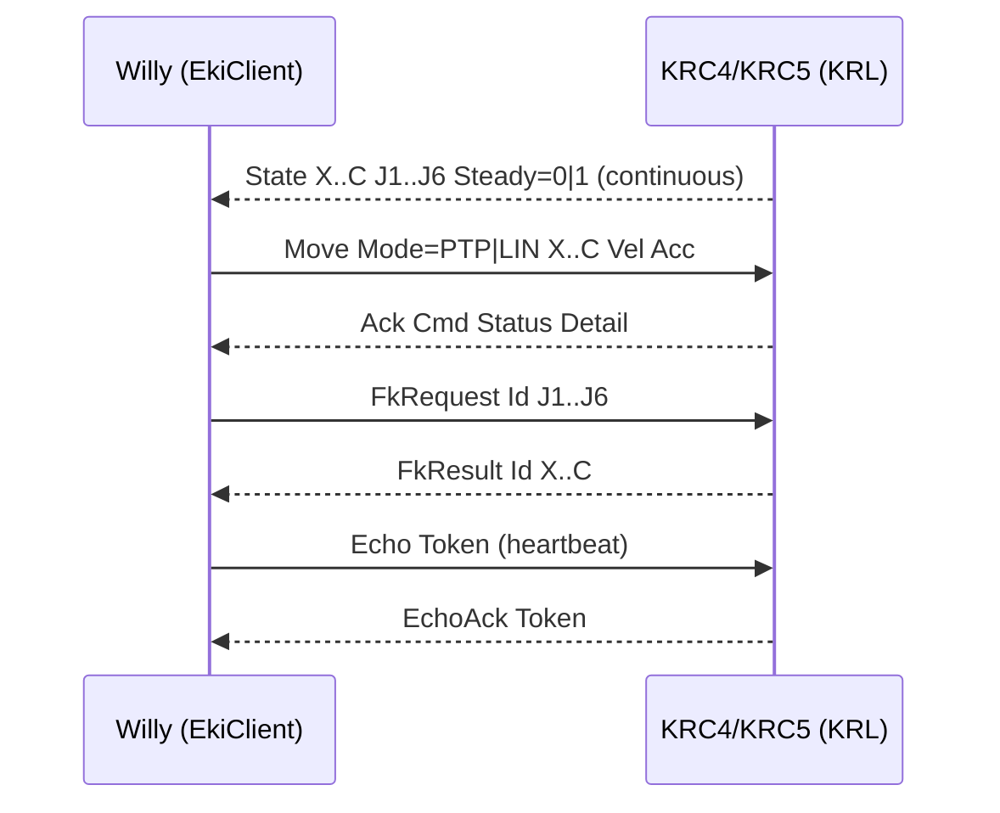

# KUKA driver (EthernetKRL)

A vendor-neutral `RobotArm` for KUKA KRC4 and KRC5 controllers, speaking EthernetKRL (EKI) over one
TCP socket carrying XML. Python standard library only, with no KUKA SDK on this side.

It sits in the drivers layer of the downward stack: it depends on `geometry` and `robot/core`, uses
the `safety` workspace and preflight guards, and is built by the driver factory. All KRL conventions
(E6POS, degrees, ABC Euler) stay inside this package. Everything above it talks to the `RobotArm`
Protocol in millimetres, XYZW quaternions and `Frame.BASE`.

## This driver has never run on a controller

The Python surface is real, registered and unit-tested, but no motion has ever run against a live
KRC4 or KRC5 from this codebase. Treat it as production-shaped contract scaffolding, not
production-validated motion.

## Contents

| File | Role |
| --- | --- |
| `__init__.py` | Public exports. |
| `arm.py` | The `KukaRobotArm` facade and `KUKA_CAPABILITIES`. It composes the transport, the workspace guard and the safety preflight, and converts units and frames at the boundary. |
| `eki_client.py` | `EkiClient`, the TCP and XML transport: a reader thread, a thread-safe telemetry cache (`EkiCachedState`), request, ack and echo registries, a heartbeat watchdog, and a fail-fast wake of everything pending when the link dies. |
| `protocol.py` | Pure XML encode and decode for the wire format. No I/O, no threads. |
| `pose_convert.py` | The `KukaCartesian` value object, `Pose` against `E6POS`, and joint radian against degree conversions. |

The controller-side half, a small KRL program plus the `EkiHwInterface` XML, ships as templates
under [`config/robot/templates/kuka/`](../../../../config/robot/templates/kuka/README.md): `Willy.src`,
`Willy.dat`, `EkiHwInterface.xml` and their own README. They have not been run on hardware.

## Public API

Exported from `kuka/__init__.py`:

- **`KukaRobotArm(config, *, home_joints=None, eki_client=None)`**, the `RobotArm` implementation:
  `connect()` and `disconnect()` (also a context manager), `get_tcp_pose()`,
  `get_joint_positions()`, `move_joint(...)`, `move_to_joints(...)` (typed and preflight-gated),
  `move_linear(...)`, `stop()`, `wait_until_steady(...)`, `fk(joints)`, `ik(pose, *, seed=None)`,
  `is_inside_workspace(pose)`, `move_to(...) -> bool`, `move_home() -> bool`, and
  `move(pose, ...) -> MotionResult`.
- **`KUKA_CAPABILITIES`**: `RobotCapabilities(vendor="kuka", model="kr6-r900", dof=6,
  supports_joint_move=True, supports_linear_move=True, supports_async_move=False,
  has_native_fk=True, has_native_ik=True, has_force_control=False, is_simulated=False)`. The driver
  substitutes a descriptor derived from the configured model and degrees of freedom where the config
  differs.
- **`EkiClient(*, role="server", host="0.0.0.0", port=7000, timeout_s=5.0, heartbeat_s=0.5,
  buffer_size=65536)`**, the transport, exposed for advanced callers: `connect`, `disconnect`,
  `is_connected`, `get_state() -> EkiCachedState`, `wait_for_first_state()`, `wait_until_steady()`,
  `send_move_cartesian()`, `send_movej()`, `send_stop()`, `send_home()`, `request_fk()`,
  `request_ik()`.
- **`KukaCartesian(x, y, z, a, b, c)`**, a frozen E6POS-equivalent value object in millimetres and
  ABC Euler degrees.
- **`pose_to_kuka_cartesian`** and **`kuka_cartesian_to_pose`**, the `Pose` against `E6POS` bridge.
  The KUKA convention is `R = Rz(A) * Ry(B) * Rx(C)`, intrinsic ZYX, in degrees.
- **`joints_rad_to_deg`** and **`joints_deg_to_rad`**.

Not exported but importable: the `protocol.py` codec helpers and `EkiCachedState`.

```python
from src.config import load_config
from src.robot.core import RobotVendor
from src.robot.drivers import create_arm

cfg = load_config()                               # robot.vendor == "kuka"
arm = create_arm(RobotVendor.KUKA, config=cfg.robot)
with arm:                                         # connect and disconnect
    pose = arm.get_tcp_pose()
    arm.move_to(target_pose)                      # workspace-guarded PTP or LIN
```

`EkiClient` can be driven over `socket.socketpair` or a fake for transport tests without a
controller.

## Wire protocol

Newline-terminated XML frames over one TCP socket. Commands to the controller use a
`<Cmd Type="Willy">` root; telemetry and replies from KRL use a `<Sen Type="Willy">` root.



| Direction | Tag | Purpose |
| --- | --- | --- |
| to KRL | `<Move Mode="PTP\|LIN" X..C Vel Acc/>` | Cartesian move |
| to KRL | `<MoveJ J1..J6 Vel Acc/>` | Joint move, in degrees |
| to KRL | `<Stop/>`, `<Home/>` | Abort, or go to the controller home |
| to KRL | `<FkRequest Id J1..J6/>`, `<IkRequest Id X..C S1..S6/>` | FK and IK round-trip |
| to KRL | `<Echo Token/>` | Heartbeat probe |
| from KRL | `<State X..C J1..J6 Steady="0\|1"/>` | Telemetry |
| from KRL | `<Ack Cmd Status Detail/>` | Command result |
| from KRL | `<FkResult .../>`, `<IkResult .../>`, `<EchoAck Token/>` | Replies |

## Configuration

`RobotConfig.kuka` is `KukaConfig` and `KukaEkiConfig` in
[`kuka_schema.py`](../../../config/schema/robot/kuka_schema.py). The schema default for `model` is
`"unconfigured"`, while the bundled `KUKA_CAPABILITIES` default is `kr6-r900`.

```yaml
robot:
  vendor: "kuka"
  workspace_limits: { ... }        # powers WorkspaceGuard
  safety: { ... }                  # RobotSafetyConfig, always applied on top; stricter wins
  kuka:
    model: "kr6-r900"
    dof: 6
    controller_ip: "192.168.1.20"  # read only when eki.role == "client"
    eki:
      role: "server"               # Willy listens and KRL dials in, which is recommended
      host: "0.0.0.0"
      port: 7000
      timeout_s: 5.0
      heartbeat_s: 0.5
      buffer_size: 65536
```

## Honest status

What is validated, in software only:

- The Python surface is real, registered under `RobotVendor.KUKA`, and the import and factory
  boundary keeps the vendor isolated, with no SDK at module top level.
- The `Pose` against `E6POS` and joint radian against degree conversions are unit-tested.
- The `EkiClient` reader-death and fail-fast path is unit-tested against a fake peer-close socket.
- The XML codec is deterministic and round-trippable.

What is unproven, and what closing it would take:

| Gap | What is missing |
| --- | --- |
| No live-controller validation | The EKI wire framing, the `<State>` cadence and the FK and IK round-trip have never met a real KRC. Whole-transport socket tests beyond reader death are thin. |
| The controller-side KRL must be deployed | The `templates/kuka/` files ship but have never run on hardware. |
| No runtime payload write | `EkiClient` has no `setPayload` equivalent, so whatever WorkVisual holds is what the controller uses. The payload guard relies on the static `config.safety` envelope. |
| Joint limits are not bundled | `resolve_joint_limits_deg` ships a built-in table for UR alone. Set `safety.joint_limits.min_deg` and `max_deg` explicitly, or the guard reports itself unavailable and the preflight fails closed. That is by design. |
| No KUKA self-collision capsules | Populate the fixtures, or wait for a mesh bundle. |
| Capability flags are intent, not proof | `supports_async_move=False` and `has_force_control=False` are neither implemented; `has_native_fk` and `has_native_ik` reflect intended KRL round-trips, not validated ones. |

Fail-closed by design, even here: every Cartesian motion is pre-checked through `WorkspaceGuard`,
and the typed `move()` path routes each pose through the vendor-neutral `SafetyPreflight`, so a
rejection surfaces a precise `MotionStatus` and no data means no motion.

## See also

- [drivers](../README.md), the registry, the factory and the vendor-neutral driver boundary
- [robot/core](../../core/README.md), the `RobotArm`, `JointPositions` and `MotionResult` contracts
- [robot/safety](../../safety/README.md), the `WorkspaceGuard` and `SafetyPreflight` every motion
  passes through
- Sibling drivers: [ur](../ur/README.md), measured against real controller software, and
  [sim](../sim/README.md), which carries the validated pick paths
