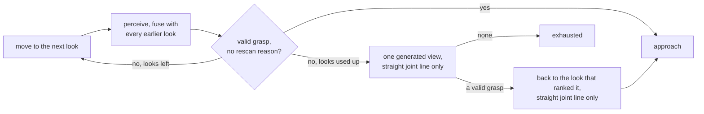

# The pick loop (`src.robot.grasping.loop`)

`BinPickingOrchestrator` turns the grasping tiers into one attempt: perceive, rank, choose a target,
execute, and act on why an attempt failed. On a wrist camera it first **looks around**: it visits the
pick's looks, fuses what each one saw and stops as soon as the grasp is safe. It also reports what a
pick is doing while it runs.

The pick service builds and drives it; you do not construct one. What you can attach is a listener that
hears each stage. This runs at a desk, on the dummy arm of the `console_dummy` profile:

```python
from willy import Cell, PickRun, Recording, load_tree
from src.robot.grasping.loop.progress import PickProgress


def show(event: PickProgress) -> None:
    print(event.stage, event.attempt, event.candidate_count)


cell = Cell.rehearsal(load_tree("console_dummy").robot)   # a dummy arm and a synthetic scene
cell.build().attach_progress_listener(show)               # the service that drives the loop
print(PickRun.from_cell(cell, runs=1, recording=Recording.off()).execute())
```

It prints `pick_started`, `attempt_started`, `perceived`, `ranked` with the candidate count,
`executing`, `attempt_finished` and `pick_finished`, then the run's verdict.

## The nouns

| Noun | Built by | Verb | Returns |
| --- | --- | --- | --- |
| `BinPickingOrchestrator` | the pick service | `run()` | `PickReport` with a `PickOutcome` |
| a listener | your function taking a `PickProgress` | `service.attach_progress_listener(fn)` | events while the pick runs |
| `TargetOrderingConfig` | `robot.grasping.ordering` | `select_target(candidates=..., config=...)` | `OrderingDecision` |
| `LookedAround` | `orch.look_around()`, on a wrist camera | `orch.go_on_with(looked)`; read `orch.looked_around` after the pick | the looks visited, the grasp they judged, the looks refused, the generated view, the move back, and how many targets each look saw (`targets_by_look`) |
| the recovery hand-over | the pick service, per pick | `orch.push_gate`, `orch.exclusion_zones`; read `orch.pushes` and `orch.failed_part` after the pick | what each push the pick considered came to (`PickPush`), and the part it failed on, which `next_target` skips |

The orchestrator depends only on the `RobotArm` Protocol, a calculator and a perception Protocol, which
is how the simulation runners and a real cell share one loop.

## Reasons become actions

| Reasons from the calculator | What the loop does |
| --- | --- |
| `RESCAN_RECOMMENDED`, `NO_CANDIDATES_GENERATED`, `NO_VALID_DEPTH`, `LOW_DEPTH_CONFIDENCE`, `LOW_MASK_CONFIDENCE`, `ACTIVE_PERCEPTION_RECOMMENDED`, `ALL_OUT_OF_WORKSPACE` | a fresh frame, without moving the robot; a wrist pick handed looks ends the attempt `exhausted` instead, because its next view was its next look |
| anything else | ends with the matching outcome |

A fixed camera never moves to look again. Another view comes from a second camera
([multiview/](../multiview/README.md)) or, on a wrist camera, from the looks a program hands the pick
(`src/robot/execution/looks.py`), below. The viewpoint planners and the relocate path were removed on
2026-09-29.

With an IK service wired, the calculator drops an unreachable candidate and the next ranked one stands;
without one, the motion planner is the first to refuse it. `IK_FAILED` means every candidate was
unreachable, and it arrives with `RESCAN_RECOMMENDED`. With the swept-path validator on, the loop executes the first candidate whose
approach is clear.

`PickOutcome` is the typed end: `EXECUTED`, `RESCANNED_EXHAUSTED`, `NO_PERCEPTION`,
`ABORTED`, `CANCELLED`, `OBJECT_NOT_DETECTED`, `EXECUTION_FAILED`, `CAMERA_FRAME_REJECTED`,
`APPROACH_PATH_BLOCKED`, `CONTROLLER_NOT_OPERATIONAL`, `GRIPPER_FAULT`. `RELOCATED_EXHAUSTED` left with the
relocate path; a record it ended reads `no_valid_grasp`.
`CANCELLED` is an operator's stop between attempts, kept apart from `ABORTED` so a stop button never counts
as a failed execution. `CONTROLLER_NOT_OPERATIONAL` stops the loop retrying into a controller that has
protective-stopped. `GRIPPER_FAULT` is a hand that needs a person: a gripper that raised while it was
commanded, a toggle with no sensor that would not start on jaws it believes closed, or a hand a push found
nobody can vouch for (a toggle's count, a width-measuring gripper not connected or unreadable); a campaign
stops on it.

`PickAttempt.action` says what each attempt did:

| Action | When |
| --- | --- |
| `executed`, `object_not_detected`, `camera_frame_rejected`, `approach_path_blocked`, `gripper_fault`, `execution_failed` | the execution policy's outcome |
| `rescan`, `exhausted` | no candidate stood: a fresh frame follows, or the pick ends |
| `controller_not_operational` | the attempt did not execute and the controller cannot move; on the way to a look it reads `look_refused` |
| `look_refused` | a wrist pick reached none of its looks; a motion to a look, to the generated view or back failed once it may have been commanded, or was refused by its verb before any command; or the controller stopped on the way (outcome `CONTROLLER_NOT_OPERATIONAL`). Nothing was perceived there and nothing else was commanded |
| `faces_unseen` | `both_faces` was asked and no view showed both jaw contact faces of the chosen grasp; `PickAttempt.withheld` names the face |
| `push` | a push inside a wrist camera's attempt (`dense_clutter`, below) pushed the part, stopped where the arm stands, or found before anything moved that the controller cannot move (the pick ends `CONTROLLER_NOT_OPERATIONAL`) or that nobody can vouch for the hand, a toggle's count or a width-measuring gripper not connected or unreadable (the pick ends `GRIPPER_FAULT`); `PickAttempt.push` carries its code |

`relocate` appears only on attempts recorded before 2026-09-29.

## The label gate

Which segmentations may be a target is the label gate's (`_is_target`), asked wherever the loop takes a part for
one: the ranking, the parts held out of the supports, the parts a later look keeps (`KeptScene.of_view`), the
regions a blocker is asked about. A segmentation's label is read as its label, else its prim path, and compared
exactly: the camera source maps the detector's words onto the object labels before (`object_labels`), so a word
no object name holds is never a target and stays a neighbour for the calculator, the push and the planner.

- **No label** (`target_label` `None`, `target_labels` empty): every segmentation, as ever.
- **One kind** (`target_label`, from `service.set_prompt(text)` or `set_target_label`): the segmentations of that
  label alone. None in the frame ends the attempt `exhausted` with `TARGET_LABEL_NOT_FOUND`, and its
  `NO_CANDIDATE` event carries `target_label` and `labels_seen`.
- **A sort** (`target_labels`, `target_label` `None`; the owner, 2026-10-09: "Grüne Teile in die gelbe Kiste, rote
  in die blaue"): any of its kinds, each compared exactly, from a `PickPrompt` whose phrase is a class list
  (`"each separate green part | each separate red part"`) and whose object labels are the kinds. The detector's
  `ambiguous` (an object it boxed under two kinds, or one it named by none) and a word no rule names are no
  targets. None of the kinds in the frame is `TARGET_LABEL_NOT_FOUND`, with `target_labels` beside
  `target_label` on its telemetry and event. A look that saw only parts its task keeps out says so kind by kind.

`PickReport.target_label` is the label of the segmentation the pick went for, the one its executed grasp belongs
to, else the one of the last grasp it chose (`""` where it chose none, and for a blocker taken as the pick): a sort
reads it to tell which rule's place the part goes to. `PickReport.unclaimed_labels`, on a sort, are the labels the
gate turned away at the pick's first look, one per segmentation in the camera's order, the parts no rule claims:
a surface the parts lie on and a part standing in a region its task keeps out (its bins, its drops) are left out;
a later look, a re-look after a push or a blocker and a rescan add none. The service carries both on
`report.pick_report` and in `report.to_dict()`.

## Which way the jaws close

Every object's calculator result passes `_closing_along` right after `compute_result`, before the target
choice, the looks' judgement and jaw faces, the deep-ranker stamp, the reranks, the approach check and
the push read its candidates. So the grasp judged is the grasp executed.

- **A program's closing axis** (`GraspMotion(closing_axis=...)`, on the policy as `closing_axis`) keeps
  only the grasps heading within 30 deg of it, either way round, each turned half a turn about its
  approach where that puts it the named way round (the owner's "choose, don't twist"). While it is set
  the calculator is asked for 36 candidates (`CANDIDATES_THE_AXIS_CHOOSES_AMONG`, or its own cap where
  that is more), the best of its own cap along the axis are kept, and the cap is given back, raise or
  not. None left is `NO_VALID_GRASP` with a WARNING that names the axis and the 30 deg, and
  `PickAttempt.withheld` says it on every attempt that found no grasp, also when the frame failed on
  another part. A part the axis refused is the frame's failure only where no other part failed for its
  own reason, whichever order the camera lists them in.
- **The cell's natural orientation** (`natural_closing_axis`, set from `robot.natural_closing_axis` by
  `RuntimePickService.from_robot_config`) turns every grasp, where no program names an axis, to the wrist
  half-turn whose tool +X lies nearer it; none is left out or tilted. Beside the simulator's twist
  (`align_closing_to_base_x`, any true value) it turns no grasp, while a push still takes its way round,
  and a value set by hand that names no axis is refused by `run()` and `look_around()` before anything
  moves, naming the field.
- **The window gap** (the owner, 2026-10-08). Inside the half-turn cable window the natural turn can have
  no configuration on the branch the arm holds where its twin, half a turn about the approach, has one: on
  2026-10-07 the natural turn needed wrist 3 at +90 deg, the window ended at +86.4, and the cell judged a
  shoulder and elbow flip. Where the arm can say so on the closed form alone (`has_a_goal_on_its_branch`,
  no screen and no controller call), such a grasp is taken as its twin, the same faces with the jaws
  swapped. `"-y"` stays wherever its turn reaches the branch, however far wrist 3 turns to it; the wrist
  camera's distance decides after it, and `both_faces` and a named axis keep their own rules.
- **The overlay.** Where either changed a result, the calculator that computed it draws its overlay again
  over the grasps kept (`redraw_debug_image`), or drops it where it cannot, so the picture a campaign
  pins ranks first the grasp gripped.
- **Refused before anything moves** (`ValueError`, `TypeError`): a `closing_axis` beside the twist, one
  set on the policy later that names no axis, and `both_faces` beside the twist.

## A wrist camera looks around

A camera on the wrist (its frames placed by the tool pose, an `EyeInHandFrameResolver`) sees only what
the arm points it at. The service hands each pick its **looks** (`orch.looks`: `JointPositions` or
`"home"`, in order), and the loop looks from each one before its first attempt. The goal is a **safe
grasp point**, never a whole scan of the part.



- **Early stop.** Each look is fused with every earlier look and, where `grasping.fusion.geometry` is on,
  with the fixed cameras, acquired once per pick. The grasp is computed again on what they saw together,
  and the looking stops at the first look whose grasp is valid with no rescan reason. An uncertain grasp
  or no candidate goes on to the next look.
- **Every look** (`orch.every_look`, handed per pick by the service and taken back; the console's "Alle
  Posen", the owner, 2026-10-08 night). The looking does not stop at a safe grasp: every look is visited,
  and the pick goes on with the judgement of the last, fused over every look; the generated view still
  follows only where that is not safe enough. A fixed camera, and a pick handed no looks, ignore it.
  `LookedAround.every_look` says it ran; the service reports `telemetry['every_look']`.
- **A weak look** (`orch.weak_look`, set where the cell is built from `robot.grasping.weak_look_trigger`,
  off by default; the owner's automatic trigger, 2026-10-08 night). On a wrist pick handed looks, a valid
  grasp whose view of the part is weak carries `ACTIVE_PERCEPTION_RECOMMENDED`, so the looking goes on
  (`_weak_look`): depth on less than 85 % of the look's own mask (`WEAK_LOOK_DEPTH_SHARE`), a part
  standing more than 1.5 times its footprint's short side over its support with no side of it seen
  (`WEAK_LOOK_TALL_RATIO`, the 25 mm extent rule), or two height plateaus in its cloud at least 15 mm
  apart with 10 % of the points each (`_two_plateaus`). The shape is judged on the views fused so far,
  so it clears once a side was seen. It only adds looks, and the generated view after them: the grasp the
  looks end on is gripped as before, with the calculator's own reasons. `LookedAround.weak` names each
  weak look and why; the service reports `telemetry['looks_weak']`.
- **One part.** Once a look ranks a valid grasp, its part is kept: later looks find it by association,
  and a look that does not see it is left out and said. Looks that call the part by different labels
  make its grasp uncertain (`RESCAN_RECOMMENDED`); looks that agree change nothing. One INFO account per
  pick handed looks says where they ended (a safe stop, no grasp, a withheld grasp or the fall-back) and
  ends `label agreed in N of M looks`: M the looks whose views of the part are in its cloud, N those that
  call it what the judged look calls it (`association.label_agreement_said`). Nothing acts on it.
- **All the data.** The support plane is refined from the part's cloud fused over two or more looks, and
  the neighbours every look saw reach the candidate filter, so a part only an earlier look saw stays an
  obstacle.
- **The footprint less the rim** (`robot.grasping.geometry.footprint_rim_mm`, 0.0 by default; the owner,
  2026-10-09). Where the calculator cuts a rim off the support-footprint stage's input
  (`GraspCalculator.support_footprint_rim_mm`, read by `_footprint_rim_mm`), every look keeps each surface
  less its mask's rim beside it (`_LookView.footprints`, `generation/footprint_rim.py`) and says in one INFO
  line what the rim took; the fusion builds the part's footprint from them by the association its cloud made,
  and the calculator is handed it beside the fused cloud (`footprint_points_base_mm`), for the stage's footprint
  alone. The fused cloud, the association, the jaw faces, the support, the planner world's hold-out and the
  part's centre read the whole surfaces, as before; a blocker's call is handed no footprint of the part, and a
  push takes the part's footprint out of the earlier looks with its surface. A look ranked alone has its rim
  cut by the calculator.
- **The targets each look saw** (`LookedAround.targets_by_look`, in the order of `visited`): the parts of its
  frame that passed the label gate and were neither a surface nor kept out, 0 for a look that segmented
  nothing. The service reports them (`telemetry['targets_by_look']`), and a task reads the first look's to
  tell when the part it takes is the last one there (the check look, 2026-10-08).
- **A refused look** (a guard or the planner refused it before anything was sent) is skipped with a
  WARNING and counts as used up. A pick that reaches none of its looks ends `look_refused` with nothing
  perceived. A look motion that failed once it may have been commanded, or a controller that stopped,
  ends the looking there with nothing else commanded.
- **One generated view**, the last resort. Once every declared look is used up and the grasp is still
  not safe, the loop turns the judged look about the part toward the jaw contact face of the chosen grasp
  no view showed, or toward the side no look faced when there is no grasp. Every turn is screened by the
  arm before it moves (`nearest_configuration`), smallest first: at most 150 deg of travel on any joint,
  every joint within half a turn of home (the cable window), at most 3 motions. It drives the **straight
  joint line only**: never cuRobo, no retract, no detour, and a blocked line skips that turn. A move past
  120 deg logs a WARNING once the arm stands there. It runs only against the planner world that holds
  every frame of the pick; otherwise, and on an arm without the verbs (the Isaac arm, the dummy), no view
  is generated and an INFO line says why (`no view is generated: ...`).
- **The move back.** Where the grasp was ranked on another look than the one the arm stands at, the arm
  goes back there on the straight joint line, under the same 150 deg cap and 120 deg warning. Refused, a
  WARNING says so and the approach starts from where the arm stands, planned and judged as every approach
  is.
- **Looks used up.** The pick goes on with the valid grasp the looks judged, safe or not, and says so;
  no valid grasp ends the attempt `exhausted`.
- **Held frames.** Every frame the wrist camera takes is held in the arm's live planner world from the
  first look until the pick ends, whether it gripped, failed or raised (`close_looks`, called by
  `run()`; `look_around()` lets go itself when it raises). Where two or more views make up the part's
  cloud, that fused cloud is what the world leaves out for the pick and where the part is said to be
  (`PickReport.target_centre_mm`). A pick handed no looks offers its own frame for both, even where a
  fixed camera is fused into its grasp.
- **`both_faces`**, off by default: a look is good only once both jaw contact faces of the chosen grasp
  were seen. Where no view, declared or generated, showed both, nothing is gripped: `faces_unseen`,
  `RESCANNED_EXHAUSTED` (the service's `no_valid_grasp`), naming the face. A fixed camera grips only a
  grasp its cameras (fused, where the cell fuses them) showed both faces of. The grasp gripped is the
  judged one: the reranks stand down and the approach check tries no other candidate. A suction cup has
  no jaw faces and always passes. The way round comes from the natural orientation and one axis to close
  along from a `closing_axis` (above): both act before the faces are judged, and the refusal then names the
  jaw after the turn. `both_faces` with `GraspMotion(align_closing_to_base_x=True)` raises `ValueError`
  before anything moves: that yaw closes the jaws on faces nobody judged.
- **The hand-eye check** runs once, on the judgement the looking ends on: the median distance between
  the looks' surfaces of the part. Above `HAND_EYE_DRIFT_WARN_MM` (6 mm, in
  [`multiview/association.py`](../multiview/association.py)) a WARNING says the calibration may have
  drifted. Nothing else is done about it.
- **Handed on.** `look_around()` is a wrist camera's and raises `ValueError` on a fixed camera. The
  decision path decides on its judgement and hands it to the next `run()` only through
  `go_on_with(looked)`. A wrist pick handed no looks looks from where the arm stands and rescans there, as
  it always did.
- **Following the parts a task kept** (`orch.follow`, `orch.follow_looks`, handed per pick by the service and
  taken back; `robot.grasping.follow_parts`, off by default; the owner, 2026-10-09). `follow` is the parts
  the task's last pick kept (`src/robot/perception/kept_scene.KeptScene`): the first look of the pick's
  first look sequence, and only that look, hands the camera source a follow, which finds them again with
  SAM2 on their boxes and no detector where nothing changed in depth and every part passes every check, and
  grounds the frame as before where anything does not. The look takes it, so no later look and no pick the
  recovery loop runs again follows it. With `follow_looks` every later look of the sequence, the generated
  view among them, segments the parts the first look saw by their boxes projected at its own stamped pose,
  each mask held to its part's footprint and 15 mm, all or nothing, and a later look ranks the part it keeps
  first, the others only where that part has no grasp (a ranking that computes every part; a lazy one
  computes the kept part alone already). The re-looks after a push or a blocker ground as before. A source
  that does not say it follows parts (`follows_parts`) grounds every frame, said once. `LookedAround`
  carries `followed`, `follow_why` (what the first look came to, or why it grounded) and `looks_followed`;
  each PERCEIVED event carries the source's route, `followed` or `grounded`, where a follow was handed.
- **The task's own places hidden from the detector** (`orch.hide_own_places`, set where the cell is built
  from `robot.grasping.hide_own_places`, off by default; the owner, 2026-10-08 night). Every acquire, a
  wrist look's and a fixed camera's, hands the camera source a `hide` (`_hidden`): the regions
  `exclusion_zones` keeps out of every label (the task's bin, the circles about its drops), placed in the
  frame by the frame resolver at its stamped pose, against the declared support (`support_config`). The
  source paints them over the copy of the frame its detector reads
  (`src/robot/perception/realsense_source.kept_out_pixels`); the segmenter, the depth and every check
  after them read the real frame. Nothing is handed with the switch off or no such region, and, said once,
  to a source that does not say it can paint (`hides_places`), with no CAMERA to BASE, or with no support
  declared: the acquire is then the one it always was.

## Recovery inside the attempt

**The next grasp of the same look comes first, and needs no recovery.** Where the policy's try was refused by
a guard or the planner before anything was sent (`generated_view.REFUSED_BEFORE_SENDING`, or the planner's own
no-plan sentence) and every pose it reached kept the open hand's jaw region out of the part's keep-out box, the
attempt hands the policy the look's next grasp, up to `GRASPS_TRIED_PER_ATTEMPT` (12); with `both_faces` only the
best. A stop asked for and the controller are read before each, a wrist pick that sent a motion goes back to its
look on a judged move first, and a toggle is never switched between tries. Every try is a row of
`PickAttempt.tries` (rank, outcome, motion status and message, sent, reached the part).

**The arm never stays where the last try left it** (2026-10-08). On the cell (2026-10-07) the line down of try 5
of 5 was refused at its standoff, and the arm stood there until the operator pressed Home 37.6 s later: every
motion after the pick was judged on the standoff's own frame, no depth over a bin. Now a wrist pick whose last
try's last commanded pose is its standoff, and which ended short of the part (refused before it was sent on, the
planner's own no-plan words, a carried lift the arm would refuse), goes back to its look the same way, inside the
pick's world (the part kept out, every frame held), with one grasp or `both_faces` too. Never after a stop, a
halt, a stopped controller, a motion sent and failed or a back-out refused at the part. Where the move back does
not run, the pick says where the arm stands (`PickReport.stands_at`, `"standoff of grasp N"`, also on the
attempt's `attempt_finished` event), and a task stops on it for a person.

**A change of branch is the last resort** (the owner's R2, 2026-10-08). On an arm that keeps its branch
(`keeping_its_branch`, the UR driver), every grasp is first judged and driven inside such a block: the route to
its standoff on the branch the arm holds, a plan swinging no joint more than `KEPT_BRANCH_OVERSHOOT_DEG` (15) past
its span. A grasp the block refused for that alone, before anything was sent, waits; only where every grasp of
that first pass was refused before anything was sent are the ones that waited tried again by the rules outside
the block, a change of branch a WARNING as ever.

**Every grasp is judged from the look before the arm leaves for it**, where the policy can
(`refusal_ahead`: the move to the standoff, the line in and the lift with the part in the jaws, on the
owner's cuRobo UR). On URSim (2026-10-03) a grasp that lifted wrist 1 out of the cable window was refused
only once the hand stood at the part. Judged ahead, it moves nothing: it is a try with the message
`judged ahead: ...`, and the next grasp follows. Where every try was refused that way, the scene is changed
as for a part every grasp of which collided (the trigger `grasps_refused_ahead`, below). The arm judges each
of the three once, the line in first and the route last, and runs the route it judged where nothing changed
since (the judge chain of 2026-10-08, [guide 05](../../../../docs/guide/05-pick-loop.md) 6.4).

Two recovery actions reach into the loop, and only where the service arms them
([recovery/](../recovery/README.md)):

- **`next_target`** skips a failed part: beside the label gate, the loop passes over a segmentation of
  the same label whose centre lies in an exclusion zone. With only excluded parts left, the pick stops
  and says so. On a wrist camera the new part gets the look sequence again: the early stop, at most one
  generated view. Before it drives the looks again, the service reads a toggle's count, and one nobody
  can vouch for ends the pick as a gripper fault before any look is driven.
- **The owner's switch** (2026-10-03, `PushGate.critical_parts`, from `recovery.critical_parts` or the
  run): parts that are not critical are **pushed first**, and the push may rearrange the scene; where no
  push plans, a blocker is cleared. **Critical parts are never pushed**, and a blocker is cleared instead.
  Both run on a part that failed `ALL_COLLIDED` and on one whose every grasp was refused ahead
  (`grasps_refused_ahead`).
- **Clear the blocker** (the owner, 2026-10-02) has a neighbour taken away where one can be
  (`_clear_the_blockers`, the rules in [recovery/blocker.py](../recovery/blocker.py)): a separate object
  among Track A's obstacle points, on what the part stands on (where no look saw its foot, the support seen
  round it says so), narrower than the hand opens, whose removal the calculator, asked again with its pixels
  blanked, says frees a grasp of the part or spares one of its refusals, and on an arm that models a carried
  part no longer past the fingertips than that model. Where no one removal frees a grasp, the calculator is
  asked once with every candidate blanked, and where that frees one, the nearest goes first. Its grasps are
  tried best first, each judged from the look before the arm leaves for it, at most
  `recovery.blocker_grasp_tries` (3). It is gripped by the policy with the part back in the planner world and
  the blocker held out of it, set down by the place verb on a free spot the camera saw or at
  `blocker_place`, and the arm goes back to its look and looks again. No budget: each removal has to spare
  some of the part's refusals, a blocker set down is never taken again, and the clearing stops with a typed
  `BlockerRecord` (`orchestrator.blockers`). A blocker's grasp refused once the arm stood over it, the hand
  known empty and open, sends the arm back to its look on a judged move, the blocker still held out of the
  world as on the way down (`BLOCKER_NOT_REACHED`, that blocker not tried again); any other stop once
  something moved is kept as a stopped push of trigger `clear_the_blocker`, which needs a person. The push
  reads the pick's stop check between its legs: a stop asked for ends it where the arm stands. The events:
  `ATTEMPT_FINISHED` with action `clear_blocker` and `blocker` (`set_aside` or the stop's code),
  `blocker_at_mm`, `set_down`, `looked_again` or `blocker_reason` in `extra`. With `blocker_is_the_pick`
  (a task that takes every part into one place, `recovery.blocker_into_the_place`, the owner, 2026-10-06) the
  blocker is the part the pick takes: gripped, lifted and reported executed on its own grasp and cloud
  (action `blocker_picked`, `blocker: taken_as_the_pick`), set down by the caller where its parts go; only a
  part the detector named is taken so, and no free spot is asked for. Nothing in a region the task keeps out is
  a blocker in either mode.
- **The push** (`nudge_target`, `dense_clutter` only) runs on a wrist camera's pick, after its looks judged
  the part, and never for critical parts; a fixed camera never pushes. It is due when no candidate survived
  and at least one collided (`ALL_COLLIDED`), when every grasp was refused ahead, or, where approach
  validation runs, when every approach was blocked; in each case a neighbour was seen within 25 mm of the
  part. The loop plans the rearranging push from the table and the neighbours every look saw (`may_shove`,
  with longer pushes up to the cell's ceiling where nobody asked for a distance), drives it with every
  neighbour it may touch held out of the world whole, goes back to the look like a grasp approach (to the
  view it generated on the straight joint line alone), looks again and judges again. Never on `NO_VALID_GRASP` or
  `NO_CANDIDATES_GENERATED`: nothing there says a neighbour is in the way, and a part the closing axis refused
  carries only `NO_VALID_GRASP`, so it is never pushed, while a boxed-in neighbour of it still is. The push
  reads the frame's failing part as the closing axis and the natural turn left it, and closes the way round
  nearer the natural orientation where the cell names one (`execute_push(..., natural_closing_axis=)`). A push
  refused before anything moved lets the attempt go on, except two that end the pick with nothing commanded: a
  controller that cannot move (`CONTROLLER_NOT_OPERATIONAL`) and a hand nobody can vouch for, a toggle's count
  or a width-measuring gripper not connected or unreadable (`GRIPPER_FAULT`, the owner's rule of 2026-09-30).
  A push that stopped once something may have moved, a toggle's count nobody can vouch for before a contact
  leg or once the arm is up among it, ends the pick where the arm stands (`ABORTED`, which the service reports
  `unsafe_recovery_refused`, or `CONTROLLER_NOT_OPERATIONAL`). The events carry it: `ATTEMPT_FINISHED` with
  action `push` and `push`, `push_mm`, `push_reason`, `push_leg` or `looked_again` in `extra`, and a
  `NO_CANDIDATE` after a push refused before motion with `push` and `push_reason`, or the zones' sentence as
  `excluded`.

## Progress

`run()` is one blocking call; a listener learns something while it is still running. `PickStage` is a
fixed set: `PICK_STARTED`, `ATTEMPT_STARTED`, `PERCEIVED`, `RANKED`, `NO_CANDIDATE`, `EXECUTING`,
`ATTEMPT_FINISHED`, `PICK_FINISHED`, `CANCELLED`. The operator console turns each into a sentence, so a
new member is a change to it as well.

- Off and byte-identical by default: with no listener each emit is one `is None` test, and no event is
  built.
- Typed: the stage is a `StrEnum` and the event a flat frozen dataclass, so it serialises with no
  translation layer.
- It cannot break a pick: a listener that raises is logged and ignored. It is called inline on the
  thread driving the robot, so a slow listener slows the loop; hand the event to a queue and return.

`service.set_cancel_check(fn)` lets a caller stop a run between attempts. It never interrupts a motion
in flight; the physical stop button does that.

## Which object first

A look's parts are computed in the camera's order and the best grasp is taken, unless the cell takes the
first good part (`robot.grasping.first_good_part`, on in the shipped tree: the owner's "speed first" of
2026-10-08). Then the parts are computed one at a time in the order they stand apart, those the hand
closes across first and the less crowded first, and the first whose result is full, carries no rescan
reason and scores `good_part_score` (0.75) or more is taken; the rest are not computed. None good, the
best is taken. With `fine_pass_waits` SFE's fine search waits while another part may have a full
result: a part whose coarse grid found few grasps gets it only where no part has a full result with a
grasp, and the choice is then the one of before. A frame with no grasp is computed whole and fails as it
always did; a later look of a wrist pick computes only the part it keeps; the selector below computes
every part.

Each part's support-footprint search runs on the cell's worker processes where the cell started them
(`robot.grasping.workers`; `orch.sfe_workers`, which `build_real_cell` sets): the loop hands the pool to the
calculator with every ranking and every asking again of the same frame, a blocker's grasps included, and the
answer is the one process's ([generation/](../generation/README.md)). With none the loop hands nothing, and
the calculator is asked as before.

`target_selector.py` runs when several objects are graspable at once. It estimates how much removing
each one would unblock the others and returns an `OrderingDecision`: the chosen index, the scores, the
mode (`single_best` or `clutter_aware`) and a reason (`local_max`, `unlock_swap`, `guard_blocked_swap`,
`no_candidates` or `disabled`). It is pure: no input or output and no robot state.

The defaults reduce to taking the best grasp, byte for byte: `enabled` is false and `unlock_weight` is
`0.0`, so the blocker graph is built and multiplied by zero. Of the three blocker signals,
`mask_adjacency_enabled` and `depth_only_enabled` work when switched on; `corridor_overlap_enabled` is
accepted and does nothing. Ordering can only change a decision where two graspable objects block each
other, and with a target label the choice is made before ordering is asked.

## What it refuses

| Refusal | When | What to do |
| --- | --- | --- |
| `CAMERA_FRAME_REJECTED` | the chosen grasp is still in the camera frame on a cell that requires BASE | check the camera's declared calibration |
| `APPROACH_PATH_BLOCKED` | every ranked candidate's approach sweep hits the scene cloud | clear the scene or re-perceive |
| `CONTROLLER_NOT_OPERATIONAL` | the controller is stopped or powered off | a person clears the stop |
| `GRIPPER_FAULT` | the gripper raised, a toggle hand believes its jaws closed and nobody at a terminal said otherwise, or a push found nobody can vouch for the hand (a toggle's count, a width-measuring gripper not connected or unreadable) | look at the hand, then run from a terminal or connect again |
| `RESCANNED_EXHAUSTED`, `NO_VALID_GRASP`, `withheld` naming the axis | the program's `closing_axis` left the part no grasp within 30 deg | name an axis the part's grasps close along, or none |
| `RuntimeError` | a configured fused camera delivered no frame and `on_camera_unavailable` is `refuse` | see [`multiview/`](../multiview/README.md) |
| `look_refused`, `EXECUTION_FAILED` or `CONTROLLER_NOT_OPERATIONAL` | a wrist pick reached none of its looks, a look motion may have moved the arm, or the controller stopped on the way | read the motion status on the attempt; teach looks the planner admits; a stopped controller needs a person |
| `faces_unseen`, `RESCANNED_EXHAUSTED` | `both_faces` was asked and no view showed both jaw contact faces | give the pick a look that faces the missing side, or leave the switch off |
| `ValueError`, nothing moved | `look_around()` on a fixed camera; `both_faces` or a `closing_axis` with a motion that yaws every grasp (`align_closing_to_base_x`); a `closing_axis` or a hand-set `natural_closing_axis` that names no axis (`TypeError` for a value of another type); `go_on_with` of a look sequence that is not the last one open | fix the call |

## Status

| Capability | Evidence |
| --- | --- |
| The loop, its outcomes and the progress events | measured in simulation: every Isaac pick runs through it |
| `CONTROLLER_NOT_OPERATIONAL` | measured against real controller software: a protective stop in URSim |
| Clutter-aware ordering | never touched hardware: tested on synthetic scenes, no measured scene where order matters |
| The first good part and the fine search waiting | pinned by tests on stand-in calculators and a ray-cast bench; not yet run on the grasp bench or the cell |
| SFE's units on worker processes | pinned by tests: the recorded Zollstock looks and a ray-cast frame of four parts give the one process's answer to the bit with a pool of two; timed on the morning's look of 2026-10-08 at a desk; not yet run on the cell |
| The wrist looks, the generated view, the move back and `both_faces` | pinned by tests on fake arms and cameras, and the Isaac arm generates no view; never touched hardware |
| Following a task's parts, the later looks' projected boxes and the kept part first | pinned by tests on a ray-cast bench through the real source (`tests/test_a_later_look_follows_the_parts_its_first_look_saw.py`); off by default; never touched hardware |
| Every look, and the weak-look trigger | pinned by tests on the ray-cast bench (`tests/test_a_wrist_pick_drives_every_look_where_asked.py`, `tests/test_a_weak_look_sends_the_pick_on_to_its_next_look.py`); the trigger is off by default, its thresholds the map's, measured on one recorded frame of the cell (the picked cube: none fires); never touched hardware |
| The task's own places hidden from the detector | pinned by tests on the ray-cast bench through the real source (`tests/test_the_tasks_own_places_are_hidden_from_the_detector.py`); off by default; needs the backend change that hands the detector a copy (`detects_on_a_copy`); never touched hardware |
| The push inside a wrist camera's attempt | pinned by tests with a fake arm and a fake live world; ran on URSim CB3 on 2026-10-02, a recorded look standing in for the camera ([`probe_push_on_the_mat.py`](../../../../scripts/ursim/probe_push_on_the_mat.py)); never touched hardware |

## Files

| File | Holds |
| --- | --- |
| [`pick_loop.py`](pick_loop.py) | `BinPickingOrchestrator`, `PickReport`, `PickOutcome`, `PickAttempt`, `LookedAround`, `judged_faces_turned_away` |
| [`progress.py`](progress.py) | `PickStage`, `PickProgress`, `emit` |
| [`target_selector.py`](target_selector.py) | `select_target`, `TargetOrderingConfig`, `OrderingDecision`, the blocker graph |
| [`_pick_helpers.py`](_pick_helpers.py) | a chosen `GraspPoint` to a `GraspPose`, and successes to `TargetCandidate` records |
| [`_shadow_aggregator.py`](_shadow_aggregator.py) | the observe-only telemetry the loop emits for the learning tools |

The shadow aggregator owns no state: every per-pick slot stays on the orchestrator, because the pick
service reads several of them by name, and moving one would drop telemetry with no error. Every shadow
producer swallows its own exceptions so it cannot break a pick, which is why the aggregator logs.

## Details

- [`execution/autonomous_grasp/`](../../execution/autonomous_grasp/README.md) builds and drives this
  orchestrator; [`motion/`](../motion/README.md) executes the chosen grasp.
- [`execution/`](../../execution/README.md) holds the looks (`looks.py`) and the one generated view with
  its move back (`generated_view.py`); [`multiview/`](../multiview/README.md) fuses the looks and says
  which jaw contact faces were seen.
- [`recovery/`](../recovery/README.md) is the second chance. The post-grasp verification stage, which no
  pick path ran, left on 2026-09-29 with `closed_loop/`; the hold is the execution policy's own check
  after its close ([`motion/`](../motion/README.md)).
- [The console](../../../../api/README.md) streams `PickStage` over a WebSocket.
- [Guide 05, the pick loop](../../../../docs/guide/05-pick-loop.md), and
  [the grasping config reference](../../../../docs/grasping-config-reference.md) for `ordering`.
- Tests: `tests/test_pick_loop.py`, `tests/test_pick_progress.py`,
  `tests/test_pick_loop_controller_state.py`, `tests/test_t4_target_selector.py`,
  `tests/test_t4_pick_loop_ordering.py`, `tests/test_a_wrist_pick_looks_until_its_grasp_is_safe.py`,
  `tests/test_a_wrist_pick_runs_end_to_end.py`, `tests/test_both_jaw_faces_are_seen.py`,
  `tests/test_the_generated_view_moves_on_its_straight_joint_line_only.py`,
  `tests/test_a_boxed_in_part_is_pushed_inside_the_pick.py`,
  `tests/test_a_pick_closes_along_the_axis_its_program_names.py`,
  `tests/test_every_grasp_closes_the_way_round_the_hand_naturally_stands.py`,
  `tests/test_the_looks_say_how_many_agreed_on_the_label.py`,
  `tests/test_a_part_the_axis_refused_is_never_pushed.py`,
  `tests/test_a_jaw_count_nobody_vouches_for_moves_nothing_more.py`, `tests/test_pick_loop_target_label_gate.py`,
  `tests/test_a_sort_names_the_kind_it_picked_and_the_parts_no_rule_claims.py`,
  `tests/test_a_sorts_pick_prompt_passes_only_its_kinds.py`.
