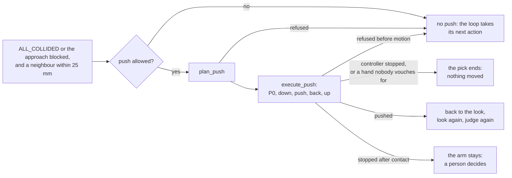

# Recovery (`src.robot.grasping.recovery`)

What to do after a pick failed: **look again**, **skip the part** for another of the same label, or, on
a wrist camera's pick in `dense_clutter`, **push the part aside** and look again. It plans; every motion
it asks for still goes through the same `RobotArm.move` and safety preflight as everything else, and
nothing here asks a person anything.

It ships off. You reach it through your cell's config, and the pick service wraps each attempt in the
recovery loop when it is on:

```yaml
robot:
  grasping:
    recovery:
      enabled: true
      allowed_actions: [rescan, next_target]   # the default is empty: enabled alone does nothing
      max_recovery_actions: 2
```

Call it directly only to test a failure class against your own policy:

```python
from src.robot.grasping import GraspFailureReason
from src.robot.grasping.recovery.orchestrator import RecoveryDispatcher
from src.robot.grasping.recovery.policy import SceneRecoveryAction

dispatcher = RecoveryDispatcher(overrides={GraspFailureReason.ALL_COLLIDED: (SceneRecoveryAction.RESCAN,)})
print(dispatcher.actions_for(GraspFailureReason.MOTION_PLAN_REFUSED))   # (NEXT_TARGET, RESCAN): never a motion
```

## The nouns

| Noun | Built by | Verb | Returns |
| --- | --- | --- | --- |
| `SceneRecoveryPolicy` | the pick service from `robot.grasping.recovery` | `permits(action)` | `bool` |
| `RecoveryDispatcher` | `RecoveryDispatcher(overrides=...)` | `actions_for(reason)` | the actions to try, in order |
| `RecoveryOrchestrator` | the pick service | `next_step(context)` | `SceneRecoveryPlan`, or `None` to stop |
| a plan | the orchestrator | `execute_recovery_motion(arm=..., plan=..., policy=...)` | `SceneRecoveryReport` |
| a failed pick | the pick service | `run_recovery_loop(...)` | the final report and the recovery trail |
| a push | `plan_push(...)`, then `execute_push(arm, plan, gripper=, offer=)` inside the pick attempt | read | `PushPlan` or `PushRefusal`; then a `PushOutcome` |
| `PushCampaign` | the pick service, one per `PickRun` or console run (`start_campaign(push_mm=)`) | `start_pick` | its `PushBudgets` (how many pushes are left), its `ExclusionZones` (which parts to skip) and its push distance |
| `PushGate` | the pick service, for one pick the policy lets push | handed to the pick loop (`push_gate`) | nothing: without it nothing pushes |
| what a push came to | the pick loop (`pushes`) | read | `PickPush`: its code, its sentence, whether the arm left the look and whether it stopped |

## The actions

`NONE` is the typed "do nothing" and may not appear in an allow-list; `ABORT` hands over to the operator.
The four the dispatcher can plan, in rising order of how much they touch the world:

| Action | What it does | Needs |
| --- | --- | --- |
| `RESCAN` | perceive again, moving nothing | nothing |
| `NEXT_TARGET` | rescan, skipping the part that failed: another part of the same label, never another object | the service's memory of failed parts |
| `NUDGE_TARGET` | the push: the open jaws move the part aside, inside a wrist camera's pick attempt | `dense_clutter` and a wrist camera; **no fixture** |
| `CONTAINER_AGITATE` | a bounded motion that redistributes a declared container's contents | a declared container, a `FixtureEnvelope` and a non-zero amplitude |

The first two change only what the cell knows; the last two change where things are. The agitation moves
only inside its `FixtureEnvelope`. **The push needs no envelope** (the owner, 2026-10-01): the automatic
push box bounds where the part lands, and a declared envelope only narrows it (*The plan*, below).
`ContainerAgitateStrategy` is the one physical strategy. The push needs no strategy either: it runs inside
the pick attempt, where the part, its neighbours, the keep-out and every look are known.

### What the service's loop does

The loop a cell built from config runs (`robot.grasping.recovery`, driven by the pick service). Its outer
gate is the mode's built-in profile, which `recovery.allowed_actions` cannot widen:

| Mode | Its profile allows |
| --- | --- |
| `easy` | nothing |
| `auto` | `rescan`, `next_target` |
| `dense_clutter` | `rescan`, `next_target`, `nudge_target` |

No built-in profile lists `container_agitate`, so a config-built cell never agitates.

- **A strategy per action, or a direct plan.** The orchestrator plans `RESCAN` directly
  (`DEFAULT_DIRECT_ACTIONS`), and `NEXT_TARGET` too where the service hands the loop its memory of failed
  parts (`direct_actions`, `skip_failed_part`). Every other action needs a strategy; without one, the next
  action in the row is tried. A physical action is never planned directly. A strategy's plan for another
  action than the one asked is dropped (`strategy_planned_another_action`). `bypass_strategies`, which
  plans every action by name, is a test seam.
- **A refusal before anything moved falls through** to the next action for the same failure. Every
  `refused_*` outcome counts. It stays in the trail, spends no action budget and does not re-run the
  pick. One failure has at most as many refusals as its rows hold distinct actions; one more ends the
  loop `escalated_no_recovery`. `aborted_motion_failed` ends the loop: the arm moved.
- **`rescan`** runs the next pick, which perceives and ranks afresh. A wrist pick handed looks gets no
  recovery rescan: its looks and its one generated view were its rescans, so a rescan never repeats them,
  and an INFO line says so; only `next_target` runs them again (below). A wrist pick handed no look and a
  fixed camera rescan where they stand.
- **`next_target`** records the failed part and rescans past it: same label only, never another object.
  The part's exclusion zone is a circle in BASE XY about its centre, radius max(30 mm, half its footprint
  diagonal), held for this pick and the next 2 (`ExclusionZones`). Beside the zones a task keeps whole
  **regions** out for its whole length (`ExclusionRegion`, a turned rectangle or a circle, for one label or every
  label, kept until `forget_regions()`): the bin it places into, its footprint grown by 10 mm, and 150 mm about a
  pose drop for "until empty", laid only where the arm's own kinematics say where the pose puts the tool.
  `applies(label)` says whether a zone or a region applies, the empty label included, and the pick loop skips
  such parts. `kept_out_by_a_region` asks of every part it skips whether a region holds it, whatever zone holds
  it too; on an attempt that saw only skipped parts, `PickAttempt.excluded_by_regions` says a region held every
  one. A look that saw only parts a region kept out is an empty look for the task (`only_kept_out`);
  `only_excluded` says a pick saw only skipped parts, for any reason, and one that saw only a part a zone skipped
  after a failed pick is a failed pick. The centre is measured on a no-candidate failure too. With only excluded
  parts left, the pick stops with a sentence. On a wrist
  camera the new part gets the look sequence again (the early stop, at most one generated view); a rescan
  of the same part never repeats the looks. It also follows `MOTION_PLAN_REFUSED`, and the next motion
  is judged whole. Without the memory, or when the failed report names no part, it is refused before
  anything moves (`refused_no_part_memory`, `refused_no_failed_part`) and the loop falls through to
  `rescan`.
- **Before the looks run again.** Before `next_target` drives a wrist pick's looks again, the service reads
  a toggle's count (`why_toggle_count_unknown`, nothing asked or sent). One **nobody can vouch for** ends the
  pick as a gripper fault (`telemetry['stage']` `before_the_re_pick`, and `re_pick_refused`: the trail's
  last step never picked) before any look is driven again, and `PickRun` and the console run stop on it
  (the owner, 2026-09-30). A re-pick that drives no look, a fixed camera's or a look-less wrist pick's
  rescan, reads nothing more: its own check before the arm moves asks where the jaws stand, as at every
  pick start.
- **`nudge_target`** is the push, which runs inside a wrist camera's pick attempt (below). The service's
  loop has no strategy for it, so it never plans one and goes on to the next action. A nudge another
  caller's loop plans is refused before anything moves (`refused_push_runs_in_the_pick`).
- **The end.** `terminal_outcome_for_trail` names what a finished loop stands for, and the service sets
  it: `unsafe_recovery_refused` where a recovery motion started and failed, `recovery_exhausted` where an
  action ran and none was left. A pick that found nothing keeps `no_target`, and one that ended on a
  stopped controller, a gripper fault, a push that stopped or a fault of the cell keeps its own.
  Otherwise the last pick's own outcome stands.

`NEXT_VIEWPOINT` was merged into `RESCAN` on 2026-09-29: with the viewpoint planners gone nothing moved
the camera for it, so it re-perceived exactly as `RESCAN` does. A config or a preset that still names
`next_viewpoint` is refused at load, `removed on purpose: use rescan`; a record logged before then keeps
the string, and the offline recovery trainer still reads it. `ActivePerceptionRecoveryStrategy` (`RESCAN`,
then `NEXT_VIEWPOINT`), `NextTargetRecoveryStrategy` and `NoRecoveryStrategy` left the same day with the
`dense_recovery` block, the only thing that built them. `SmallNudgeStrategy`, a blind +X offset from
wherever the arm stood, left with the push that replaced it.

## The push

A clutter jam is the one case a push is for. The jaws stay open and the **outer face of the leading
finger** moves the failed part along the closing axis, away from the neighbours that blocked the grasp.
Then the pick looks again. Nobody is asked anything on the way, and DO0 is never written. The push runs
**on a wrist camera's pick only**, after its looks judged the part: a fixed-camera cell never pushes.



**When.** No candidate survived and at least one collided (`ALL_COLLIDED`), or, where approach
validation runs, every ranked candidate's approach was blocked. In both cases a neighbour was seen
within 25 mm of the part (`neighbour_evidence`, on the neighbour clouds of every look). Never on
`NO_VALID_GRASP` or `NO_CANDIDATES_GENERATED`: nothing there says a neighbour is in the way. The
geometric and the deep calculator both trigger it.

**Allowed.** `push_permitted(profile, policy)`: recovery on and the mode in `apply_modes`; `dense_clutter`,
the one profile that lists `nudge_target`; `recovery.allowed_actions` names it; neither
`max_recovery_actions` nor its `per_action_budget` is zero. **No fixture needed**: without one the push
runs 30 mm, at most 50, and the automatic push box alone bounds it. The service then hands the pick a
**`PushGate`** where it could read the cell's push inputs (`PushCell`: the registry hand, the workspace, the
hand's clearance, a declared container) and the campaign has a distance; a WARNING says once why a
permitted cell cannot push. The **budgets** come on top: 1 push per part, 2 per pick, 5 per campaign (`PushBudgets`).
A part pushed once is the same part within 30 mm plus the push length of where it stood. A spent budget
means no more pushes, never a stop.

**Before the plan**, the pick loop reads, cheapest first: an attempt left to pick the part from afterwards
(`refused_no_attempt_left`, so `max_attempts: 1` never pushes), the part's points (`refused_no_target_points`),
a resolved support (`refused_no_support`), a neighbour within 25 mm (`no_blocking_neighbour`), the plan, the
budgets (`part_already_pushed`, `pick_budget_spent`, `campaign_budget_spent`) and the joints to come back to
(`refused_joints_unknown`). Each is no push, and the attempt goes on.

**How far.** `recovery.fixture.push_distance_mm`, 30 mm unless asked otherwise (`push_mm` on `PickRun`
and on the console's pick request). `recovery.fixture.max_nudge_mm` is the longest push the cell allows,
50 mm by default and at most; a cell with no fixture takes both defaults. A request up to that ceiling is
taken as asked; above it, or under 10 mm, it is refused with a sentence, never shortened
(`resolve_push_distance`): `PickRun` refuses above 50 or under 10 mm as it is built and the cell's ceiling
as its campaign starts, before any pick; the console answers `422 push_distance_refused` and starts no run.

**The plan** (`plan_push`, pure numpy in BASE millimetres):

- **The hand** comes from the gripper registry (`push_hand.py`): the fingers of the cell's jaw and the
  housing's thickness, `palm_thickness_mm`, 75 mm on the Hand-E. A cell that names no hand, or carries no
  parallel jaw, plans no push.
- **The direction.** Each offered axis is tried both ways, at 0, 45, 90 and 135 deg. The swept open hand
  keeps the camera world's margin plus its line clearance from every neighbour point (25 mm with the shipped
  values), so the planner plans no push the line judge's clearance check would refuse; the judge can still
  refuse a line for other reasons (*A stop*, below). **Beside the pushed part it keeps 10 mm**
  (`BESIDE_THE_PART_CLEARANCE_MM`, the owner's decision of 2026-10-02): a neighbour point inside the box the
  push keeps out of the camera world round the part and its path (the smallest rectangle about them, as the
  world boxes a target, grown by the world's margin) is one the guard does not see while the push runs. The
  part's own path keeps 5 mm from every neighbour point not behind it, and its clearance to its neighbours
  grows by at least 10 mm. The largest gain wins.
- **The height.** The part must rest on the support: its base, the 2nd percentile of its heights, at most
  10 mm above it (`part_not_on_support`: a part on something nobody segmented, or seen only from above).
  No push for a part under 15 mm of its own height, none for one that reaches within 5 mm of the palm's
  underside (`part_reaches_the_palm`), and none on a support tilted more than 5 deg. The fingertip rides
  at support + clamp(own height / 2, 10, 20) mm, and never under the **finger floor**: over a surface the
  camera world holds as a solid, the solid's top along the hand's sweep plus the guard's distance plus 1 mm
  (`finger_floor_mm`); a push whose finger would pass over the part there is refused
  (`refused_finger_floor_over_the_part`). The support is the surface the part stands on, read on its own
  local plane, where the camera world found one (`SupportModel.surface_under`, its `table_points`).
- **The workspace.** Every TCP point of the push stays 20 mm inside every face of the workspace box,
  `z_min` included. The finger rides 10 to 20 mm over the table, so a `workspace_limits.z_min` set well
  above the table refuses every push: the base tree's 100 mm does, for a table at base Z 0. Check it on
  the cell.
- **The push box.** With no container, the extent of the surface the part stands on where the camera world
  found one, else the workspace box intersected with the table the camera saw,
  shrunk by the push plus 30 mm; with a declared container, its interior. A declared fixture box only
  narrows it; without one, this box alone bounds the push. The predicted landing plus 15 mm stays inside.
  The seen table is kept as 5 mm cells in BASE XY: every cell within the push plus 45 mm of each landing
  point, and every cell under the hand's swept footprint, must be seen (a table point in it, or the part
  or a segmented neighbour standing on it). A shadow, a hole, a gap or a diagonal table edge refuses that
  direction, and fewer than 100 seen cells near the part refuses the push (`no_table_seen`). From one
  45 deg wrist view the shadow behind a part usually falls in that window: the table points fused over
  every look are what let a push through.

**Before anything moves** (`execute_push`), each of these is read, and none asks anybody. The first that
fails is a `refused_*` outcome with zero motion, and the pick falls through: the recovery loop takes its
next action for the failure, as if no push had been due. Two end the pick instead, with nothing commanded:
a controller that cannot move or cannot be read (`controller_not_operational`, as a stopped controller
ends a pick anywhere), and a hand nobody can vouch for (below).

| Checked | Refused as |
| --- | --- |
| a `PushPlan` whose legs keep the owner's speeds: down, back and up at 50 mm/s, the push at 25 mm/s, 0.1 m/s² | `refused_no_plan`, `refused_leg_too_fast` |
| the shape of a push, whoever built it: 10 to 50 mm, at most 5 deg off straight down, P0 80 mm above the contact start, a 10 mm contact gap, 5 mm back, 80 mm up, each station within 1 mm | `refused_push_too_short`, `refused_push_too_long`, `refused_plan_malformed` |
| an arm with the typed `move` that judges every straight line (`LineMotion.CHECKED`), and its live camera world | `refused_no_typed_move`, `refused_lines_not_judged`, `refused_no_live_world` |
| the part's points on the offer, and the plan's part inside their footprint plus 5 mm | `refused_no_target_points`, `refused_offer_not_the_part` |
| a controller that can move | `refused_controller_stopped` |
| a connected hand whose jaws stand open: a toggle's count says open (`jaws_closed` false, `why_jaws_unknown()` empty), a hand that measures its width reads within 2 mm of fully open | `refused_no_gripper`, `refused_jaws_closed`, `refused_jaws_unknown` |
| the arm at rest, where `safety.dwell` asks for it | `refused_arm_not_steady` |

A count that says **closed** means no push, and the pick falls through. A count **nobody can vouch for**
(DO0 switched at the pendant since the pick began, the count lost at a failed change or a disconnect, or
its output unreadable) **ends the pick as a gripper fault**, as the toggle's own refusal ends one (the
owner, 2026-09-30): nothing more moves, no `next_target` drives the looks again, the report's
`gripper_fault` says why, and `PickRun` and the console run stop on it. So does a gripper that measures
its width (the Robotiq socket driver) found **not connected** there, or whose width read fails: that driver
counts itself connected until the program disconnects it, so a socket that stopped answering shows as a
read that fails. Nobody is asked either way: `jaws_open_for_a_pick`, which can ask a person, is never
called. A connected width that reads short of open is no push, and a gripper that neither counts nor measures never says its jaws stand open: both are
plain refusals.

**The motion.** Inside `keeping_out`, with the part and its swept travel held out of the world
(`refused_keep_out_not_taken` where the world does not take them): P0 in the air above the contact start,
like a grasp approach (the arm's plain `move`: the straight joint line first, a capped cuRobo detour only
where the line is blocked); then down, push, back 5 mm and up, each a judged straight line
(`move(pose, linear=True, vel=, acc=)`) at the plan's speed, the controller read, a toggle's count read
again and the arm's rest waited for before each. Every pose closes the way round nearer the cell's
`robot.natural_closing_axis` where it names one (`push_tool_quaternion`, as every camera grasp), else
nearer where the tool stands. The controller and a toggle's count are read once more after the up leg:
either one failing there stops the arm at the lift point. Then the arm goes back to the look like a grasp
approach (to the one view the pick generated, on the straight joint line alone), the pick's target is
offered to the world again, what the earlier looks saw of the part leaves their views,
and the pick looks again, fused with its earlier frames, and judges again. A stop asked for while the
push was planned moves nothing (`refused_stop_requested`): the next attempt, or the recovery's next pick,
ends `cancelled` before it moves.

**A stop.** A P0 refused before anything was sent (`refused_approach_not_sent`) moved nothing and falls
through. So does a **down leg refused before it was sent** (`refused_down_not_sent`), the arm still in the
air at P0: it goes back to the look like a grasp approach first, and the round trip counts against the
budgets. That fall-through is the lead's ruling of 2026-09-29, pending the owner. "Before it was sent" is
the one rule a look uses too: a guard or the planner refused (`REFUSED_BEFORE_SENDING`), or the planner
found no plan. A down leg refused with a status not known as "nothing sent" (`unsupported`,
`connection_error`, `controller_rejected`) may have been commanded, and **stops**: safe, and how often
it happens is for URSim to measure. Once anything else may have moved, nothing more moves: a leg
refused or failed, a failed move back to the look, a controller that cannot be read, a toggle's count
nobody can vouch for before a contact leg or once the arm is up (DO0 switched while the push drives), or an
arm not at rest is `unsafe_recovery_refused`, and a controller that says it cannot move, a protective stop, is
`controller_not_operational`. The arm stays where it stopped: no planned escape, no automatic recovery
(`recover_from_protective_stop` is never called). A `CameraWorldUnavailable` on the way is raised out, as
on every motion of a pick, and its report carries the stopped push too.

The report then **needs a person** (`needs_person`), the campaign ends, and the service **refuses every
pick** (`unsafe_recovery_refused`, nothing asked, perceived or moved) until a new `PickRun` or console run
starts, or a program calls `acknowledge_needs_person()`. **Clear the cell first**: that run's first pick
drives the arm from wherever the push left it to its first look.

**What it records.** The attempt's action `push` and its `push` code, every push the pick considered in
`telemetry['pushes']` (with the plan's `finger_height_mm` and `landing_box_xy_mm` and every motion's
`leg_verdicts`, which robot.log says too) and a stopped one's sentence in `telemetry['push_stopped']`, and a
`nudge_target` row in the record's `recovery_actions` for every push whose arm left the look (`plan_reason`
`push_in_the_pick`, `recovered_success` on the last row where the recovery ended in a success). The trail's
actions never list a push. All of it is additive.

## Every gate an action passes

An action is planned only when all of these hold; otherwise nothing moves.

- The policy is enabled and the resolved mode is in its `apply_modes`.
- The attempt has not used `max_recovery_actions`, and the action is within its `per_action_budget`.
- The mode's behaviour profile lists it in `recovery_allowed_actions`, and the policy lists it too.
- It has not already been tried for the same failure class (`RecoveryHistoryEntry` records the pairs); a
  refusal before motion blocks it for the rest of that failure.
- The orchestrator can plan it: directly, or through a strategy.
- `CONTAINER_AGITATE` has a `FixtureEnvelope`, and the policy refuses to be built without one. The push
  needs none: a declared envelope only narrows its push box.

`easy` never recovers, twice over: its profile allows no action, and it is absent from the default
`apply_modes` (`auto`, `dense_clutter`). `ContainerAgitateStrategy` adds its own gate: it plans nothing
until `max_agitate_amplitude_mm` is above zero, and no built-in profile lists `container_agitate`. When
armed, the executor checks all three waypoints against the envelope before it moves any, so a refusal
always means nothing moved: an air shake while `agitate_contact_depth_mm` is `0.0`, otherwise a descend,
a sweep along +X and a retract. A config names `container_agitate` only where `support.container`
declares its interior box.

## Failure class to action

`RecoveryDispatcher` maps each `GraspFailureReason` to actions; `overrides` replaces the sequence for any
class you list. Three entries are rules rather than tuning:

- `ALL_COLLIDED` is the one class that offers the push: `next_target`, `nudge_target`,
  `container_agitate`, then `rescan`. `NO_CANDIDATES_GENERATED` and `NO_VALID_GRASP` get `next_target`
  and `rescan` only: nothing says a neighbour is in the way, so a push has no direction to go.
- `MOTION_PLAN_REFUSED` maps to `next_target`, then `rescan`, never an action that commands motion:
  moving after the cell declined to move is how a refusal becomes a motion. `next_target` moves nothing
  itself, and the next pick's motion is judged whole.
- `CONTROLLER_NOT_OPERATIONAL` maps to nothing: a stopped cell needs a person, not a retry. So do
  `TARGET_LABEL_NOT_FOUND`, `TOPOLOGY_RISK_REJECTED`, `SEMANTIC_REJECTED` and
  `DEFORMABLE_ROUTING_REQUIRED`.

## What it refuses

| Refusal | When | What to do |
| --- | --- | --- |
| refused at load, and `ValueError` from `SceneRecoveryPolicy` | `container_agitate` allowed with no fixture (the push needs none) | declare `recovery.fixture` |
| refused at load | `container_agitate` in `allowed_actions` or `per_action_budget` while `support.container` declares no interior box (`floor_height_mm` alone does not count) | declare `interior_min_mm` and `interior_max_mm`, or drop the action |
| refused at load | `recovery.fixture.max_nudge_mm` or `push_distance_mm` under 10 or over 50 mm, or the distance above the ceiling | a push of 10 to 50 mm, within `max_nudge_mm` |
| refused at load | an unknown action or mode name | use the names in the tables above |
| `ValueError` from `SceneRecoveryPolicy` | `NONE` in `allowed_actions`, a duplicate, or a negative budget | fix the list |
| plan `NONE`, with a reason | a gate above failed | read the plan's `reason` and telemetry |
| report `refused_no_tcp`, `refused_agitate_disabled`, `refused_envelope_violation`, `refused_no_typed_move`, `refused_push_runs_in_the_pick` | no start pose, an agitation with no amplitude, a waypoint outside the envelope, an arm with no typed `move`, or a nudge the loop planned | nothing moved; the loop tries its next action |
| trail `refused_no_part_memory`, `refused_no_failed_part` | `next_target` with no memory of failed parts, or a report that names no part | nothing moved; the loop falls through to `rescan` |
| a push distance refused (`422 push_distance_refused` on the console) | asked above `max_nudge_mm` or 50 mm, or under 10 mm | ask within the ceiling, or raise `max_nudge_mm` (50 at most) |
| report `aborted_motion_failed` | a recovery move came back other than `EXECUTED` | nothing further moves; read the motion status |
| push `refused_controller_stopped`, pick `controller_not_operational` | the controller could not move, or could not be read, before the push | nothing moved; a person clears the stop where the arm is visible |
| push `refused_jaws_unknown`, pick `gripper_fault` | nobody can say where a toggle's jaws stand when the push reads the count, or a width-measuring gripper is not connected or its width read failed | nothing moved; look at the jaws, then connect again: a toggle's connect asks where they stand, and a width gripper is reconnected |
| report `gripper_fault`, `telemetry['stage']` `before_the_re_pick`, `re_pick_refused` | `next_target` found a toggle's count nobody can vouch for before it drove the looks again; the trail's last step never picked | nothing moved; look at the jaws, then connect again |
| push `unsafe_recovery_refused`, `controller_not_operational` | a push stopped once anything may have moved | the campaign ends and the service refuses every pick until a new run starts; clear the cell first |

## Traps

- `robot.grasping.recovery` is the loop around the whole attempt, and the only recovery block since
  `robot.grasping.dense_recovery` was removed on 2026-09-29 (a tree that still writes it is refused).
- `allowed_actions` is empty in the config schema and `(RESCAN,)` on a runtime `SceneRecoveryPolicy`
  built by hand. Enabling recovery in YAML without naming actions allows nothing.
- A mode outside `apply_modes` keeps recovery inert whatever `recovery.enabled` says, and a list that
  still names `closed_loop` or `dense_autonomous` (removed 2026-09-29) is refused at load.
- The shipped `dense_clutter` preset allows `rescan` alone: a push needs `nudge_target` in
  `allowed_actions`. A `recovery.fixture` is optional and only narrows where the part may land.
- A push needs the table seen around the part. From one 45 deg wrist view the shadow behind the part
  usually refuses it (`landing_over_unseen_table`): give the pick looks, or declare a container. A part
  whose lower side is hidden fails closed (`part_not_on_support`).
- A local config that still writes `max_nudge_mm: 5`, or a `max_nudge_mm` under 30 with no
  `push_distance_mm`, no longer loads, on purpose: 5 mm allowed no push a finger fits, and a ceiling
  under 30 mm now sits below the 30 mm default `push_distance_mm`. Delete the line to take 50 mm, or
  write 10 to 50 mm with a `push_distance_mm` no longer than it.
- The push reads a toggle's count before P0, once its plan and budgets passed, again before each contact
  leg and once the arm is up; `next_target` reads it before it drives the looks again. DO0 switched on the
  way back to the look, or before a re-pick that drives no look, goes unseen until that pick's own check
  before the approach (`PickRun` asks, a console run stops). Keep hands off the pendant's tool outputs
  while a pick runs.
- During the push the keep-out takes neighbour points out of the world well beyond the part's path: up
  to about 21 mm for a push along a BASE axis, about 36 mm for a diagonal 50 mm push. The planner's hand
  clearance guards the hand there, and its hand model carries neither the wrist camera nor the coupling.

## Status

| Capability | Evidence |
| --- | --- |
| The recovery loop and container agitation | measured in simulation: `run_dense_pick` drives the service's loop with `--recovery`, and agitation with `--g6` through a strategy it builds itself |
| The push planner, the budgets and the exclusion zones | pinned by tests on synthetic scenes; never touched hardware |
| The push motion | pinned by tests: a fake arm and a fake live world record every call, and the owner's toggle Hand-E runs as a real `JawIOGripper` on fake I/O; ran on URSim CB3 on 2026-10-02 with the owner's tree and a recorded look as the camera ([`probe_push_on_the_mat.py`](../../../../scripts/ursim/probe_push_on_the_mat.py)), not yet in Isaac; never touched hardware |

## Files

| File | Holds |
| --- | --- |
| `policy.py` | `SceneRecoveryAction`, `SceneRecoveryPolicy`, `FixtureEnvelope`, `ContainerAgitateStrategy`, `execute_recovery_motion`, `push_permitted`, `refused_before_motion` |
| `orchestrator.py` | `RecoveryDispatcher`, `RecoveryOrchestrator`, `run_recovery_loop`, `terminal_outcome_for_trail`, `RecoveryHistoryEntry` and the trail |
| `push_planner.py` | `plan_push`, `PushPlan`, `PushRefusal`, `PushHand`, `resolve_push_distance`, `neighbour_evidence`, `table_points_from_cloud`, and the owner's numbers as named constants |
| `push_hand.py` | the push's hand: the cell's jaw and the registry's `palm_thickness_mm` |
| `push_motion.py` | `execute_push`, `PushOutcome`, `PushOutcomeCode`, `push_tool_quaternion` |
| `push_gate.py` | `PushGate`, `PushCell`, `PushCampaign`, `PickPush`, `FailedPart`, `support_points_of_views`: what the service hands a pick, what a campaign keeps, what a push came to |
| `push_budgets.py` | `PushBudgets`: 1 push per part, 2 per pick, 5 per campaign |
| `exclusion_zones.py` | `ExclusionZones`: the failed parts `next_target` skips, and the `ExclusionRegion`s a task keeps out for its whole length |
| `blocker.py` | clear the blocker: `clusters_of`, `not_a_blocker`, `mask_of`, `free_spot`, `release_pose`, `taught_place`, `BlockerRecord` and its codes ([`loop/`](../loop/README.md) runs it, before the push) |
| `trail_serialize.py` | `recovery_actions_from_trail`, the trail as the record's `recovery_actions` block |

## Details

- [`loop/`](../loop/README.md) reports the failure this package reacts to, runs the push inside the
  attempt and skips the excluded parts; [`types/`](../types/README.md) holds `GraspFailureReason`.
- `closed_loop/` held the other second chance, the two-scan refinement taken before the failure; it
  was removed on 2026-09-29.
- [`safety/`](../../safety/README.md) holds the guards every recovery waypoint still passes.
- [The grasping config reference](../../../../docs/grasping-config-reference.md) for the `recovery`
  block and the modes it fires in.
- Tests: `tests/test_recovery_policy.py`, `tests/test_t5_recovery_dispatcher.py`,
  `tests/test_t5_recovery_orchestrator.py`, `tests/test_t5_service_retry_loop.py`,
  `tests/test_recovery_fixture_wiring.py`, `tests/test_a_refused_recovery_falls_through_to_the_next_action.py`,
  `tests/test_a_push_is_planned_from_what_the_camera_saw.py`, `tests/test_a_push_budget_and_a_skipped_part.py`,
  `tests/test_a_push_moves_only_when_every_guard_holds.py`, `tests/test_a_push_takes_its_hand_from_the_registry.py`,
  `tests/test_container_agitate_needs_a_declared_container.py`, `tests/test_a_rescan_is_the_only_second_look.py`,
  and end to end on the owner's cell in miniature: `tests/test_a_boxed_in_part_is_pushed_inside_the_pick.py`,
  `tests/test_a_push_and_its_re_pick_leave_the_toggle_alone.py`, `tests/test_api_pick_push_distance.py`,
  `tests/test_a_push_needs_no_fixture.py` (the automatic push box alone, and a declared fixture narrowing it),
  `tests/test_a_jaw_count_nobody_vouches_for_moves_nothing_more.py` (the re-pick, the contact legs and the
  lift point, a width gripper not connected or unreadable) and
  `tests/test_a_part_the_axis_refused_is_never_pushed.py` (the closing axis and the natural orientation
  beside the push).
